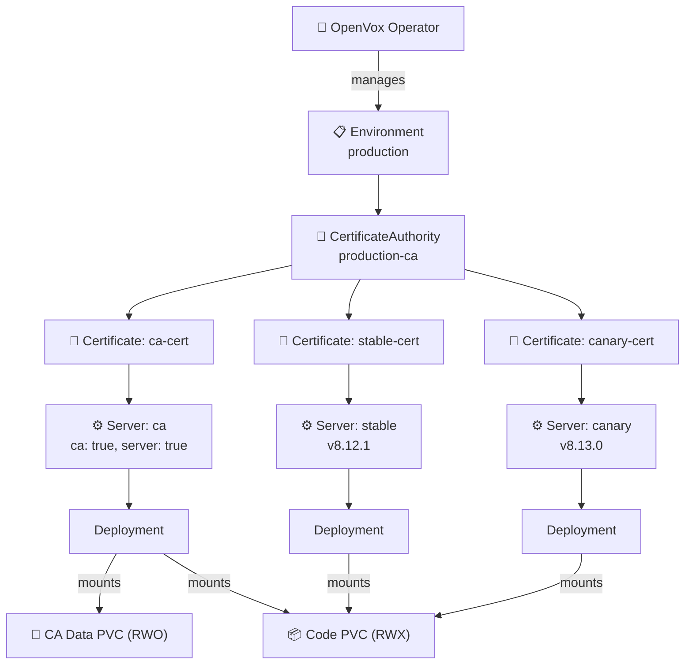
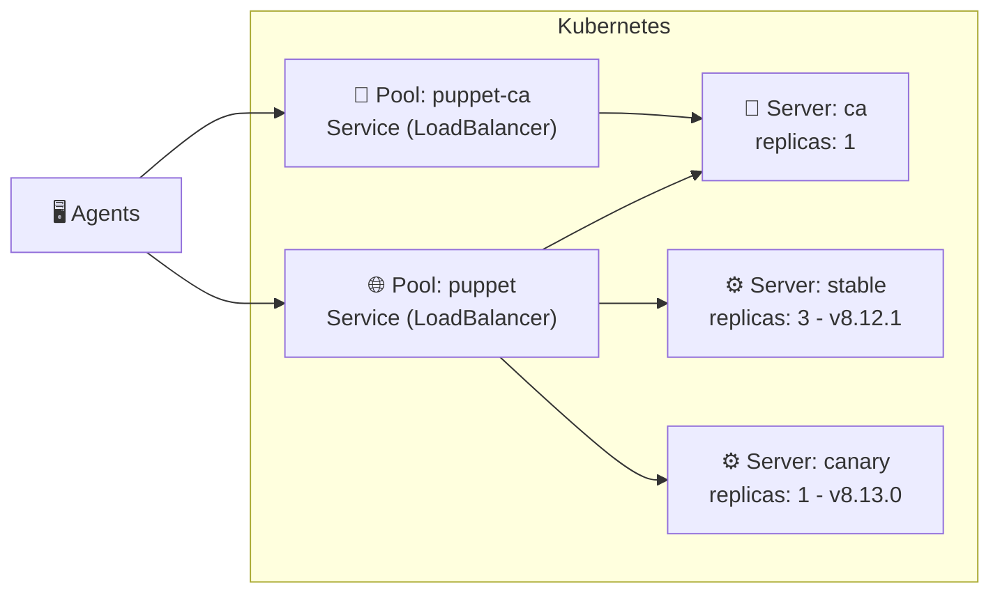

# 🦊 openvox-operator

A Kubernetes Operator for running [OpenVox Server](https://github.com/OpenVoxProject) environments on **Kubernetes** and **OpenShift**.

- 🔐 **Automated CA Lifecycle** - CA initialization, certificate signing and distribution - fully managed
- 📦 **One Image, Two Roles** - Same rootless image runs as CA or server, configured by the operator
- ⚡ **Scalable Servers** - Scale catalog compilation horizontally - multiple server pools with HPA
- 🔄 **Multi-Version Deployments** - Run different server versions side by side - canary deployments, rolling upgrades
- 🔒 **Rootless & OpenShift Ready** - Random UID compatible, no root, no ezbake, no privilege escalation
- ☸️ **Kubernetes-Native** - All config via ConfigMaps/Secrets - no entrypoint scripts, no ENV translation

> **⚠️ Status: Early Development** - This project is experimental and under active development. CRDs, APIs, and behavior may change at any time. Not ready for production use. Feedback is welcome - especially on the CRD data model, which is still evolving. Feel free to open an [issue](https://github.com/slauger/openvox-operator/issues).

## Architecture



### Pool Traffic Flow



The CA server can be member of both pools - it handles CA requests via the `puppet-ca` service and can also serve catalog requests from external agents via the `puppet` service.

## CRD Model

All resources use the API group `openvox.voxpupuli.org/v1alpha1`.

```
Environment
  └─ CertificateAuthority (environmentRef → Environment)
       └─ Certificate (authorityRef → CertificateAuthority)
            └─ Server (certificateRef → Certificate)
                 └─ Pool (selector → Server Pods)
```

| Kind | Purpose | Creates |
|---|---|---|
| **`Environment`** | Shared config (puppet.conf, auth.conf, etc.), PuppetDB connection | ConfigMaps, ServiceAccount |
| **`CertificateAuthority`** | CA infrastructure: keys, signing, public certificates | PVC, CA Setup Job, CA Secret |
| **`Certificate`** | Lifecycle of a single certificate (request, sign) | Cert Setup Job, SSL Secret |
| **`Server`** | OpenVox Server instance pool | Deployment, HPA |
| **`Pool`** | Owns a Kubernetes Service that selects Server Pods | Service (type, annotations, port) |

### Planned (not yet implemented)

| Kind | Purpose |
|---|---|
| **`CodeDeploy`** | r10k code deployment from Git (PVC, Job, CronJob) |
| **`SigningPolicy`** | Policy-based CSR approval (psk, pattern, token, any) |
| *`Database`* | *OpenVox DB (StatefulSet, Service)* |

### Why separate CRDs for CA and Certificates?

Traditional Puppet/OpenVox Server bundles CA management, certificate signing, and server runtime into a single process. This works on VMs where `puppetserver ca` (a CRuby CLI) manages everything locally. In Kubernetes, that approach doesn't work: the container image has **no system Ruby** - only JRuby embedded in the server JAR. The operator uses a custom JRuby wrapper that calls CA operations through `clojure.main` instead.

By separating the CA lifecycle (`CertificateAuthority`) from certificate signing (`Certificate`) and from the server runtime (`Server`), each concern becomes independently manageable. Certificates can be issued before a server is running, revoked without restarting pods, and the CA can be initialized once while multiple servers share the same signed certificate for horizontal scaling.

## Differences to VM-based Installations

Traditional Puppet/OpenVox Server installations on VMs use OS packages that install both a system Ruby (CRuby) and the server JAR with its embedded JRuby. The system Ruby is used by CLI tools like `puppet config set` and `puppetserver ca`. The server process requires root privileges.

This operator takes a **Kubernetes-native approach** that differs in several key areas:

| | VM-based | openvox-operator |
|---|---|---|
| **Ruby** | System Ruby (CRuby) installed alongside JRuby for CLI tooling | **No system Ruby** - only JRuby embedded in the server JAR |
| **Configuration** | `puppet.conf` managed via `puppet config set`, Puppet modules, or config management | Declarative CRDs, operator renders ConfigMaps and Secrets |
| **Privileges** | Requires root | Fully rootless, random UID compatible |
| **CA Management** | `puppetserver ca` CLI with CRuby shebang | Custom JRuby wrapper that routes through `clojure.main` |
| **Certificates** | Each server has its own certificate | `Certificate` CRD manages the cert lifecycle - all replicas of a `Server` share the same certificate, enabling seamless horizontal scaling |
| **Scaling** | Horizontal scaling possible but requires manual setup of additional server VMs | Horizontal via Deployment replicas and HPA |
| **Code Deployment** | r10k installed on the VM, triggered by cron or webhook | `CodeDeploy` CRD (planned) manages r10k as a Kubernetes Job/CronJob |
| **Multi-Version** | Separate VMs or manual package pinning | Multiple `Server` CRDs in the same `Pool` with different image tags |

By eliminating system Ruby from the runtime image, the container has a smaller footprint and a reduced attack surface, avoiding the duplicate Ruby installation (CRuby + JRuby) that the OS packages carry.

## Installation

```bash
helm install openvox-operator \
  oci://ghcr.io/slauger/charts/openvox-operator \
  --version 0.1.0 \
  --namespace openvox-system \
  --create-namespace
```

## Documentation

For getting started guides, examples, and detailed architecture documentation, see the [documentation](https://slauger.github.io/openvox-operator).

## License

Apache License 2.0
