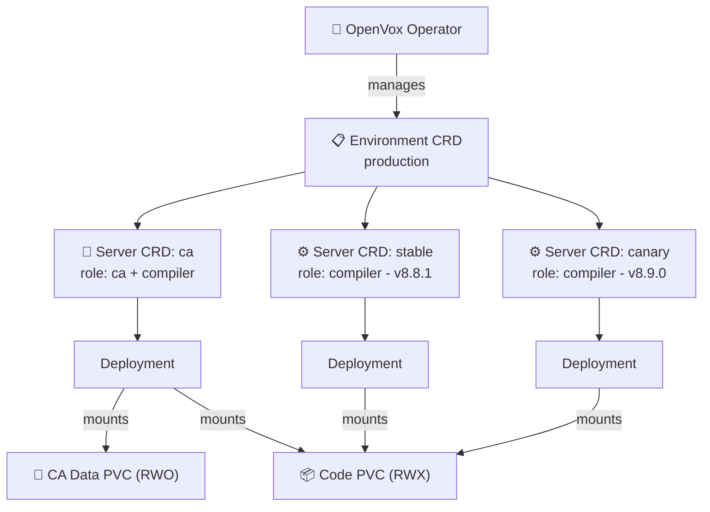
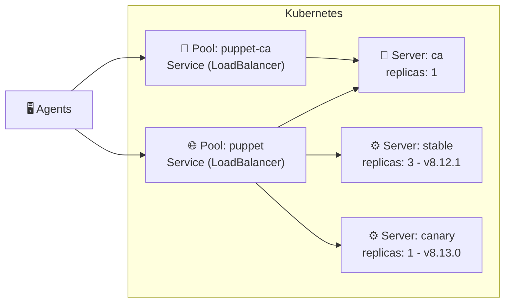

# 🦊 openvox-operator

A Kubernetes Operator for running [OpenVox Server](https://github.com/OpenVoxProject) environments on **Kubernetes** and **OpenShift**.

- 🔐 **Automated CA Lifecycle** - CA initialization, certificate signing and distribution - fully managed
- 📦 **One Image, Two Roles** - Same rootless image runs as CA or compiler, configured by the operator
- ⚡ **Scalable Compilers** - Scale catalog compilation horizontally - multiple server pools with HPA
- 🔄 **Multi-Version Deployments** - Run different server versions side by side - canary deployments, rolling upgrades
- 🔒 **Rootless & OpenShift Ready** - Random UID compatible, no root, no ezbake, no privilege escalation
- ☸️ **Kubernetes-Native** - All config via ConfigMaps/Secrets - no entrypoint scripts, no ENV translation

## Architecture



### Pool Traffic Flow



The CA server can be member of both pools - it handles CA requests via the `puppet-ca` service and can also serve catalog requests from external agents via the `puppet` service.

## CRD Model

All resources use the API group `openvox.voxpupuli.org/v1alpha1`.

| Kind | Purpose | Creates |
|---|---|---|
| **`Environment`** | Shared config, CA lifecycle, OpenVox DB connection | ConfigMaps, CA Job, CA Secret, CA PVC, CA Service |
| **`Pool`** | Owns a Kubernetes Service | Service (type, annotations, port) |
| **`Server`** | OpenVox Server instance pool | Deployment, HPA |
| **`CodeDeploy`** | r10k code deployment from Git | PVC, Job, CronJob |
| **`SigningPolicy`** | Policy-based CSR approval (psk, pattern, token, any) | — |
| **`CertificateRequest`** | Represents a pending/signed CSR | — |
| *`Database`* | *OpenVox DB (future)* | *StatefulSet, Service* |


## Differences to VM-based Installations

Traditional Puppet/OpenVox Server installations on VMs use OS packages that install both a system Ruby (CRuby) and the server JAR with its embedded JRuby. The system Ruby is used by CLI tools like `puppet config set` and `puppetserver ca`. The server process requires root privileges.

This operator takes a **Kubernetes-native approach** that differs in several key areas:

| | VM-based | openvox-operator |
|---|---|---|
| **Ruby** | System Ruby (CRuby) installed alongside JRuby for CLI tooling | **No system Ruby** - only JRuby embedded in the server JAR |
| **Configuration** | `puppet.conf` managed via `puppet config set`, Puppet modules, or config management | Declarative CRDs, operator renders ConfigMaps and Secrets |
| **Privileges** | Requires root | Fully rootless, random UID compatible |
| **CA Management** | `puppetserver ca` CLI with CRuby shebang | Custom JRuby wrapper that routes through `clojure.main` |
| **Certificates** | Each compiler has its own certificate | All replicas of a `Server` share the same certificate, enabling seamless horizontal scaling |
| **Scaling** | Horizontal scaling possible but requires manual setup of additional compiler VMs | Horizontal via Deployment replicas and HPA |
| **Code Deployment** | r10k installed on the VM, triggered by cron or webhook | `CodeDeploy` CRD manages r10k as a Kubernetes Job/CronJob |
| **Multi-Version** | Separate VMs or manual package pinning | Multiple `Server` CRDs in the same `Pool` with different image tags |

By eliminating system Ruby from the runtime image, the container has a smaller footprint and a reduced attack surface, avoiding the duplicate Ruby installation (CRuby + JRuby) that the OS packages carry.

## Examples

### Minimal - Single Pod does everything

```yaml
apiVersion: openvox.voxpupuli.org/v1alpha1
kind: Environment
metadata:
  name: lab
spec:
  image: { repository: ghcr.io/slauger/openvoxserver, tag: "8.12.1" }
  ca:
    autosign: "true"
---
apiVersion: openvox.voxpupuli.org/v1alpha1
kind: Server
metadata:
  name: puppet
spec:
  environmentRef: lab
  ca:
    enabled: true
    compiler: true     # CA also compiles catalogs
  replicas: 1
```

### Production - CA + Compiler Pool + Canary

```yaml
apiVersion: openvox.voxpupuli.org/v1alpha1
kind: Environment
metadata:
  name: production
spec:
  image: { repository: ghcr.io/slauger/openvoxserver, tag: "8.12.1" }
  ca:
    certname: puppet
    dnsAltNames: [puppet, puppet-ca]
    ttl: 157680000
    storage: { size: 1Gi }
  puppetdb:
    serverUrls: ["https://openvoxdb:8081"]
  puppet:
    environmentTimeout: unlimited
    storeconfigs: true
    reports: puppetdb
---
apiVersion: openvox.voxpupuli.org/v1alpha1
kind: Pool
metadata:
  name: puppet
spec:
  environmentRef: production
  service:
    type: LoadBalancer
    port: 8140
---
apiVersion: openvox.voxpupuli.org/v1alpha1
kind: Server
metadata:
  name: ca
spec:
  environmentRef: production
  ca: { enabled: true }
  replicas: 1
  javaArgs: "-Xms512m -Xmx1024m"
---
apiVersion: openvox.voxpupuli.org/v1alpha1
kind: Server
metadata:
  name: stable
spec:
  environmentRef: production
  poolRef: puppet
  image: { tag: "8.12.1" }
  replicas: 3
  maxActiveInstances: 2
  javaArgs: "-Xms512m -Xmx1024m"
---
apiVersion: openvox.voxpupuli.org/v1alpha1
kind: Server
metadata:
  name: canary
spec:
  environmentRef: production
  poolRef: puppet                 # same pool as stable!
  image: { tag: "8.13.0" }       # newer version
  replicas: 1
  javaArgs: "-Xms512m -Xmx1024m"
```

### CodeDeploy - r10k from Git

```yaml
apiVersion: openvox.voxpupuli.org/v1alpha1
kind: CodeDeploy
metadata:
  name: control-repo
spec:
  environmentRef: production
  image: { repository: ghcr.io/slauger/r10k, tag: "latest" }
  sources:
    - name: puppet
      remote: https://github.com/example/control-repo.git
      basedir: /etc/puppetlabs/code/environments
  schedule: "*/5 * * * *"
  volume: { size: 5Gi }
```

## License

Apache License 2.0
