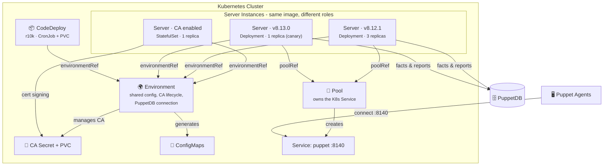

# 🦊 openvox-operator

A Kubernetes Operator for running [OpenVox Server](https://github.com/OpenVoxProject) environments on **Kubernetes** and **OpenShift**.

<table>
<tr>
<td>🔐</td><td><b>Automated CA Lifecycle</b><br/>CA initialization, certificate signing and distribution - fully managed</td>
<td>📦</td><td><b>One Image, Two Roles</b><br/>Same rootless image runs as CA or compiler, configured by the operator</td>
</tr>
<tr>
<td>⚡</td><td><b>Scalable Compilers</b><br/>Scale catalog compilation horizontally - multiple server pools with HPA</td>
<td>🔄</td><td><b>Multi-Version Deployments</b><br/>Run different server versions side by side - canary deployments, rolling upgrades</td>
</tr>
<tr>
<td>🔒</td><td><b>Rootless & OpenShift Ready</b><br/>Random UID compatible, no root, no ezbake, no privilege escalation</td>
<td>☸️</td><td><b>Kubernetes-Native</b><br/>All config via ConfigMaps/Secrets - no entrypoint scripts, no ENV translation</td>
</tr>
</table>

## Architecture



## CRD Model

All resources use the API group `openvox.voxpupuli.org/v1alpha1`.

| Kind | Purpose | Creates |
|---|---|---|
| **`Environment`** | Shared config, CA lifecycle, PuppetDB connection | ConfigMaps, CA Job, CA Secret, CA PVC, CA Service |
| **`Pool`** | Owns a Kubernetes Service | Service (type, annotations, port) |
| **`Server`** | OpenVox Server instance pool | Deployment or StatefulSet, HPA |
| **`CodeDeploy`** | r10k code deployment from Git | PVC, Job, CronJob |
| *`Database`* | *OpenVoxDB (future)* | *StatefulSet, Service* |

Servers reference their Environment and optionally a Pool:

```
Environment <-- Server (environmentRef)
Environment <-- CodeDeploy (environmentRef)
Environment <-- Pool (environmentRef)
Pool        <-- Server (poolRef)
```

> Detailed data model: [docs/data-model.md](docs/data-model.md) - [docs/design.md](docs/design.md)

## Examples

### Minimal - Single Pod does everything

```yaml
apiVersion: openvox.voxpupuli.org/v1alpha1
kind: Environment
metadata:
  name: lab
spec:
  image: { repository: ghcr.io/slauger/openvoxserver, tag: "8.12.1" }
  ca:
    autosign: "true"
---
apiVersion: openvox.voxpupuli.org/v1alpha1
kind: Server
metadata:
  name: puppet
spec:
  environmentRef: lab
  ca:
    enabled: true
    compiler: true     # CA also compiles catalogs
  replicas: 1
```

### Production - CA + Compiler Pool + Canary

```yaml
apiVersion: openvox.voxpupuli.org/v1alpha1
kind: Environment
metadata:
  name: production
spec:
  image: { repository: ghcr.io/slauger/openvoxserver, tag: "8.12.1" }
  ca:
    certname: puppet
    dnsAltNames: [puppet, puppet-ca]
    ttl: 157680000
    storage: { size: 1Gi }
  puppetdb:
    serverUrls: ["https://openvoxdb:8081"]
  puppet:
    environmentTimeout: unlimited
    storeconfigs: true
    reports: puppetdb
---
apiVersion: openvox.voxpupuli.org/v1alpha1
kind: Pool
metadata:
  name: puppet
spec:
  environmentRef: production
  service:
    type: LoadBalancer
    port: 8140
---
apiVersion: openvox.voxpupuli.org/v1alpha1
kind: Server
metadata:
  name: ca
spec:
  environmentRef: production
  ca: { enabled: true }
  replicas: 1
  javaArgs: "-Xms512m -Xmx1024m"
---
apiVersion: openvox.voxpupuli.org/v1alpha1
kind: Server
metadata:
  name: stable
spec:
  environmentRef: production
  poolRef: puppet
  image: { tag: "8.12.1" }
  replicas: 3
  maxActiveInstances: 2
  javaArgs: "-Xms512m -Xmx1024m"
---
apiVersion: openvox.voxpupuli.org/v1alpha1
kind: Server
metadata:
  name: canary
spec:
  environmentRef: production
  poolRef: puppet                 # same pool as stable!
  image: { tag: "8.13.0" }       # newer version
  replicas: 1
  javaArgs: "-Xms512m -Xmx1024m"
---
apiVersion: openvox.voxpupuli.org/v1alpha1
kind: CodeDeploy
metadata:
  name: control-repo
spec:
  environmentRef: production
  image: { repository: ghcr.io/slauger/r10k, tag: "latest" }
  sources:
   - name: puppet
      remote: https://github.com/example/control-repo.git
      basedir: /etc/puppetlabs/code/environments
  schedule: "*/5 * * * *"
  volume: { size: 5Gi }
```

### Status

```
$ kubectl get environment
NAME         CA READY   AGE
production   true       1h

$ kubectl get pool
NAME     TYPE           SERVICE   AGE
puppet   LoadBalancer   puppet    1h

$ kubectl get server
NAME     ENVIRONMENT   POOL     IMAGE     REPLICAS   READY   AGE
ca       production             8.12.1    1          1       1h
stable   production    puppet   8.12.1    3          3       1h
canary   production    puppet   8.13.0    1          1       30m

$ kubectl get codedeploy
NAME           ENVIRONMENT   SCHEDULE      LAST DEPLOY   AGE
control-repo   production    */5 * * * *   2m ago        1h
```

## Container Image

The image is **Kubernetes-first** - intentionally slim, no Docker-Compose support.

| ✅ Included | ❌ Removed (vs. upstream) |
|---|---|
| UBI9 + JDK 17 | entrypoint.d scripts |
| OpenVox Server tarball | System Ruby / Gemfile / bundle install |
| PuppetDB termini | ENV→config translation logic |
| JRuby openvox gem | gcc / make / ruby-devel |
| OpenShift random-UID pattern | Docker-Compose support |
| openvoxserver-ca rootless patches | |

**Entrypoint** - direct JVM, nothing else:

```bash
exec java ${JAVA_ARGS} \
   -Dlogappender=STDOUT \
   -cp "${INSTALL_DIR}/puppet-server-release.jar" \
    clojure.main -m puppetlabs.trapperkeeper.main \
   --config "${CONFIG}" --bootstrap-config "${BOOTSTRAP_CONFIG}"
```

Local testing: use `kind` or `minikube` with the same K8s manifests.

## Project Structure

```
openvox-operator/
├── images/openvoxserver/          # 🐳 Rootless K8s-first container image (UBI9)
│   ├── Containerfile
│   ├── entrypoint.sh              #    Direct java - no entrypoint.d
│   └── healthcheck.sh
├── api/v1alpha1/                  # 📋 CRD type definitions
├── cmd/main.go                    # 🚀 Operator entrypoint
├── internal/controller/           # ⚙️  Reconciliation logic
├── config/
│   ├── crd/bases/                 #    CRD manifests
│   ├── rbac/                      #    RBAC roles
│   └── samples/                   #    Example CRs
├── docs/                          # 📐 Architecture & design docs
├── go.mod
└── LICENSE                        #    Apache 2.0
```

## Roadmap

- [x] Rootless OpenVox Server container image (UBI9, tarball-based, no ezbake)
- [x] CRD data model design (Environment, Pool, Server, CodeDeploy)
- [ ] Implement multi-CRD Go types and controllers
- [ ] Simplify container image (remove entrypoint.d, Gemfile, System Ruby)
- [ ] CRD manifest generation and RBAC
- [ ] r10k code deployment (Job / CronJob with shared PVC)
- [ ] HPA for compiler autoscaling
- [ ] cert-manager intermediate CA support
- [ ] OLM bundle for OpenShift
- [ ] Rootless OpenVoxDB container image

## License

Apache License 2.0
