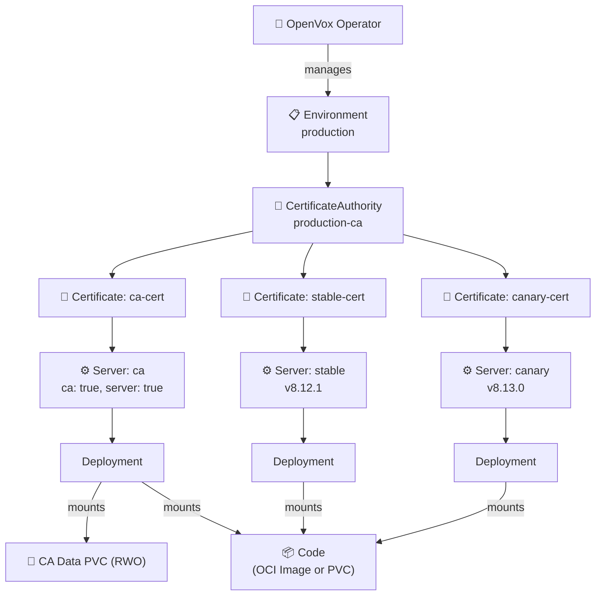
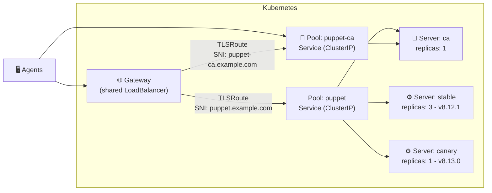

# 🦊 openvox-operator

[](https://github.com/slauger/openvox-operator/actions/workflows/ci.yaml)
[](https://github.com/slauger/openvox-operator/actions/workflows/go.yaml)
[](https://goreportcard.com/report/github.com/slauger/openvox-operator)
[](https://pkg.go.dev/github.com/slauger/openvox-operator)
[](LICENSE)

A Kubernetes Operator for running [OpenVox Server](https://github.com/OpenVoxProject) environments on **Kubernetes** and **OpenShift**.

- 🔐 **Automated CA Lifecycle** - CA initialization, certificate signing, distribution, and periodic CRL refresh - fully managed
- 📜 **Declarative Signing Policies** - CSR approval via patterns, DNS SANs, CSR attributes, or open signing - no autosign scripts
- 📦 **One Image, Two Roles** - Same rootless image runs as CA or server, configured by the operator
- ⚡ **Scalable Servers** - Scale catalog compilation horizontally - multiple server pools with HPA
- 🔄 **Multi-Version Deployments** - Run different server versions side by side - canary deployments, rolling upgrades
- 🔒 **Rootless & OpenShift Ready** - Random UID compatible, no root, no ezbake, no privilege escalation
- 🪶 **Minimal Image** - UBI9-based, no system Ruby, no ezbake packaging - smaller footprint, fewer updates
- 🧠 **Auto-tuned JVM** - Heap size calculated from memory limits (90%) - no manual `-Xmx` tuning needed
- 📦 **OCI Image Volumes** - Package Puppet code as OCI images, deploy immutably with automatic rollout (K8s 1.31+)
- 🌐 **Gateway API** - SNI-based TLSRoute support - share a single LoadBalancer across environments via TLS passthrough
- 🔃 **Automatic Config Rollout** - Config and certificate changes trigger rolling restarts automatically
- ☸️ **Kubernetes-Native** - All config via ConfigMaps/Secrets - no entrypoint scripts, no ENV translation

> **⚠️ Status: Early Development** - This project is experimental and under active development. CRDs, APIs, and behavior may change at any time. Not ready for production use. Feedback is welcome - especially on the CRD data model, which is still evolving. Feel free to open an [issue](https://github.com/slauger/openvox-operator/issues).

## Architecture



### Pool Traffic Flow

Pools can expose Servers via dedicated LoadBalancer Services or share a single LoadBalancer using Gateway API TLSRoute with SNI-based routing:



The CA server can be member of both pools - it handles CA requests via the `puppet-ca` service and can also serve catalog requests from external agents via the `puppet` service. Gateway API support is optional - Pools work with plain LoadBalancer/NodePort Services without it.

## CRD Model

All resources use the API group `openvox.voxpupuli.org/v1alpha1`.

| Kind | Purpose | Creates |
|---|---|---|
| **`Environment`** | Shared config (puppet.conf, auth.conf, etc.), PuppetDB connection | ConfigMaps, Secrets, ServiceAccount |
| **`CertificateAuthority`** | CA infrastructure: keys, signing, split Secrets (cert, key, CRL) | PVC, Job, ServiceAccount, Role, RoleBinding, 3 Secrets |
| **`SigningPolicy`** | Declarative CSR signing policy (any, pattern, DNS SANs, CSR attributes) | *(rendered into Environment's autosign Secret)* |
| **`Certificate`** | Lifecycle of a single certificate (request, sign) | TLS Secret |
| **`Server`** | OpenVox Server instance pool (CA and/or server role) | Deployment |
| **`Pool`** | Service + optional Gateway API TLSRoute for Server Pods | Service, TLSRoute (optional) |

### Planned (not yet implemented)

| Kind | Purpose |
|---|---|
| *`Database`* | *OpenVox DB (StatefulSet, Service)* |

## Differences to VM-based Installations

Traditional Puppet/OpenVox Server installations on VMs use OS packages that install both a system Ruby (CRuby) and the server JAR with its embedded JRuby. The system Ruby is used by CLI tools like `puppet config set` and `puppetserver ca`. The server process requires root privileges.

This operator takes a **Kubernetes-native approach** that differs in several key areas:

| | VM-based | openvox-operator |
|---|---|---|
| **Ruby** | System Ruby (CRuby) installed alongside JRuby for CLI tooling | **No system Ruby** - only JRuby embedded in the server JAR |
| **Configuration** | `puppet.conf` managed via `puppet config set`, Puppet modules, or config management | Declarative CRDs, operator renders ConfigMaps and Secrets |
| **Privileges** | Requires root | Fully rootless, random UID compatible |
| **CA Management** | `puppetserver ca` CLI with CRuby shebang | Custom JRuby wrapper that routes through `clojure.main` |
| **Certificates** | Each server has its own certificate | `Certificate` CRD manages the cert lifecycle - all replicas of a `Server` share the same certificate, enabling seamless horizontal scaling |
| **CSR Signing** | `autosign.conf` or Ruby scripts | `SigningPolicy` CRD with declarative rules (any, pattern, DNS SANs, CSR attributes) |
| **CRL** | File on disk, manual refresh | Split Secret (`{ca}-ca-crl`), operator-driven periodic refresh via CA HTTP API |
| **Scaling** | Horizontal scaling possible but requires manual setup of additional server VMs | Horizontal via Deployment replicas and HPA |
| **Code Deployment** | r10k installed on the VM, triggered by cron or webhook | OCI image volumes or PVC — code packaged as immutable container images |
| **Multi-Version** | Separate VMs or manual package pinning | Multiple `Server` CRDs in the same `Pool` with different image tags |

By eliminating system Ruby from the runtime image, the container has a smaller footprint and a reduced attack surface, avoiding the duplicate Ruby installation (CRuby + JRuby) that the OS packages carry.

## Quick Start

### 1. Install the Operator

```bash
helm install openvox-operator \
  oci://ghcr.io/slauger/charts/openvox-operator \
  --namespace openvox-system \
  --create-namespace
```

### 2. Deploy a Stack

The `openvox-stack` chart deploys a complete OpenVox environment (Environment, CertificateAuthority, SigningPolicy, Certificate, Server, Pool) with a single Helm release:

```bash
helm install production \
  oci://ghcr.io/slauger/charts/openvox-stack \
  --namespace openvox \
  --create-namespace
```

This creates a single CA+Server with autosign enabled.

## Local Development

Build all container images locally and deploy the operator to Docker Desktop Kubernetes:

```bash
make local-deploy
```

Deploy the openvox-stack (single-node by default):

```bash
make local-stack
```

Override the image tag or use a different scenario:

```bash
make local-deploy LOCAL_TAG=my-feature
make local-stack LOCAL_TAG=my-feature STACK_VALUES=charts/openvox-stack/ci/multi-server-values.yaml
```

### Available Targets

| Target | Description |
|---|---|
| `local-build` | Build all container images with the current git commit as tag |
| `local-deploy` | Build images, install CRDs, and deploy the operator via Helm |
| `local-stack` | Deploy the openvox-stack via Helm with local images |

## Documentation

For detailed architecture documentation and CRD reference, see the [documentation](https://slauger.github.io/openvox-operator).

## License

Apache License 2.0
