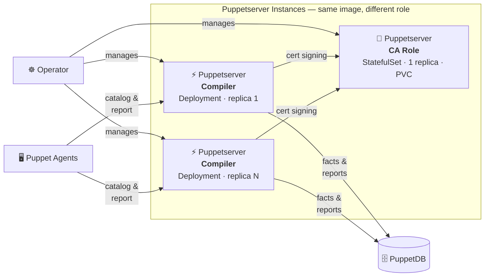

# 🦊 openvox-operator

A Kubernetes Operator for running [OpenVox Server](https://github.com/OpenVoxProject) environments on **Kubernetes** and **OpenShift**.

<table>
<tr>
<td>🔐</td><td><b>Automated CA Lifecycle</b><br/>CA initialization, certificate signing and distribution — fully managed</td>
<td>📦</td><td><b>One Image, Two Roles</b><br/>Same rootless image runs as CA server or compiler, configured by the operator</td>
</tr>
<tr>
<td>⚡</td><td><b>Scalable Compilers</b><br/>Scale catalog compilation horizontally with Deployments and HPA</td>
<td>🔒</td><td><b>Rootless & OpenShift Ready</b><br/>Random UID compatible, no root, no ezbake, no privilege escalation</td>
</tr>
<tr>
<td>☸️</td><td><b>Kubernetes-Native Config</b><br/>All configuration via ConfigMaps and Secrets — no entrypoint scripts</td>
<td>🗄️</td><td><b>PuppetDB Integration</b><br/>Connect to external PuppetDB for reports, facts and exported resources</td>
</tr>
</table>

## Architecture



The Operator watches `OpenVoxServer` custom resources and manages the full lifecycle:

1. **Generates ConfigMaps** from the CR spec (puppet.conf, puppetdb.conf, webserver.conf)
2. **Initializes the CA** via a one-time Job (`puppetserver ca setup`)
3. **Runs the CA server** as a StatefulSet (replicas: 1, persistent CA data)
4. **Deploys compilers** as a scalable Deployment (replicas: 1–N)
5. **Bootstraps SSL** — compilers obtain certificates from the CA server automatically

> 📐 Detailed architecture: [docs/architecture.md](docs/architecture.md) · [docs/design.md](docs/design.md) · [architecture.drawio](docs/architecture.drawio)

## Quick Start

### Build the Image

```bash
cd images/openvoxserver
podman build -t openvoxserver:rootless .
```

### Deploy with the Operator

```bash
kubectl apply -f config/crd/bases/            # Install CRD
kubectl apply -f config/manager/              # Deploy operator
kubectl apply -f config/samples/openvox_v1alpha1_openvoxserver.yaml
```

### Deploy with Plain Manifests (no operator)

```bash
kubectl apply -f examples/kubernetes/
```

## Custom Resource

```yaml
apiVersion: openvox.voxpupuli.org/v1alpha1
kind: OpenVoxServer
metadata:
  name: production
spec:
  image:
    repository: ghcr.io/slauger/openvoxserver
    tag: "8.12.1"

  ca:
    enabled: true
    autosign: "true"
    certname: "puppet"
    dnsAltNames: [puppet, puppet-ca]
    storage: { size: 1Gi }
    javaArgs: "-Xms512m -Xmx1024m"

  compilers:
    replicas: 2
    javaArgs: "-Xms512m -Xmx1024m"
    maxActiveInstances: 2

  puppetdb:
    enabled: true
    serverUrls: ["https://openvoxdb:8081"]

  code:
    volume: { size: 5Gi }
```

```
$ kubectl get openvoxserver
NAME         PHASE     CA READY   COMPILERS   AGE
production   Running   true       2           5m
```

## Container Image

The image is **Kubernetes-first** — intentionally slim, no Docker-Compose support.

| ✅ Included | ❌ Removed (vs. upstream) |
|---|---|
| UBI9 + JDK 17 | entrypoint.d scripts |
| OpenVox Server tarball | System Ruby / Gemfile / bundle install |
| PuppetDB termini | ENV→config translation logic |
| JRuby openvox gem | gcc / make / ruby-devel |
| OpenShift random-UID pattern | Docker-Compose support |
| openvoxserver-ca rootless patches | |

**Entrypoint** — direct JVM, nothing else:

```bash
exec java ${JAVA_ARGS} \
    -Dlogappender=STDOUT \
    -cp "${INSTALL_DIR}/puppet-server-release.jar" \
    clojure.main -m puppetlabs.trapperkeeper.main \
    --config "${CONFIG}" --bootstrap-config "${BOOTSTRAP_CONFIG}"
```

Local testing: use `kind` or `minikube` with the same K8s manifests.

## Project Structure

```
openvox-operator/
├── images/openvoxserver/          # 🐳 Rootless K8s-first container image (UBI9)
│   ├── Containerfile
│   ├── entrypoint.sh              #    Direct java — no entrypoint.d
│   └── healthcheck.sh
├── api/v1alpha1/                  # 📋 CRD type definitions
├── cmd/main.go                    # 🚀 Operator entrypoint
├── internal/controller/           # ⚙️  Reconciliation logic
│   ├── openvoxserver_controller.go
│   ├── configmap.go               #    ConfigMap generation
│   ├── ca.go                      #    CA Job / StatefulSet / Service
│   └── compiler.go                #    Compiler Deployment / Service
├── config/
│   ├── crd/bases/                 #    CRD manifests
│   ├── rbac/                      #    RBAC roles
│   └── samples/                   #    Example CRs
├── docs/                          # 📐 Architecture & design docs
├── go.mod
└── LICENSE                        #    Apache 2.0
```

## Roadmap

- [x] Rootless OpenVox Server container image (UBI9, tarball-based, no ezbake)
- [x] Operator scaffolding (CRD types, controller, reconciliation loop)
- [ ] Simplify container image (remove entrypoint.d, Gemfile, System Ruby)
- [ ] CRD manifest generation and RBAC
- [ ] r10k code deployment (Job / CronJob with shared PVC)
- [ ] HPA for compiler autoscaling
- [ ] cert-manager intermediate CA support
- [ ] OLM bundle for OpenShift
- [ ] Rootless OpenVox DB container image

## License

Apache License 2.0
