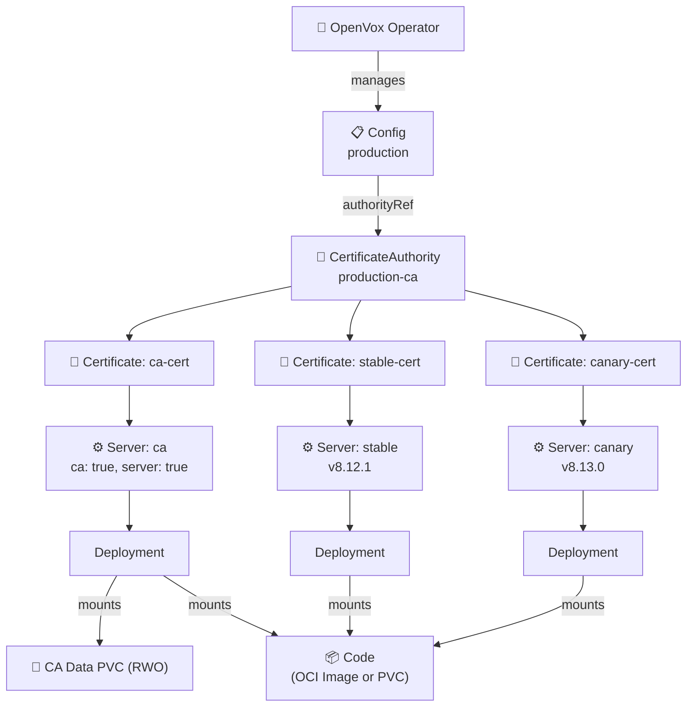
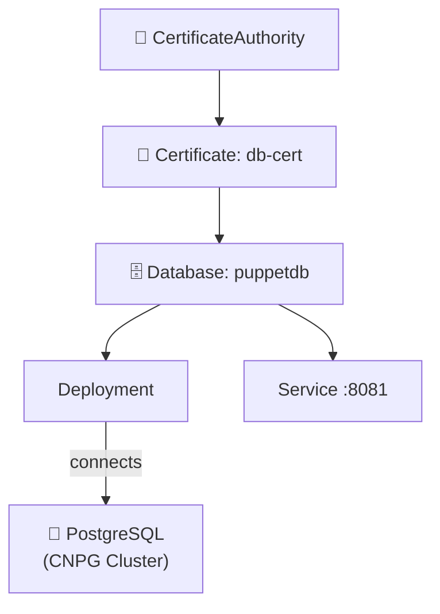
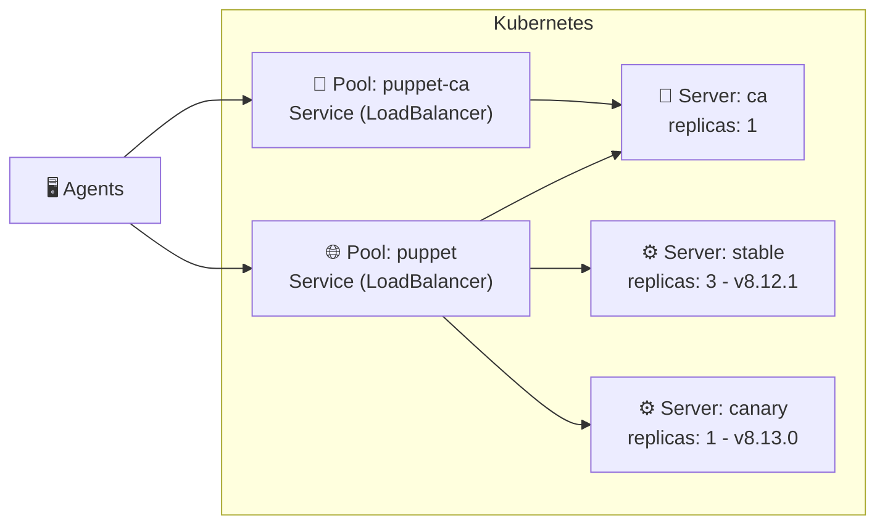
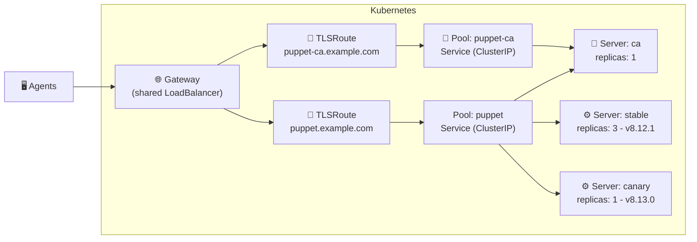

# 🦊 openvox-operator

[](https://github.com/slauger/openvox-operator/actions/workflows/ci.yaml)
[](https://goreportcard.com/report/github.com/slauger/openvox-operator)
[](https://pkg.go.dev/github.com/slauger/openvox-operator)
[](LICENSE)

A Kubernetes Operator that maps [OpenVox Server](https://github.com/OpenVoxProject) infrastructure onto native building blocks - CRDs, Secrets, OCI image volumes, and Gateway API - for running Puppet on **Kubernetes** and **OpenShift**.

- 🔐 **Automated CA Lifecycle** - CA initialization, certificate signing, distribution, and periodic CRL refresh - fully managed
- 📜 **Declarative Signing Policies** - CSR approval via patterns, DNS SANs, CSR attributes, or open signing - no autosign scripts
- 🏷️ **External Node Classification** - Declarative ENC support for Foreman, Puppet Enterprise, or custom HTTP classifiers
- 📦 **One Image, Two Roles** - Same rootless image runs as CA or server, configured by the operator
- ⚡ **Scalable Servers** - Scale catalog compilation horizontally - multiple server pools with HPA
- 🔄 **Multi-Version Deployments** - Run different server versions side by side - canary deployments, rolling upgrades
- 🔒 **Rootless & OpenShift Ready** - Random UID compatible, no root, no ezbake, no privilege escalation
- 🪶 **Minimal Image** - UBI9-based, no system Ruby, no ezbake packaging - smaller footprint, fewer updates
- 🧠 **Auto-tuned JVM** - Heap size calculated from memory limits (90%) - no manual `-Xmx` tuning needed
- 📦 **OCI Image Volumes** - Package Puppet code as OCI images, deploy immutably with automatic rollout (K8s 1.35+)
- 🌐 **Gateway API** - SNI-based TLSRoute support - share a single LoadBalancer across environments via TLS passthrough
- 🗄️ **Managed OpenVox DB** - Deploy OpenVox DB (PuppetDB) with external PostgreSQL - TLS, config, and credentials managed by the operator
- 🔃 **Automatic Config Rollout** - Config and certificate changes trigger rolling restarts automatically
- ☸️ **Kubernetes-Native** - All config via ConfigMaps/Secrets - no entrypoint scripts, no ENV translation

> **⚠️ Status: Early Development** - This project is experimental and under active development. CRDs, APIs, and behavior may change at any time. Not ready for production use. Feedback is welcome - especially on the CRD data model, which is still evolving. Feel free to open an [issue](https://github.com/slauger/openvox-operator/issues).

## Architecture



A **Config** is the root resource - it holds shared configuration (puppet.conf, PuppetDB connection), manages code deployment, and references a **CertificateAuthority** via `authorityRef`. A **CertificateAuthority** initializes the CA infrastructure and periodically refreshes the CRL. Each **Certificate** is signed by the CA and stored as a Kubernetes Secret. A **Server** references a Certificate and creates a Deployment - it can run as CA, catalog server, or both. Servers declare pool membership via `poolRefs`. **Pools** are pure networking resources that create Services selecting Server pods by pool label, with optional Gateway API TLSRoute for SNI-based routing. A **Database** deploys OpenVox DB (PuppetDB) as a Deployment with a Service, connecting to an external PostgreSQL instance.

Puppet code is mounted into Server pods via **OCI image volumes** (immutable, automatic rollout on image change, K8s 1.35+) or a **PVC** (mutable, externally managed). See [Code Deployment](docs/concepts/code-deployment.md) for details.

### Database

A **Database** deploys OpenVox DB (PuppetDB) with TLS certificates from the CA and connects to an external PostgreSQL instance (e.g. via [CloudNative PG](https://cloudnative-pg.io/)).



### Pool Traffic Flow

Each Pool owns a Kubernetes Service that selects Server pods. The CA server can be member of both pools - handling CA requests via its dedicated pool and also serving catalog requests through the server pool.

**LoadBalancer Services** - each Pool gets its own external IP:



**Gateway API TLSRoute** - all Pools share a single LoadBalancer, routed by SNI hostname:



## CRD Model

All resources use the API group `openvox.voxpupuli.org/v1alpha1`.

| Kind | Purpose | Creates |
|---|---|---|
| **`Config`** | Shared config (puppet.conf, auth.conf, etc.), OpenVox DB connection | ConfigMaps, Secrets, ServiceAccount |
| **`CertificateAuthority`** | CA infrastructure: keys, signing, split Secrets (cert, key, CRL) | PVC, Job, ServiceAccount, Role, RoleBinding, 3 Secrets |
| **`SigningPolicy`** | Declarative CSR signing policy (any, pattern, DNS SANs, CSR attributes) | *(rendered into Config's autosign Secret)* |
| **`NodeClassifier`** | External Node Classifier (ENC) endpoint (Foreman, PE, custom HTTP) | *(rendered into Config's ENC Secret)* |
| **`ReportProcessor`** | Report forwarding endpoint (generic webhook or PuppetDB Wire Format v8) | *(rendered into Config's report-webhook Secret)* |
| **`Certificate`** | Lifecycle of a single certificate (request, sign) | TLS Secret |
| **`Server`** | OpenVox Server instance pool (CA and/or server role), declares pool membership via `poolRefs` | Deployment |
| **`Database`** | OpenVox DB with external PostgreSQL | Deployment, Service, ConfigMap, Secret |
| **`Pool`** | Networking resource: Service + optional Gateway API TLSRoute for Servers that reference this Pool | Service, TLSRoute (optional) |

## Differences to VM-based Installations

Traditional Puppet/OpenVox Server installations on VMs use OS packages that install both a system Ruby (CRuby) and the server JAR with its embedded JRuby. The system Ruby is used by CLI tools like `puppet config set` and `puppetserver ca`. The server process requires root privileges.

This operator takes a **Kubernetes-native approach** that differs in several key areas:

| | VM-based | openvox-operator |
|---|---|---|
| **Ruby** | System Ruby (CRuby) installed alongside JRuby for CLI tooling | **No system Ruby** - only JRuby embedded in the server JAR |
| **Configuration** | `puppet.conf` managed via `puppet config set`, Puppet modules, or config management | Declarative CRDs, operator renders ConfigMaps and Secrets |
| **Privileges** | Requires root | Fully rootless, random UID compatible |
| **CA Management** | `puppetserver ca` CLI with CRuby shebang | Custom JRuby wrapper that routes through `clojure.main` |
| **Certificates** | Each server has its own certificate | `Certificate` CRD manages the cert lifecycle - all replicas of a `Server` share the same certificate, enabling seamless horizontal scaling |
| **CSR Signing** | `autosign.conf` or Ruby scripts | `SigningPolicy` CRD with declarative rules (any, pattern, DNS SANs, CSR attributes) |
| **ENC** | Script on disk, manually configured | `NodeClassifier` CRD with support for Foreman, PE, or custom HTTP endpoints |
| **CRL** | File on disk, manual refresh | Split Secret (`{ca}-ca-crl`), operator-driven periodic refresh via CA HTTP API |
| **Scaling** | Horizontal scaling possible but requires manual setup of additional server VMs | Horizontal via Deployment replicas and HPA |
| **Code Deployment** | r10k installed on the VM, triggered by cron or webhook | OCI image volumes or PVC - code packaged as immutable container images |
| **Traffic Routing** | DNS round-robin or hardware load balancer per environment | Gateway API TLSRoute with SNI-based routing - share a single LoadBalancer across environments |
| **Multi-Version** | Separate VMs or manual package pinning | Multiple `Server` CRDs in the same `Pool` with different image tags |

By eliminating system Ruby from the runtime image, the container has a smaller footprint and a reduced attack surface, avoiding the duplicate Ruby installation (CRuby + JRuby) that the OS packages carry.

## Quick Start

### 1. Install the Operator

```bash
helm install openvox-operator \
  oci://ghcr.io/slauger/charts/openvox-operator \
  --namespace openvox-system \
  --create-namespace
```

### 2. Deploy a Stack

The `openvox-stack` chart deploys a complete OpenVox stack (Config, CertificateAuthority, SigningPolicy, Certificate, Server, Pool) with a single Helm release:

```bash
helm install production \
  oci://ghcr.io/slauger/charts/openvox-stack \
  --namespace openvox \
  --create-namespace
```

This creates a single CA+Server with autosign enabled.

### 3. Deploy OpenVox DB with CNPG (Optional)

If you want to run OpenVox DB (PuppetDB) backed by CloudNative PG, first install the [CNPG operator](https://cloudnative-pg.io/), then deploy a PostgreSQL cluster using the `openvox-db-postgres` chart:

```bash
helm install pg-cluster \
  oci://ghcr.io/slauger/charts/openvox-db-postgres \
  --namespace openvox \
  --set database=openvoxdb
```

Then deploy the stack with database enabled, referencing the CNPG-generated service and credentials secret:

```bash
helm install production \
  oci://ghcr.io/slauger/charts/openvox-stack \
  --namespace openvox \
  --set database.enabled=true \
  --set database.postgres.host=pg-cluster-rw \
  --set database.postgres.credentialsSecretRef=pg-cluster-app
```

## Local Development

The `local-build` and `local-deploy` targets build all container images locally and deploy the operator via Helm with `pullPolicy: Never`. This works with clusters that have direct access to the local image store (e.g. Docker Desktop Kubernetes via kubeadm).

> **Note:** OCI image volumes require Kubernetes 1.35+ (`ImageVolume` feature gate). Docker Desktop's built-in kubeadm currently ships Kubernetes 1.34, so agent tests that use OCI code mounts won't work with local images. Use [kind](https://kind.sigs.k8s.io/) with the `ImageVolume` feature gate enabled (see `tests/e2e/kind-config.yaml`) and CI-built images from ghcr.io instead.

```bash
make local-build                  # Build all images
make local-deploy                 # Build + install operator via Helm
make local-stack                  # Deploy openvox-stack with local images
make uninstall                    # Remove everything
```

Override the image tag or use a different scenario:

```bash
make local-deploy LOCAL_TAG=my-feature
make local-stack LOCAL_TAG=my-feature STACK_VALUES=charts/openvox-stack/ci/multi-server-values.yaml
```

### Testing

Run unit tests:

```bash
make test
```

E2E tests require container images in ghcr.io because they run on a kind cluster with the `ImageVolume` feature gate. Images are automatically built and pushed on every push to `develop`. For feature branches, trigger the E2E workflow manually:

```bash
# Images are auto-built on push to develop (tagged as "develop")
export IMAGE_TAG=develop
make e2e

# For feature branches: build and push images manually
gh workflow run e2e.yaml --ref $(git branch --show-current)
gh run watch $(gh run list --workflow=e2e.yaml --limit=1 --json databaseId -q '.[0].databaseId')
export IMAGE_TAG=$(git branch --show-current)  # branch name is used as tag
make e2e
```

Subsets of E2E tests can be run separately:

```bash
make e2e-stack        # stack deployment tests (single-node, multi-server)
make e2e-agent        # agent tests (basic, broken, idempotent, concurrent)
make e2e-integration  # integration tests (enc, report, full)
make e2e-database     # Database with CNPG PostgreSQL tests
make e2e-gateway      # Envoy Gateway TLSRoute tests
```

Some tests require external dependencies (CNPG operator, Envoy Gateway). Install them all at once:

```bash
make e2e-deps         # Install CNPG + Envoy Gateway
```

See [Testing](docs/development/testing.md) for details.

### Available Targets

| Target | Description |
|---|---|
| `install` | Install operator via Helm (supports `IMAGE_TAG=<tag>`) |
| `stack` | Deploy openvox-stack via Helm (supports `IMAGE_TAG=<tag>`) |
| `uninstall` | Remove stack, operator, and CRDs from the cluster |
| `unstack` | Remove only the openvox-stack |
| `local-build` | Build all container images with the current git commit as tag |
| `local-deploy` | Build images and deploy the operator via Helm (`pullPolicy: Never`) |
| `local-install` | Deploy operator via Helm with local images (no build) |
| `local-stack` | Deploy openvox-stack via Helm with local images |
| `e2e` | Run all E2E tests (installs CNPG + Envoy Gateway dependencies) |
| `e2e-stack` | Run stack deployment tests (single-node, multi-server) |
| `e2e-agent` | Run agent tests (basic, broken, idempotent, concurrent) |
| `e2e-integration` | Run integration tests (enc, report, full) |
| `e2e-database` | Run Database with CNPG PostgreSQL tests |
| `e2e-gateway` | Run Envoy Gateway TLSRoute tests |
| `e2e-deps` | Install CNPG + Envoy Gateway for E2E tests |
| `ci` | Run all CI checks locally (lint, vet, test, manifests, vulncheck, helm-lint) |

## Documentation

For detailed architecture documentation and CRD reference, see the [documentation](https://slauger.github.io/openvox-operator).

## License

Apache License 2.0
