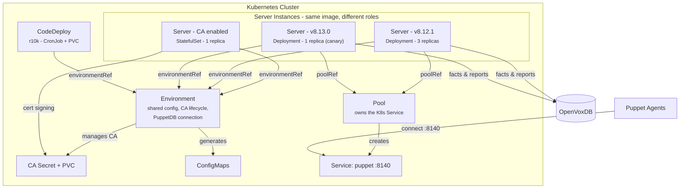

# Architecture

```mermaid
graph TB
    subgraph cluster ["Kubernetes Cluster"]
        Env["Environment<br/><small>shared config, CA lifecycle,<br/>PuppetDB connection</small>"]

        Env -->|manages CA| CASecret["CA Secret + PVC"]
        Env -->|generates| CM["ConfigMaps"]

        Pool["Pool<br/><small>owns the K8s Service</small>"]
        Pool -->|creates| Svc["Service: puppet :8140"]

        subgraph servers ["Server Instances - same image, different roles"]
            CA["Server - CA enabled<br/><small>StatefulSet - 1 replica</small>"]
            V1["Server - v8.12.1<br/><small>Deployment - 3 replicas</small>"]
            V2["Server - v8.13.0<br/><small>Deployment - 1 replica (canary)</small>"]
        end

        CA -->|environmentRef| Env
        V1 -->|environmentRef| Env
        V2 -->|environmentRef| Env
        V1 -->|poolRef| Pool
        V2 -->|poolRef| Pool
        CA -->|cert signing| CASecret

        CodeDeploy["CodeDeploy<br/><small>r10k - CronJob + PVC</small>"]
        CodeDeploy -->|environmentRef| Env
    end

    Agents["Puppet Agents"] -->|connect :8140| Svc
    V1 & V2 -->|facts & reports| PuppetDB[("OpenVoxDB")]
```
