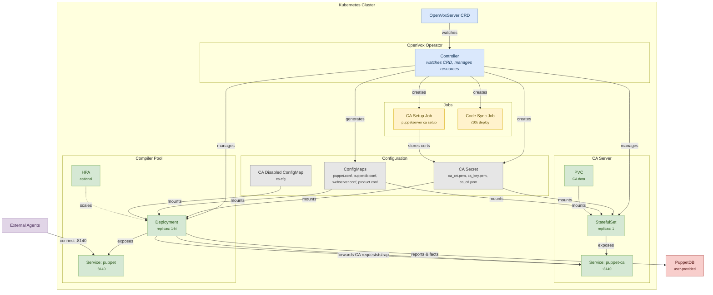

# Architecture

```mermaid
graph TB
    subgraph cluster["Kubernetes Cluster"]
        CRD["OpenVoxServer CRD"]

        subgraph operator["OpenVox Operator"]
            Controller["Controller<br/><i>watches CRD, manages resources</i>"]
        end

        CRD -->|watches| Controller

        subgraph config["Configuration"]
            CM["ConfigMaps<br/><small>puppet.conf, puppetdb.conf,<br/>webserver.conf, product.conf</small>"]
            CASecret["CA Secret<br/><small>ca_crt.pem, ca_key.pem, ca_crl.pem</small>"]
            CADisabled["CA Disabled ConfigMap<br/><small>ca.cfg</small>"]
        end

        Controller -->|generates| CM
        Controller -->|creates| CASecret

        subgraph jobs["Jobs"]
            CASetup["CA Setup Job<br/><small>puppetserver ca setup</small>"]
            CodeSync["Code Sync Job<br/><small>r10k deploy</small>"]
        end

        Controller -->|creates| CASetup
        Controller -->|creates| CodeSync
        CASetup -->|stores certs| CASecret

        subgraph ca["CA Server"]
            CAStatefulSet["StatefulSet<br/><small>replicas: 1</small>"]
            CAPVC["PVC<br/><small>CA data</small>"]
            CASvc["Service: puppet-ca<br/><small>:8140</small>"]
        end

        Controller -->|manages| CAStatefulSet
        CASecret -->|mounts| CAStatefulSet
        CM -->|mounts| CAStatefulSet
        CAPVC -->|mounts| CAStatefulSet
        CAStatefulSet -->|exposes| CASvc

        subgraph compilers["Compiler Pool"]
            CompilerDeploy["Deployment<br/><small>replicas: 1-N</small>"]
            CompilerSvc["Service: puppet<br/><small>:8140</small>"]
            HPA["HPA<br/><small>optional</small>"]
        end

        Controller -->|manages| CompilerDeploy
        CASecret -->|mounts| CompilerDeploy
        CM -->|mounts| CompilerDeploy
        CADisabled -->|mounts| CompilerDeploy
        CompilerDeploy -->|exposes| CompilerSvc
        HPA -.->|scales| CompilerDeploy
        CompilerDeploy -->|ssl bootstrap| CASvc
        CompilerDeploy -->|forwards CA requests| CASvc
    end

    Agents["External Agents"]
    PuppetDB["PuppetDB<br/><small>user-provided</small>"]

    Agents -->|connect :8140| CompilerSvc
    CompilerDeploy -->|reports & facts| PuppetDB

    classDef operator fill:#dae8fc,stroke:#6c8ebf,color:#1a3a5c
    classDef config fill:#e6e6e6,stroke:#999999,color:#333
    classDef job fill:#fff2cc,stroke:#d6a800,color:#5a4a00
    classDef ca fill:#d5e8d4,stroke:#82b366,color:#2d5a1e
    classDef compiler fill:#d5e8d4,stroke:#82b366,color:#2d5a1e
    classDef external fill:#e1d5e7,stroke:#9673a6,color:#4a2d5a
    classDef db fill:#f8cecc,stroke:#b85450,color:#5a1a18

    class Controller operator
    class CM,CASecret,CADisabled config
    class CASetup,CodeSync job
    class CAStatefulSet,CAPVC,CASvc ca
    class CompilerDeploy,CompilerSvc,HPA compiler
    class Agents external
    class PuppetDB db
    class CRD operator
```
