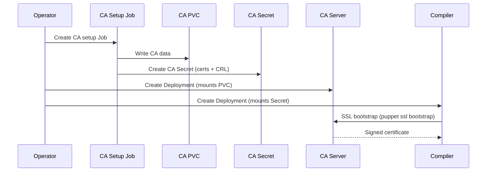

# Architecture

## Overview

The openvox-operator follows the standard Kubernetes operator pattern: a controller watches Custom Resources and reconciles the desired state by creating and managing Kubernetes-native workloads (Deployments, Services, ConfigMaps, Secrets, Jobs).

## CRD Relationships

The operator uses multiple CRDs that reference each other:

```
Environment <-- Server (environmentRef)
Environment <-- Pool (environmentRef)
Environment <-- CodeDeploy (environmentRef)
Pool        <-- Server (poolRef)
```

- An **Environment** is the root resource. It manages the CA lifecycle, generates ConfigMaps for puppet.conf/puppetdb.conf/webserver.conf, and holds shared configuration.
- A **Server** references an Environment and optionally a Pool. It creates a Deployment (with Recreate strategy for CA, RollingUpdate for compilers).
- A **Pool** references an Environment and creates a Kubernetes Service. All Servers that reference the same Pool are selected by this Service.
- A **CodeDeploy** references an Environment and manages r10k as a Job/CronJob with a shared PVC.

## CA Lifecycle

The Certificate Authority is fully managed by the operator:

1. The Environment controller creates a CA setup **Job** that runs `puppetserver ca setup`
2. The Job stores CA certificates in a **PVC** and creates a Kubernetes **Secret** with public CA data (ca_crt.pem, ca_crl.pem)
3. The CA Server mounts the CA PVC directly
4. Compiler Servers mount the CA Secret (read-only) and bootstrap their SSL certificates against the CA Service



## Dedicated ServiceAccounts

Each Environment creates dedicated ServiceAccounts with minimal privileges:

| ServiceAccount | Purpose | K8s API Token |
|---|---|---|
| `{env}-ca-setup` | CA setup job: creates CA certs and writes the CA Secret | Yes |
| `{env}-server` | All server pods (CA + compiler) | No |

The operator itself runs with its own ServiceAccount (managed by the Helm chart) with cluster-wide RBAC.

## Scaling

- **CA Server**: Always a single replica with Recreate deployment strategy (only one pod writes to the CA PVC)
- **Compiler Servers**: Horizontally scalable via `replicas` or HPA. All replicas of a Server share the same certificate from a Secret.
- **Multi-Version**: Multiple Server CRDs with different image tags can join the same Pool for canary deployments

## Code Deployment

The CodeDeploy CRD manages r10k in a separate image. It creates a PVC for code storage that Servers mount read-only.

| Setup | Access Mode | Requirement |
|---|---|---|
| Single-Node (default) | RWO | Any storage provider |
| Multi-Node | RWX | NFS, CephFS, EFS, Longhorn, etc. |

For single-node setups, RWO with pod affinity is sufficient. Multi-node clusters require an RWX-capable storage provider.
