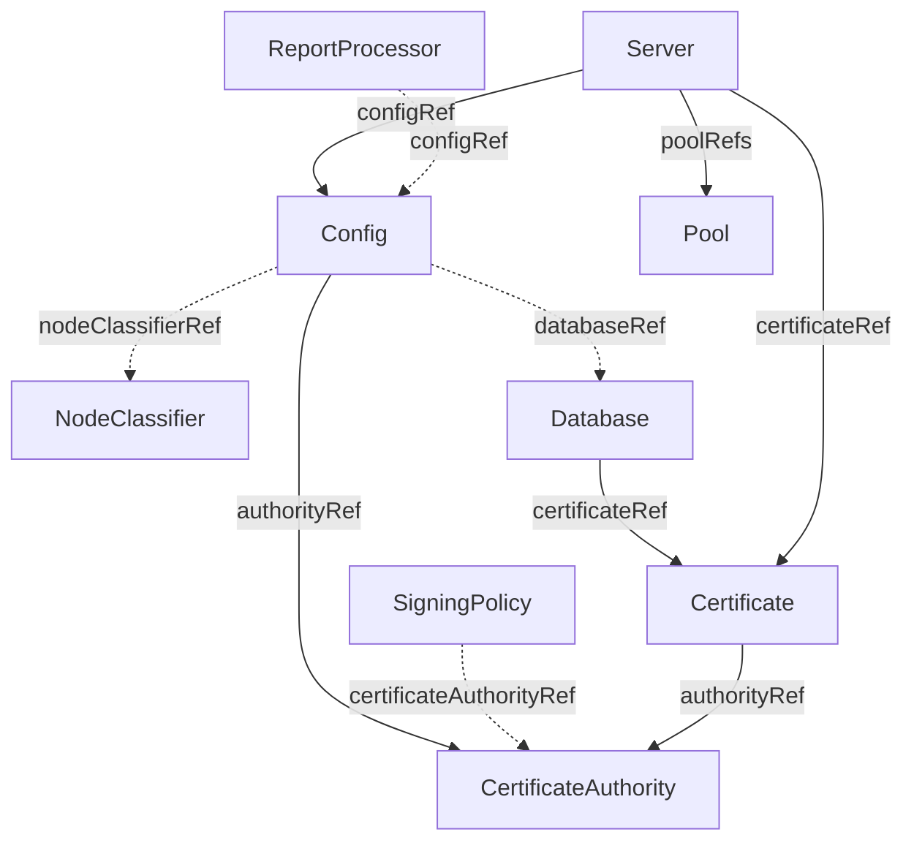
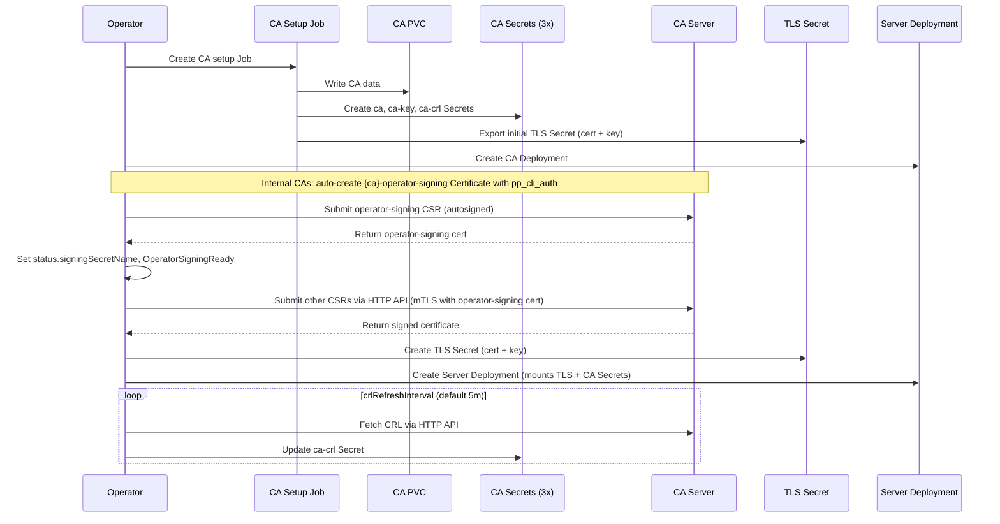

# Architecture

## Overview

The openvox-operator follows the standard Kubernetes operator pattern: a controller watches Custom Resources and reconciles the desired state by creating and managing Kubernetes-native workloads (Deployments, Services, ConfigMaps, Secrets, Jobs).

## CRD Relationships

The operator uses multiple CRDs that form a hierarchy:

- A **Config** is the root resource. It generates ConfigMaps for puppet.conf/puppetdb.conf/webserver.conf and holds shared configuration.
- A **CertificateAuthority** is a standalone resource managing the CA infrastructure: PVC, setup Job, and CA Secret. A Config references it via `authorityRef`.
- A **SigningPolicy** is an optional resource that references a CertificateAuthority and defines declarative CSR signing rules (any, pattern match, or CSR attribute match). The Config controller renders all SigningPolicies into an autosign policy file. If no SigningPolicy exists, autosigning is disabled.
- A **NodeClassifier** is an optional standalone resource defining an External Node Classifier endpoint. A Config references it via `nodeClassifierRef`. The Config controller renders the classifier configuration into an ENC Secret, and puppet.conf gets `node_terminus = exec`. See [External Node Classification](external-node-classification.md).
- A **ReportProcessor** is an optional standalone resource that defines an external endpoint for Puppet run reports. One or more ReportProcessors can reference the same Config via `configRef`. The Config controller collects all matching ReportProcessors, renders a `report-webhook.yaml` config, and sets `reports = webhook` in puppet.conf. A minimal Ruby shim (`webhook.rb`) pipes each report as JSON to the `openvox-report` binary, which forwards it to all configured endpoints. Supports built-in PuppetDB wire format v8 (`processor: puppetdb`) and generic HTTP webhooks with configurable auth (mTLS, Bearer, Basic, custom headers). See [Report Processing](report-processing.md).
- A **Certificate** references a CertificateAuthority and manages the lifecycle of a single certificate: signing Job and TLS Secret.
- A **Database** creates a Deployment of OpenVox DB pods. It references a Certificate for SSL and connects to an external PostgreSQL instance. A Config can reference a Database via `databaseRef` to automatically wire the PuppetDB connection URL from its `status.url`.
- A **Server** references a Config and a Certificate. It creates a Deployment (with Recreate strategy for CA, RollingUpdate for servers). The Server waits for the Certificate to reach the `Signed` phase before creating its Deployment. A Server declares pool membership via `poolRefs`.
- A **Pool** is a pure networking resource that creates a Kubernetes Service. Servers join a Pool by listing its name in their `poolRefs`.

## Why Separate CRDs for CA and Certificates?

Traditional Puppet/OpenVox Server bundles CA management, certificate signing, and server runtime into a single process. This works on VMs where `puppetserver ca` (a CRuby CLI) manages everything locally. This operator deliberately ships **no agent Ruby** - only JRuby embedded in the server JAR - to keep the image small and reduce the update surface. CA operations are handled through a custom JRuby wrapper that calls `clojure.main` instead.

By separating the CA lifecycle (`CertificateAuthority`) from certificate signing (`Certificate`) and from the server runtime (`Server`), each concern becomes independently manageable. Certificates can be issued before a server is running, revoked without restarting pods, and the CA can be initialized once while multiple servers share the same signed certificate for horizontal scaling.

## CA Lifecycle

The Certificate Authority is managed by the CertificateAuthority controller:

1. The CertificateAuthority controller creates a **PVC** for CA data, an internal **ClusterIP Service** (`{name}-internal`), and a **Job** that runs `puppetserver ca setup`
2. The Job stores CA keys on the PVC and creates three Kubernetes **Secrets**:
   - `{name}-ca` -- public CA certificate (`ca_crt.pem`)
   - `{name}-ca-key` -- CA private key (`ca_key.pem`, never mounted in pods)
   - `{name}-ca-crl` -- CRL data (`ca_crl.pem`, `infra_crl.pem`)
3. The CertificateAuthority transitions to the `Ready` phase
4. For internal CAs, the controller creates an auto-managed `{name}-operator-signing` Certificate carrying the `pp_cli_auth` extension. Once signed, its TLS Secret (`{name}-operator-signing-tls`) becomes the operator's mTLS credential for HTTP-based CSR signing. `status.signingSecretName` is populated and the `OperatorSigningReady` condition is set to `True`. External CAs skip this step.
5. The controller periodically fetches the CRL from the internal Service and updates the CRL Secret (configurable via `crlRefreshInterval`, default `5m`)

The internal Service (`{name}-internal`) is used exclusively by the operator for CSR signing and CRL refresh. Its FQDN is automatically added as a SAN to the CA server certificate. This is separate from the Pool Service, which users can configure as ClusterIP, LoadBalancer, or NodePort for external access.

The operator-signing certificate is decoupled from the CA server certificate so that signing credentials can be rotated or revoked independently from the CA's identity. See [Certificate Signing](certificate-signing.md#operator-signing-certificate) for details.

## Certificate Lifecycle

Certificates are managed by the Certificate controller:

1. The Certificate controller waits for the referenced CertificateAuthority to be `Ready`
2. It determines the signing strategy:
   - **CA setup export**: The first Certificate (created with the CA) gets its cert+key exported directly by the CA setup Job
   - **HTTP signing**: Additional Certificates are signed by the operator in-process -- it generates an RSA key pair, submits a CSR to the Puppet CA HTTP API, and polls for the signed certificate
3. The controller creates a TLS **Secret** with cert.pem and key.pem
4. The Certificate transitions to the `Signed` phase

## Dedicated ServiceAccounts

The operator creates dedicated ServiceAccounts with minimal privileges:

| ServiceAccount | Created by | Purpose | K8s API Token |
|---|---|---|---|
| `{cfg}-server` | Config controller | All server pods | No (`automountServiceAccountToken: false`) |
| `{ca}-ca-setup` | CertificateAuthority controller | CA setup job: creates CA Secrets | Yes (scoped to `{ca}-ca`, `{ca}-ca-key`, `{ca}-ca-crl` Secrets) |

The operator itself runs with its own ServiceAccount (managed by the Helm chart) with cluster-wide RBAC.

## Pod Volumes

Server pods can optionally use `readOnlyRootFilesystem: true` for security hardening. This is controlled by the `.spec.readOnlyRootFilesystem` field in the Config CRD (default: `false`). When enabled, all writable paths are backed by emptyDir volumes and `server-var-dir` is redirected to `/run/puppetserver`. All configuration comes from ConfigMaps and Secrets. This section documents every volume mounted into Server and CA pods.

### Server Pod Volumes

| Volume | Type | Mount Path | RO | Purpose |
|--------|------|------------|-----|---------|
| `ssl` | emptyDir | `/etc/puppetlabs/puppet/ssl` | No | SSL directory, populated by init container from Secret volumes |
| `ssl-cert` | Secret | `/ssl-cert` (init container only) | Yes | TLS certificate + private key from Certificate CRD |
| `ssl-ca` | Secret | `/ssl-ca` (init container only) | Yes | CA certificate from CertificateAuthority CRD |
| `ssl-ca-crl` | Secret | `/etc/puppetlabs/puppet/crl` | Yes | CRL data (non-CA pods only, auto-synced by kubelet) |
| `puppet-conf` | ConfigMap | `.../puppet/puppet.conf` | Yes | Puppet agent/server configuration |
| `puppetdb-conf` | ConfigMap | `.../puppet/puppetdb.conf` | Yes | OpenVox DB connection settings |
| `puppetserver-conf` | ConfigMap | `.../conf.d/puppetserver.conf` | Yes | JRuby, HTTP client, and profiler settings |
| `webserver-conf` | ConfigMap | `.../conf.d/webserver.conf` | Yes | Jetty webserver and TLS configuration |
| `auth-conf` | ConfigMap | `.../conf.d/auth.conf` | Yes | Puppet Server authorization rules (HOCON) |
| `ca-conf` | ConfigMap | `.../conf.d/ca.conf` | Yes | CA endpoint configuration |
| `ca-cfg` | ConfigMap | `.../services.d/ca.cfg` | Yes | Service bootstrap (CA enabled/disabled) |
| `product-conf` | ConfigMap | `.../conf.d/product.conf` | Yes | Product telemetry settings |
| `logback-xml` | ConfigMap | `.../puppetserver/logback.xml` | Yes | Logging configuration |
| `metrics-conf` | ConfigMap | `.../conf.d/metrics.conf` | Yes | Metrics endpoint configuration |
| `puppetserver-data` | emptyDir | `/run/puppetserver` | No | Server runtime data (`server-var-dir`) |
| `tmp` | emptyDir | `/tmp` | No | Temporary files |
| `var-log` | emptyDir | `/var/log/puppetlabs` | No | Server logs |

**CA-only volumes** (additional when `server.spec.ca: true`):

| Volume | Type | Mount Path | RO | Purpose |
|--------|------|------------|-----|---------|
| `ca-data` | PVC | `/etc/puppetlabs/puppetserver/ca` | No | CA private keys and signed certificates |
| `autosign-policy` | Secret | `.../puppet/autosign-policy.yaml` | Yes | Autosign policy rendered from SigningPolicy CRDs |

**Code volume** (when `code` is configured):

| Volume | Type | Mount Path | RO | Purpose |
|--------|------|------------|-----|---------|
| `code` | OCI Image or PVC | `/etc/puppetlabs/code` | Yes | Puppet environments and modules |

### CA Setup Job Volumes

The CA setup Job runs once to initialize the Certificate Authority. It uses a minimal set of volumes:

| Volume | Type | Mount Path | RO | Purpose |
|--------|------|------------|-----|---------|
| `ca-data` | PVC | `/etc/puppetlabs/puppetserver/ca` | No | CA data (persisted across restarts) |
| `ssl` | emptyDir | `/etc/puppetlabs/puppet/ssl` | No | Temporary SSL workspace |
| `puppet-conf` | ConfigMap | `.../puppet/puppet.conf` | Yes | Puppet configuration |
| `puppetserver-conf` | ConfigMap | `.../conf.d/puppetserver.conf` | Yes | JRuby and directory path settings |
| `puppetserver-data` | emptyDir | `/run/puppetserver` | No | Server runtime data (`server-var-dir`) |
| `tmp` | emptyDir | `/tmp` | No | Temporary files |

### Why `/run/puppetserver` Instead of the Default Path?

The container image bundles JRuby gems and libraries under the default `server-var-dir` path (`/opt/puppetlabs/server/data/puppetserver/`):

- `jruby-gems/` -- JRuby gem home (installed during image build)
- `vendored-jruby-gems/` -- Vendored gems including `openvoxserver-ca` and its dependencies
- `jars/` -- Server JAR files
- `lib/` -- Puppet Ruby libraries

Puppet Server creates runtime subdirectories (yaml, state, lib, preview, server_data, facts.d, locales) under `server-var-dir` at startup. Mounting an emptyDir over the default path would hide the bundled files, causing gem resolution failures. Instead, the operator reconfigures `server-var-dir` to `/run/puppetserver` (a writable emptyDir) via `puppetserver.conf`, keeping `gem-home` and `gem-path` pointing to the original read-only image paths.

## Scaling

- **CA Server**: Always a single replica with Recreate deployment strategy (only one pod writes to the CA PVC)
- **Servers**: Horizontally scalable via `replicas` or HPA. All replicas of a Server share the same certificate from a Secret.
- **Multi-Version**: Multiple Server CRDs with different image tags can join the same Pool for canary deployments

## Code Deployment

Puppet code is deployed to Server pods via the `CodeSpec` on the Config or Server CRD. Two modes are supported:

### OCI Image Volume (recommended)

Package Puppet code as an OCI image and reference it in the Config's `code.image` field. The operator mounts it as a read-only image volume (Kubernetes 1.35+, or 1.31+ with the `ImageVolume` feature gate). Code changes are rolled out by updating the image reference.

### PVC

Reference an existing PVC via `code.claimName`. The PVC must contain the Puppet environments directory. Suitable for setups where code is deployed externally (e.g. CI/CD pipeline writing to a shared volume).

See [Code Deployment](code-deployment.md) for the full guide.

## Why a New Approach?

Traditional Puppet/OpenVox Server installations on VMs use OS packages that install both the agent Ruby (a dedicated CRuby shipped with the agent packages) and the server JAR with its embedded JRuby. Existing container images carry this VM-centric approach into containers, leading to several problems in a Kubernetes context.

### ezbake Legacy

Upstream OpenVox Server uses ezbake for packaging. It generates init scripts that start as root and switch to the puppet user via `runuser`/`su`/`sudo`. This breaks rootless containers and OpenShift random UIDs.

### Duplicate Ruby Installation

The server needs JRuby (embedded in the JAR) for runtime. Existing containers additionally install the agent Ruby + the openvox gem just so entrypoint scripts can call `puppet config set/print`. This is unnecessary when configuration comes via ConfigMaps.

### Docker Logic in Kubernetes

Existing images use ~15 entrypoint scripts that translate environment variables into config files. This is a Docker-Compose pattern. In Kubernetes, the operator renders configuration into ConfigMaps and Secrets directly.

### No Role Separation

Existing containers decide at startup whether to run as CA or server based on environment variables. In Kubernetes, the operator handles orchestration and role assignment through the CRD model.

## How openvox-operator Differs

| | VM-based / Docker | openvox-operator |
|---|---|---|
| **Ruby** | Agent Ruby (CRuby) alongside JRuby | No agent Ruby - only JRuby in the server JAR |
| **Configuration** | `puppet config set`, entrypoint scripts, ENV vars | Declarative CRDs, operator renders ConfigMaps |
| **Privileges** | Requires root | Fully rootless, random UID compatible |
| **CA Management** | `puppetserver ca` CLI (CRuby) | Custom JRuby wrapper via `clojure.main` |
| **Certificates** | Each server has its own certificate | `Certificate` CRD manages the cert lifecycle - all replicas of a Server share one certificate |
| **CSR Signing** | `autosign.conf` or Ruby scripts | `SigningPolicy` CRD with declarative rules (any, pattern, CSR attributes, DNS SAN validation) |
| **CRL** | File on disk, manual refresh | Split Secret (`{ca}-ca-crl`), operator-driven periodic refresh via CA HTTP API |
| **Scaling** | Manual VM provisioning | Deployment replicas + HPA |
| **Code Deployment** | r10k on the VM, cron/webhook | OCI image volumes or PVC - code packaged as immutable container images |
| **Traffic Routing** | DNS round-robin or hardware load balancer per environment | Gateway API TLSRoute with SNI-based routing - share a single LoadBalancer across environments |
| **Multi-Version** | Separate VMs or package pinning | Multiple Servers in the same Pool |

## Container Image

The operator uses a minimal container image:

**Included:**

- UBI9 + JDK 17
- Tarball installation (puppet-server-release.jar, CLI tools, vendored JRuby gems)
- OpenVox DB termini
- OpenShift random-UID pattern (chgrp 0, chmod g=u)
- Direct `java` entrypoint (no wrapper scripts)

**Removed (compared to upstream images):**

- All entrypoint.d scripts
- Agent Ruby and openvox gem
- Gemfile / bundle install / ruby-devel / gcc / make
- ENV var to config translation logic
- Docker-Compose support
