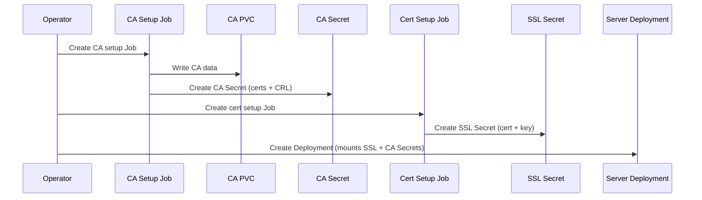

# Architecture

## Overview

The openvox-operator follows the standard Kubernetes operator pattern: a controller watches Custom Resources and reconciles the desired state by creating and managing Kubernetes-native workloads (Deployments, Services, ConfigMaps, Secrets, Jobs).

## CRD Relationships

The operator uses multiple CRDs that form a hierarchy:

```
Environment
  └─ CertificateAuthority (environmentRef → Environment)
       └─ Certificate (authorityRef → CertificateAuthority)
            └─ Server (certificateRef → Certificate, environmentRef → Environment)
                 └─ Pool (selector → Server Pods, environmentRef → Environment)
```

- An **Environment** is the root resource. It generates ConfigMaps for puppet.conf/puppetdb.conf/webserver.conf and holds shared configuration.
- A **CertificateAuthority** references an Environment and manages the CA infrastructure: PVC, setup Job, and CA Secret.
- A **Certificate** references a CertificateAuthority and manages the lifecycle of a single certificate: signing Job and SSL Secret.
- A **Server** references an Environment and a Certificate. It creates a Deployment (with Recreate strategy for CA, RollingUpdate for servers). The Server waits for the Certificate to reach the `Signed` phase before creating its Deployment.
- A **Pool** references an Environment and creates a Kubernetes Service. Server pods are selected by label.

## CA Lifecycle

The Certificate Authority is managed by the CertificateAuthority controller:

1. The CertificateAuthority controller creates a **PVC** for CA data and a **Job** that runs `puppetserver ca setup`
2. The Job stores CA keys on the PVC and creates a Kubernetes **Secret** with public CA data (ca_crt.pem, ca_crl.pem, infra_crl.pem)
3. The CertificateAuthority transitions to the `Ready` phase

## Certificate Lifecycle

Certificates are managed by the Certificate controller:

1. The Certificate controller waits for the referenced CertificateAuthority to be `Ready`
2. It determines the signing strategy:
   - **Local signing**: If no CA server is running, the Job mounts the CA PVC directly and signs locally
   - **HTTP bootstrap**: If a CA server is running, the Job runs `puppet ssl bootstrap` against the CA service
3. The Job creates an SSL **Secret** with cert.pem and key.pem
4. The Certificate transitions to the `Signed` phase



## Dedicated ServiceAccounts

The operator creates dedicated ServiceAccounts with minimal privileges:

| ServiceAccount | Created by | Purpose | K8s API Token |
|---|---|---|---|
| `{env}-server` | Environment controller | All server pods | No (`automountServiceAccountToken: false`) |
| `{ca}-ca-setup` | CertificateAuthority controller | CA setup job: creates CA Secret | Yes (scoped to CA Secret) |
| `{cert}-cert-setup` | Certificate controller | Cert setup job: creates SSL Secret | Yes (scoped to SSL + CA Secrets) |

The operator itself runs with its own ServiceAccount (managed by the Helm chart) with cluster-wide RBAC.

## Scaling

- **CA Server**: Always a single replica with Recreate deployment strategy (only one pod writes to the CA PVC)
- **Servers**: Horizontally scalable via `replicas` or HPA. All replicas of a Server share the same certificate from a Secret.
- **Multi-Version**: Multiple Server CRDs with different image tags can join the same Pool for canary deployments

## Code Deployment

The CodeDeploy CRD (planned) manages r10k in a separate image. It creates a PVC for code storage that Servers mount read-only.

| Setup | Access Mode | Requirement |
|---|---|---|
| Single-Node (default) | RWO | Any storage provider |
| Multi-Node | RWX | NFS, CephFS, EFS, Longhorn, etc. |

For single-node setups, RWO with pod affinity is sufficient. Multi-node clusters require an RWX-capable storage provider.
