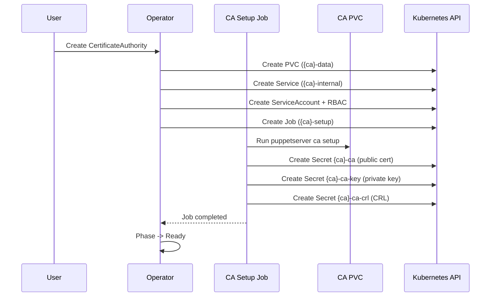
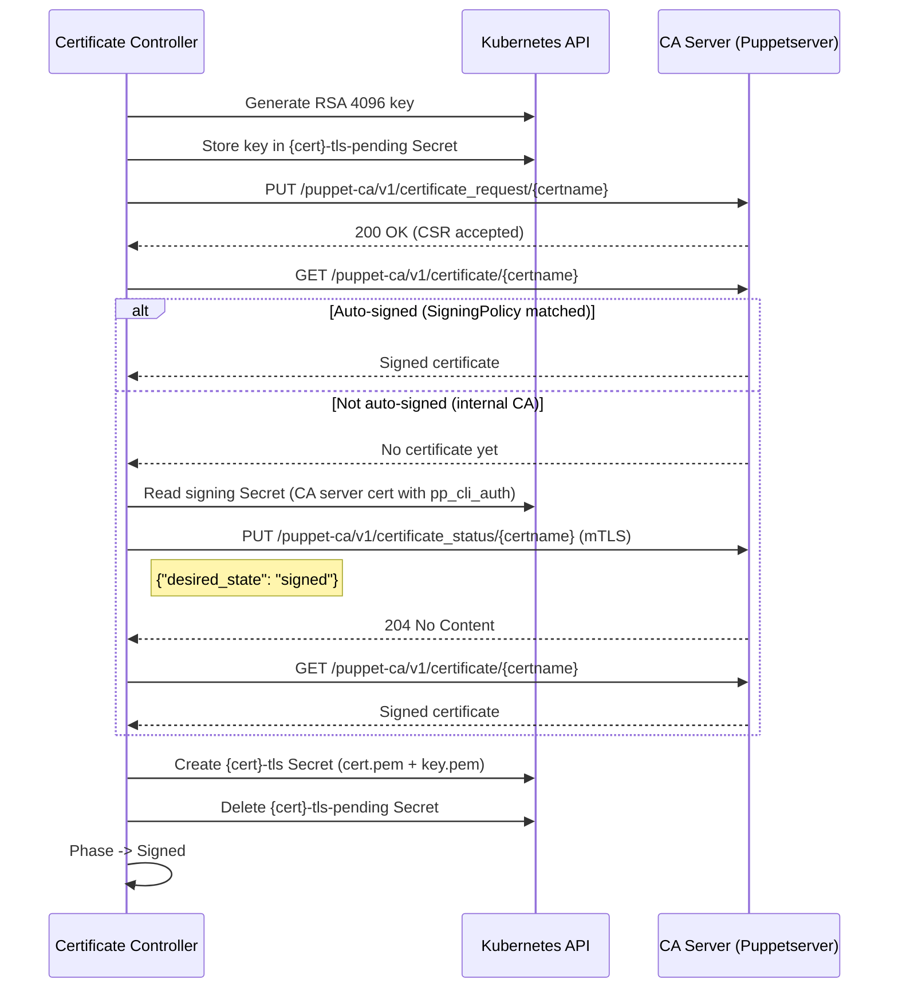

# Certificate Signing

This guide explains how the operator bootstraps a Certificate Authority, signs certificates, and distributes CRLs.

## CA Bootstrap

When a CertificateAuthority resource is created, the operator runs a setup Job that initializes the CA on a PVC:



The setup Job:

1. Runs `puppetserver ca setup` on the PVC to generate the CA key pair and self-signed certificate
2. Exports three Secrets via the Kubernetes API:
    - **`{ca}-ca`** - public CA certificate (`ca_crt.pem`), mounted in all pods
    - **`{ca}-ca-key`** - CA private key (`ca_key.pem`), never mounted in pods
    - **`{ca}-ca-crl`** - certificate revocation list, mounted in non-CA pods
3. If a Certificate resource already exists for the CA server, the Job also signs and exports its TLS Secret

The Job is idempotent: if the CA is already initialized on the PVC, it skips setup and only ensures the Secrets exist.

### Operator Signing Certificate

For internal CAs (i.e. when `spec.external` is not set), the CertificateAuthority controller automatically creates a dedicated `Certificate` named `{ca}-operator-signing` once the CA reaches `Ready`. This Certificate carries the `pp_cli_auth` CSR extension which authorizes its bearer to call the CA's certificate signing endpoint via the HTTP API.

Once the operator-signing Certificate is itself `Signed`, the controller:

1. Sets `status.signingSecretName` on the CertificateAuthority to the resulting TLS Secret name (`{ca}-operator-signing-tls`)
2. Sets the `OperatorSigningReady` condition to `True`

From this point on, the Certificate controller uses this Secret for mTLS-authenticated CSR signing against the CA HTTP API (see Strategy 2 below). The operator never reuses the CA server's own certificate for signing -- the operator signing cert is rotated independently and can be revoked without disrupting CA traffic.

External CAs do not get an operator-signing Certificate: they manage their own signing credentials externally.

## Certificate Signing Strategies

The operator uses two strategies depending on when the Certificate is created relative to the CA:

### Strategy 1: CA Setup Export

**When:** The Certificate exists before or at the same time as the CA setup Job runs.

The CA setup Job signs the certificate as part of the initial `puppetserver ca setup` and exports the cert+key directly as a Kubernetes Secret. The Certificate controller detects the existing Secret, adopts it (sets ownerReference), and marks the Certificate as `Signed`.

This is the typical path for the **CA server's own certificate**.

### Strategy 2: HTTP Signing

**When:** The Certificate is created after the CA is already `Ready`.

This is the typical path for **non-CA compile servers**:



The controller:

1. Generates an RSA 4096-bit private key and stores it in a temporary `{cert}-tls-pending` Secret
2. Creates a CSR with the configured `certname` and `dnsAltNames`
3. Submits the CSR via HTTP PUT to the CA server's Puppetserver API
4. Checks if the certificate was auto-signed (e.g. by a matching SigningPolicy)
5. If not auto-signed and the CA has a signing secret (`status.signingSecretName`), the operator signs the CSR directly via the CA HTTP API using mTLS with the operator-signing certificate (the auto-managed `{ca}-operator-signing` cert with the `pp_cli_auth` extension required by `auth.conf`)
6. Once signed, creates the final `{cert}-tls` Secret and deletes the pending Secret

For **external CAs** (where `spec.external` is set), the operator does not attempt to sign the CSR itself. Instead, it falls back to polling until the certificate is signed externally or via the external CA's own autosign mechanism.

The pending Secret ensures idempotency: if the controller restarts mid-signing, it reuses the same key instead of generating a new one.

### CSR Poll Backoff

Polling for a signed certificate uses exponential backoff to avoid hammering the CA when a CSR is awaiting manual signing or external autosign. After 10 unsuccessful poll attempts the Certificate moves into the `WaitingForSigning` phase. The poll interval is:

| Attempts | Interval |
|---|---|
| 0-2 | 5s |
| 3-5 | 30s |
| 6-9 | 2m |
| 10+ | 5m |

The attempt counter is stored as the annotation `openvox.voxpupuli.org/csr-poll-attempts` on the pending Secret `{cert}-tls-pending`. Manual resolution from the CA pod:

```bash
puppetserver ca sign --certname <certname>
```

The controller picks up the signed certificate on the next poll cycle.

### CSR Extensions

The `Certificate` CRD's `csrExtensions` field lets you embed Puppet CSR extension attributes into the request. The controller wires these into the CSR before submission. Supported extensions:

| Field | Purpose |
|---|---|
| `ppCliAuth: true` | Adds `pp_cli_auth=true`, granting the certificate authority to call the CA signing endpoint. Used by the auto-managed operator-signing cert. |
| `ppRole` | Sets `pp_role` -- often consumed by ENC or trusted facts. |
| `ppEnvironment` | Sets `pp_environment`. |
| `customExtensions` | Map of arbitrary `pp_*` extension names to string values. |

A SigningPolicy can match on these extensions via `csrAttributes` to restrict which CSRs may be auto-signed. See [Certificate](../reference/certificate.md#csr-extensions) for the full schema and examples.

### Service Discovery

The Certificate controller connects to the CA via the internal Service created by the CertificateAuthority controller:

- **Internal CA:** `https://{ca-name}-internal.{namespace}.svc:8140`
- **External CA:** Uses the URL from `spec.external.url`

The internal Service FQDN is automatically added as a SAN to the CA server certificate during CA setup, so TLS validation works without manual configuration. No Pool or Server discovery is needed.

## CRL Distribution

The operator periodically fetches the CRL from the CA server and stores it as a Secret:

1. Fetches CRL from `https://{ca-service}:8140/puppet-ca/v1/certificate_revocation_list/ca`
2. Updates the `{ca}-ca-crl` Secret with the fresh CRL
3. Requeues after `spec.crlRefreshInterval` (default: 5 minutes)

Non-CA pods mount the CRL Secret as a **directory volume** (without SubPath), which allows kubelet to auto-sync the content without pod restarts. CA pods read the CRL directly from their PVC.

## Secrets Overview

| Secret | Contents | Created By | Mounted In |
|--------|----------|------------|------------|
| `{ca}-ca` | `ca_crt.pem` | CA setup Job | All pods (trust chain) |
| `{ca}-ca-key` | `ca_key.pem` | CA setup Job | Never (API access only) |
| `{ca}-ca-crl` | `ca_crl.pem` | CA setup Job, then operator refresh | Non-CA pods (directory mount) |
| `{cert}-tls` | `cert.pem`, `key.pem` | CA setup Job or Certificate controller | Server pods (SSL) |
| `{cert}-tls-pending` | `key.pem` | Certificate controller | Never (temporary, deleted after signing) |

## Phase Lifecycle

### CertificateAuthority

```
Pending -> Initializing -> Ready
                |
                v
              Error
```

| Phase | Description |
|-------|-------------|
| `Pending` | Waiting for Config with `authorityRef` pointing to this CA |
| `Initializing` | CA setup Job is running |
| `Ready` | CA Secrets created, certificates can be signed |
| `Error` | Setup Job failed (retried up to 3 times) |

### Certificate

```
Pending -> Requesting -> WaitingForSigning -> Signed
              |                  |
              +------> Error <---+
```

| Phase | Description |
|-------|-------------|
| `Pending` | Waiting for CertificateAuthority to reach `Ready` (or `External`) |
| `Requesting` | CSR submitted, polling for signed certificate |
| `WaitingForSigning` | Polled 10+ times without success, backed off to a longer poll interval |
| `Signed` | TLS Secret created, Server can mount it |
| `Error` | Signing failed |

For the full CRD reference, see [Certificate](../reference/certificate.md).
