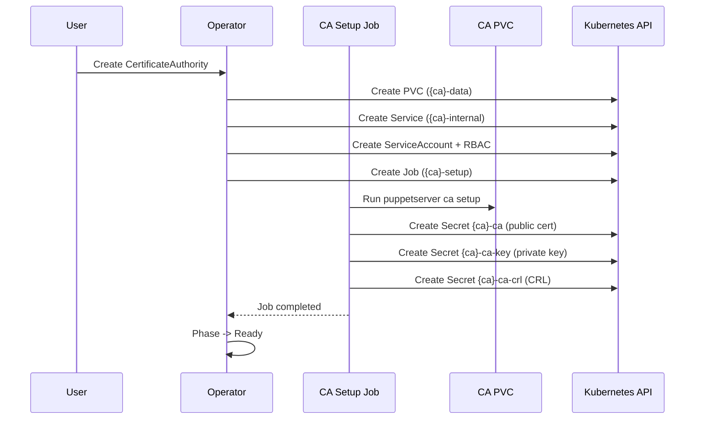
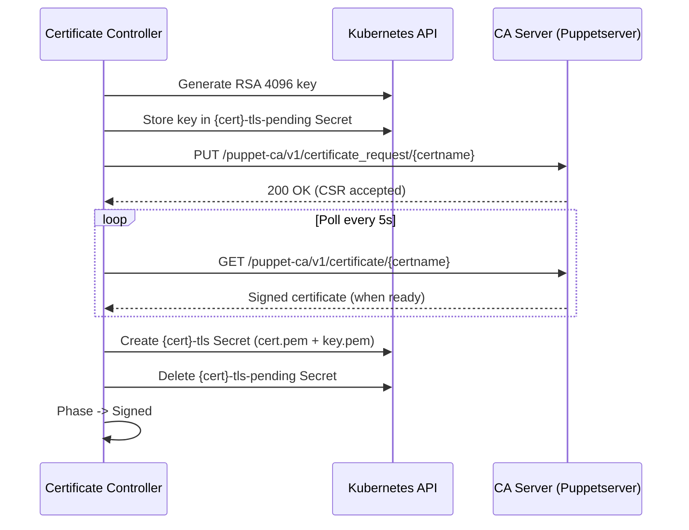

# Certificate Signing

This guide explains how the operator bootstraps a Certificate Authority, signs certificates, and distributes CRLs.

## CA Bootstrap

When a CertificateAuthority resource is created, the operator runs a setup Job that initializes the CA on a PVC:



The setup Job:

1. Runs `puppetserver ca setup` on the PVC to generate the CA key pair and self-signed certificate
2. Exports three Secrets via the Kubernetes API:
    - **`{ca}-ca`** - public CA certificate (`ca_crt.pem`), mounted in all pods
    - **`{ca}-ca-key`** - CA private key (`ca_key.pem`), never mounted in pods
    - **`{ca}-ca-crl`** - certificate revocation list, mounted in non-CA pods
3. If a Certificate resource already exists for the CA server, the Job also signs and exports its TLS Secret

The Job is idempotent: if the CA is already initialized on the PVC, it skips setup and only ensures the Secrets exist.

## Certificate Signing Strategies

The operator uses two strategies depending on when the Certificate is created relative to the CA:

### Strategy 1: CA Setup Export

**When:** The Certificate exists before or at the same time as the CA setup Job runs.

The CA setup Job signs the certificate as part of the initial `puppetserver ca setup` and exports the cert+key directly as a Kubernetes Secret. The Certificate controller detects the existing Secret, adopts it (sets ownerReference), and marks the Certificate as `Signed`.

This is the typical path for the **CA server's own certificate**.

### Strategy 2: HTTP Signing

**When:** The Certificate is created after the CA is already `Ready`.

This is the typical path for **non-CA compile servers**:



The controller:

1. Generates an RSA 4096-bit private key and stores it in a temporary `{cert}-tls-pending` Secret
2. Creates a CSR with the configured `certname` and `dnsAltNames`
3. Submits the CSR via HTTP PUT to the CA server's Puppetserver API
4. Polls for the signed certificate via HTTP GET (every 5 seconds)
5. Once signed, creates the final `{cert}-tls` Secret and deletes the pending Secret

The pending Secret ensures idempotency: if the controller restarts mid-signing, it reuses the same key instead of generating a new one.

### Service Discovery

The Certificate controller connects to the CA via the internal Service created by the CertificateAuthority controller:

- **Internal CA:** `https://{ca-name}-internal.{namespace}.svc:8140`
- **External CA:** Uses the URL from `spec.external.url`

The internal Service FQDN is automatically added as a SAN to the CA server certificate during CA setup, so TLS validation works without manual configuration. No Pool or Server discovery is needed.

## CRL Distribution

The operator periodically fetches the CRL from the CA server and stores it as a Secret:

1. Fetches CRL from `https://{ca-service}:8140/puppet-ca/v1/certificate_revocation_list/ca`
2. Updates the `{ca}-ca-crl` Secret with the fresh CRL
3. Requeues after `spec.crlRefreshInterval` (default: 5 minutes)

Non-CA pods mount the CRL Secret as a **directory volume** (without SubPath), which allows kubelet to auto-sync the content without pod restarts. CA pods read the CRL directly from their PVC.

## Secrets Overview

| Secret | Contents | Created By | Mounted In |
|--------|----------|------------|------------|
| `{ca}-ca` | `ca_crt.pem` | CA setup Job | All pods (trust chain) |
| `{ca}-ca-key` | `ca_key.pem` | CA setup Job | Never (API access only) |
| `{ca}-ca-crl` | `ca_crl.pem` | CA setup Job, then operator refresh | Non-CA pods (directory mount) |
| `{cert}-tls` | `cert.pem`, `key.pem` | CA setup Job or Certificate controller | Server pods (SSL) |
| `{cert}-tls-pending` | `key.pem` | Certificate controller | Never (temporary, deleted after signing) |

## Phase Lifecycle

### CertificateAuthority

```
Pending -> Initializing -> Ready
                |
                v
              Error
```

| Phase | Description |
|-------|-------------|
| `Pending` | Waiting for Config with `authorityRef` pointing to this CA |
| `Initializing` | CA setup Job is running |
| `Ready` | CA Secrets created, certificates can be signed |
| `Error` | Setup Job failed (retried up to 3 times) |

### Certificate

```
Pending -> Requesting -> Signed
              |
              v
            Error
```

| Phase | Description |
|-------|-------------|
| `Pending` | Waiting for CertificateAuthority to reach `Ready` |
| `Requesting` | CSR submitted, polling for signed certificate |
| `Signed` | TLS Secret created, Server can mount it |
| `Error` | Signing failed |
