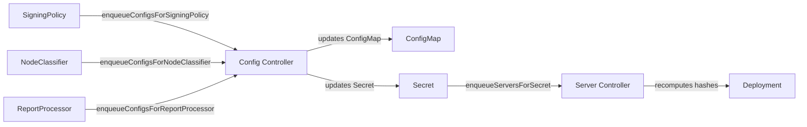

# Configuration Rollout

This guide explains how configuration changes propagate to Server pods and which changes require a pod restart.

## Hash-Based Rolling Restarts

The Server controller adds SHA256 hash annotations to the pod template. When any tracked hash changes, Kubernetes detects a pod template change and triggers a rolling restart (or recreate for CA pods).

Tracked annotations:

| Annotation | Source | Triggers Restart |
|------------|--------|:---:|
| `openvox.voxpupuli.org/config-hash` | ConfigMap (`{config}-config`) | Yes |
| `openvox.voxpupuli.org/ssl-secret-hash` | SSL Secret (`{cert}-tls`) | Yes |
| `openvox.voxpupuli.org/ca-secret-hash` | CA Secret (`{ca}-ca`) | Yes |
| `openvox.voxpupuli.org/enc-secret-hash` | ENC Secret (`{config}-enc`) | Yes |
| `openvox.voxpupuli.org/report-webhook-secret-hash` | Report webhook Secret (`{config}-report-webhook`) | Yes |
| `openvox.voxpupuli.org/code-image` | Code OCI image reference | Yes |

## What Triggers a Restart

Any change to the Config CRD spec fields that affect the ConfigMap causes a rolling restart:

| Changed Field | Affected File | Restart |
|---------------|---------------|:---:|
| `puppet.*` | `puppet.conf` | Yes |
| `puppetdb.*` | `puppetdb.conf` | Yes |
| `puppetserver.*` | `puppetserver.conf`, `webserver.conf`, `auth.conf` | Yes |
| `logging.*` | `logback.xml` | Yes |
| `metrics.*` | `metrics.conf` | Yes |

Changes to CRDs that generate Secrets with tracked hashes also trigger restarts:

| Changed CRD | Generated Secret | Restart |
|--------------|-----------------|:---:|
| NodeClassifier | `{config}-enc` | Yes |
| ReportProcessor | `{config}-report-webhook` | Yes |

## What Does NOT Trigger a Restart

| Changed CRD | Generated Secret | Restart | How It Propagates |
|--------------|-----------------|:---:|-------------------|
| SigningPolicy | `{ca}-autosign-policy` | No | `openvox-autosign` reads the policy file on every CSR signing request. The Secret is not tracked in pod annotations. |
| CRL updates (non-CA) | `{ca}-ca-crl` | No | Mounted as a directory volume (without SubPath), which kubelet auto-syncs every ~60 seconds. |

## Controller Watch Mechanics

The operator uses a chain of watches to propagate changes from sub-resources to the correct Servers:

1. **SigningPolicy/NodeClassifier/ReportProcessor changes** trigger the Config controller via custom watch handlers
2. The **Config controller** reconciles the ConfigMap and Secrets
3. **Secret changes** trigger the Server controller via a Secret watcher (filtered by `app.kubernetes.io/managed-by: openvox-operator` label)
4. The **Server controller** recomputes all hash annotations on the pod template
5. If any hash changed, Kubernetes performs a **rolling restart**

## Rollout Strategy

| Server Role | Strategy | Reason |
|-------------|----------|--------|
| CA (`ca: true`) | `Recreate` | Only one pod can write to the CA PVC at a time |
| Non-CA | `RollingUpdate` | Zero-downtime updates for stateless catalog compilation |

## Common Scenarios

### Updating a Puppet Setting

Changing `spec.puppet.environmentTimeout` on a Config:

1. Config controller updates the ConfigMap (`puppet.conf` changes)
2. Server controller detects updated `config-hash` annotation
3. Rolling restart of all Servers referencing this Config

### Adding a Signing Policy

Creating or updating a SigningPolicy:

1. Config controller is triggered via SigningPolicy watcher
2. Autosign policy Secret is updated
3. Server controller is triggered but autosign hash is **not tracked** - no restart
4. `openvox-autosign` reads the updated policy at the next CSR signing attempt

### Changing ENC Configuration

Updating a NodeClassifier:

1. Config controller is triggered via NodeClassifier watcher
2. ENC Secret (`{config}-enc`) is updated
3. Server controller detects updated `enc-secret-hash` annotation
4. Rolling restart of all Servers with `server: true` referencing this Config
