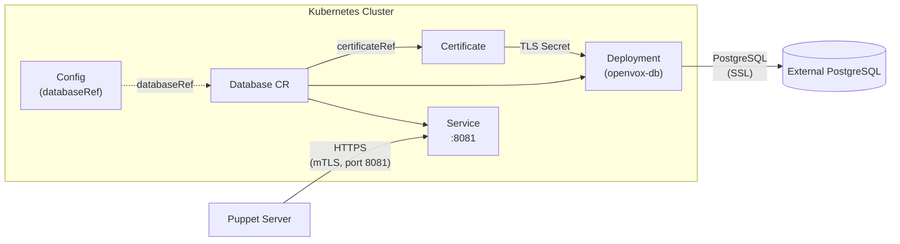

# Database

The `Database` CRD manages OpenVox DB (PuppetDB) instances as a Kubernetes Deployment. OpenVox DB is the data store for Puppet catalogs, facts, and reports. The operator runs the JVM-based DB process; the underlying PostgreSQL backend is **not** managed by the operator and must be provided externally (e.g. via [CloudNativePG](https://cloudnative-pg.io/), an existing managed Postgres, or a manually provisioned instance).

## How It Works



1. The Database controller waits for the referenced `Certificate` to reach the `Signed` phase
2. It validates that the PostgreSQL credentials Secret exists
3. It renders a `database.ini` Secret with the PostgreSQL connection string and a ConfigMap with `jetty.ini`, `config.ini`, and `auth.conf`
4. It creates a Deployment of OpenVox DB pods that connect to the external PostgreSQL backend over SSL and serve mTLS traffic on port 8081
5. A `Config` can reference the Database via `databaseRef` to automatically wire the PuppetDB connection URL into Server pods -- the operator reads `status.url` and writes it into `puppetdb.conf` (no need to set `puppetdb.serverUrls` manually)

## Why an External PostgreSQL?

Unlike a stateful database operator, openvox-operator deliberately does **not** manage PostgreSQL itself. PostgreSQL has its own well-established operator ecosystem (CloudNativePG, Zalando, Crunchy) with mature backup, failover, and HA features that this operator should not duplicate.

The Database CRD focuses on what is openvox-specific: the OpenVox DB JVM process, its Jetty TLS configuration, the connection string rendering, and integration with the rest of the openvox CRD hierarchy.

## TLS Flow

OpenVox DB uses two independent TLS channels:

| Channel | Purpose | Trust |
|---|---|---|
| **Jetty (port 8081)** | Inbound traffic from Puppet Server (mTLS) | Puppet CA (from `Certificate` + `CertificateAuthority`) |
| **PostgreSQL** | Outbound DB connection | PostgreSQL server's own CA (configurable via `sslMode`) |

The Jetty TLS material is mounted from the `Certificate`'s TLS Secret and the `CertificateAuthority`'s CA Secret. An init container (`tls-init`) copies the certs from read-only Secret mounts into a writable `emptyDir` named after the Certificate's `certname`, as required by OpenVox DB's path conventions:

```
/etc/puppetlabs/puppetdb/ssl/
  certs/
    ca.pem
    {certname}.pem
  private_keys/
    {certname}.pem
```

## Config Integration

A `Config` can wire the Database connection two ways:

### Via `databaseRef` (recommended)

```yaml
apiVersion: openvox.voxpupuli.org/v1alpha1
kind: Config
metadata:
  name: production
spec:
  authorityRef: production-ca
  databaseRef: production-db   # operator reads Database.status.url
  image:
    repository: ghcr.io/slauger/openvox-server
    tag: "8.12.1"
```

The operator reads `Database.status.url` (e.g. `https://production-db.namespace.svc.cluster.local:8081`) and renders it into `puppetdb.conf`. When the Database is not yet `Running`, the Config controller waits.

### Via static `puppetdb.serverUrls`

```yaml
spec:
  puppetdb:
    serverUrls:
      - https://external-puppetdb.example.com:8081
```

Use this when pointing at an OpenVox DB instance not managed by this operator. `databaseRef` and `puppetdb` are mutually exclusive.

## Report Storage

When combined with a `ReportProcessor` of type `puppetdb`, Puppet run reports are forwarded to OpenVox DB and persisted to PostgreSQL. The flow is:

```
Puppet Agent → Puppet Server → openvox-report → Database (mTLS) → PostgreSQL
```

See [Report Processing](report-processing.md) for the full pipeline and [ReportProcessor](../reference/reportprocessor.md) for configuration options.

## PostgreSQL Credentials

PostgreSQL credentials are provided via a Kubernetes Secret with `username` and `password` keys:

```yaml
apiVersion: v1
kind: Secret
metadata:
  name: pg-credentials
type: Opaque
stringData:
  username: openvoxdb
  password: <your-password>
```

The operator computes a hash of this Secret and adds it to the Deployment pod template annotations. Rotating the credentials in the Secret triggers a rolling restart of the Database pods automatically. The same applies to the SSL Secret, the CA Secret, and the rendered ConfigMap -- see [Configuration Rollout](config-rollout.md).

## Scaling

OpenVox DB supports horizontal scaling for read traffic. All replicas share the same PostgreSQL backend and the same TLS certificate. There is no leader election at the operator level -- coordination happens inside PostgreSQL.

For production, run with at least 2 replicas behind a `PodDisruptionBudget`:

```yaml
spec:
  replicas: 2
  pdb:
    enabled: true
    minAvailable: 1
```

For the full CRD reference, see [Database](../reference/database.md).
