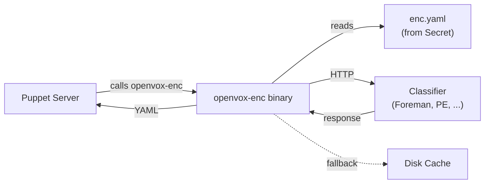

# External Node Classification

The openvox-operator supports External Node Classifiers (ENCs) via the `NodeClassifier` CRD. An ENC is an external service that tells Puppet Server which classes, parameters, and environment to assign to a node.

## How It Works



1. Create a `NodeClassifier` resource with your classifier endpoint configuration
2. Set `nodeClassifierRef` on your `Config` to reference it
3. The operator renders `enc.yaml` into a Secret, mounted into Server pods
4. puppet.conf gets `node_terminus = exec` and `external_nodes = /usr/local/bin/openvox-enc`
5. Puppet Server calls the `openvox-enc` binary for every node, which queries the classifier and returns YAML

The `openvox-enc` binary is a static Go binary shipped in the openvox-server container image. Like `openvox-autosign`, configuration changes only update the Secret — kubelet syncs the file without a pod restart.

## Supported Classifiers

### Foreman

Foreman provides an ENC endpoint that returns YAML. It supports both simple GET requests with mTLS (using Puppet certificates) and the v2 API with Basic Auth.

**GET with mTLS (classic):**

```yaml
apiVersion: openvox.voxpupuli.org/v1alpha1
kind: NodeClassifier
metadata:
  name: foreman
spec:
  url: https://foreman.example.com
  request:
    method: GET
    path: /node/{certname}
  response:
    format: yaml
  auth:
    mtls: true
  cache:
    enabled: true
```

**GET with Basic Auth (API v2):**

```yaml
apiVersion: openvox.voxpupuli.org/v1alpha1
kind: NodeClassifier
metadata:
  name: foreman-api
spec:
  url: https://foreman.example.com
  request:
    method: GET
    path: /api/v2/hosts/{certname}/enc
  response:
    format: yaml
  auth:
    basic:
      secretRef:
        name: foreman-credentials
        usernameKey: username
        passwordKey: password
```

### Puppet Enterprise

PE's Node Classifier uses a POST-based API that accepts node facts and returns JSON classification data.

```yaml
apiVersion: openvox.voxpupuli.org/v1alpha1
kind: NodeClassifier
metadata:
  name: pe-classifier
spec:
  url: https://pe-console.example.com:4433
  request:
    method: POST
    path: /classifier-api/v1/classified/nodes/{certname}
    body: facts
  response:
    format: json
  timeoutSeconds: 10
  auth:
    token:
      header: X-Authentication
      secretKeyRef:
        name: pe-rbac-token
        key: token
  cache:
    enabled: true
```

### Custom HTTP Service

Any HTTP service that returns Puppet ENC YAML or JSON can be used.

**Bearer token auth:**

```yaml
apiVersion: openvox.voxpupuli.org/v1alpha1
kind: NodeClassifier
metadata:
  name: custom-enc
spec:
  url: https://enc-service.internal:8443
  request:
    method: GET
    path: /v1/classify/{certname}
  response:
    format: yaml
  auth:
    bearer:
      secretKeyRef:
        name: enc-api-token
        key: token
```

**Cluster-internal (no auth):**

```yaml
apiVersion: openvox.voxpupuli.org/v1alpha1
kind: NodeClassifier
metadata:
  name: internal-enc
spec:
  url: http://enc-service.enc-system.svc:8080
  request:
    method: GET
    path: /enc/{certname}
  response:
    format: yaml
```

## Authentication Methods

| Method | Description | Use Case |
|---|---|---|
| `mtls` | Mutual TLS using Puppet SSL certificates | Foreman with Puppet CA trust |
| `token` | Custom HTTP header with token value | Puppet Enterprise (X-Authentication) |
| `bearer` | Authorization: Bearer header | Generic API services |
| `basic` | HTTP Basic Authentication | Foreman API v2, legacy services |

At most one authentication method may be configured per NodeClassifier.

## Request Body Types

For POST-based classifiers, the `body` field controls what is sent:

| Value | Description | Use Case |
|---|---|---|
| `facts` | JSON with `certname` and `facts` (from Puppet's YAML facts cache) | Puppet Enterprise classifier |
| `certname` | Minimal JSON with `certname` only | Lightweight classifiers |
| *(empty)* | No body | GET requests |

The `body` field is only allowed when `method` is `POST`.

## Caching

When `cache.enabled` is true, the binary caches successful classification responses to disk. If the classifier is unreachable, the last cached response for that node is returned instead. This provides resilience against temporary classifier outages.

The cache uses an emptyDir volume mounted at the configured `cache.directory` (default `/var/cache/openvox-enc`). Cache files are named `{certname}.yaml`.

## Config Integration

Reference a NodeClassifier from your Config:

```yaml
apiVersion: openvox.voxpupuli.org/v1alpha1
kind: Config
metadata:
  name: production
spec:
  authorityRef: production-ca
  nodeClassifierRef: foreman
  image:
    repository: ghcr.io/slauger/openvox-server
    tag: "8.12.1"
```

This generates the following puppet.conf entries in the `[server]` section:

```ini
node_terminus = exec
external_nodes = /usr/local/bin/openvox-enc
```

For the full CRD reference, see [NodeClassifier](../reference/nodeclassifier.md).
