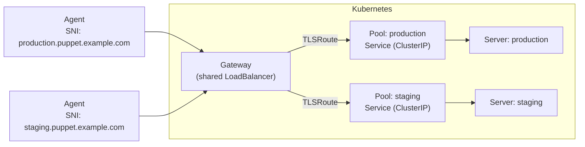

# Gateway API Integration

## Overview

The openvox-operator supports [Gateway API](https://gateway-api.sigs.k8s.io/) TLSRoute resources for SNI-based routing. This allows multiple Puppet environments to share a single LoadBalancer via Server Name Indication (SNI) instead of requiring a dedicated LoadBalancer Service per environment.

Since Puppet uses mTLS between agents and servers, TLS passthrough is required -- the Gateway does not terminate TLS.

## Architecture



The Gateway resource itself is cluster-admin managed infrastructure. The operator only creates TLSRoute resources that attach to an existing Gateway.

## Prerequisites

- Gateway API CRDs installed in the cluster (v1.0.0+, TLSRoute is GA since v1.2.0)
- A Gateway resource configured with a TLS passthrough listener
- A Gateway controller (e.g. Envoy Gateway, Cilium, Istio, NGINX Gateway Fabric)

## How It Works

1. The operator detects Gateway API CRDs at startup. If not present, TLSRoute support is disabled gracefully.
2. When a Pool has `route.enabled: true`, the operator creates a TLSRoute that:
   - Matches traffic by SNI hostname
   - Attaches to the referenced Gateway listener
   - Routes to the Pool's Service as backend
3. The TLSRoute is owned by the Pool and will be garbage collected when the Pool is deleted.

## Configuration

Enable routing on a Pool by adding the `route` section:

```yaml
apiVersion: openvox.voxpupuli.org/v1alpha1
kind: Pool
metadata:
  name: puppet
spec:
  service:
    type: ClusterIP
    port: 8140
  route:
    enabled: true
    hostname: production.puppet.example.com
    gatewayRef:
      name: puppet-gateway
      sectionName: tls
    injectDNSAltName: true
```

### Route Fields

| Field | Type | Default | Description |
|---|---|---|---|
| `enabled` | bool | `false` | Activates TLSRoute creation |
| `hostname` | string | - | SNI hostname for routing (required when enabled) |
| `gatewayRef.name` | string | - | Name of the Gateway to attach to (required when enabled) |
| `gatewayRef.sectionName` | string | - | Listener name on the Gateway |
| `injectDNSAltName` | bool | `false` | Automatically add the hostname to Certificate dnsAltNames |

### Validation

CEL validation ensures that `hostname` and `gatewayRef.name` are set when `enabled` is `true`. The operator also logs a warning if two Pools in the same namespace use the same hostname.

## DNS Alt Name Injection

When `injectDNSAltName: true`, the operator adds the route hostname to the `dnsAltNames` of Certificates used by Servers matching this Pool. This ensures the server's TLS certificate includes the SNI hostname, which is required for TLS passthrough to work correctly.

Without this, agents connecting via the SNI hostname would see a certificate mismatch because the server certificate wouldn't include that hostname as a SAN.

**Side effect:** Modifying the Certificate's `dnsAltNames` resets its phase to `Pending`, which triggers re-signing and recreates the TLS Secret. This causes a brief restart of affected Server pods. This only happens once per hostname -- subsequent reconciles detect the hostname is already present and skip the update.

## Gateway Setup Example

The Gateway resource is not managed by the operator. A cluster admin creates it:

```yaml
apiVersion: gateway.networking.k8s.io/v1
kind: Gateway
metadata:
  name: puppet-gateway
spec:
  gatewayClassName: envoy  # depends on your Gateway controller
  listeners:
    - name: tls
      protocol: TLS
      port: 8140
      tls:
        mode: Passthrough
```

## Helm Chart Configuration

The `openvox-stack` chart provides a `gateway` section for shared Gateway settings:

```yaml
gateway:
  name: puppet-gateway
  sectionName: tls

pools:
  - name: puppet
    serverRef: ca
    service:
      type: ClusterIP
      port: 8140
    route:
      enabled: true
      hostname: production.puppet.example.com
      injectDNSAltName: true
```

The `gateway.name` and `gateway.sectionName` are shared across all pools -- individual pools only need to set their hostname.

## Graceful Degradation

The operator works without Gateway API CRDs installed:

- At startup, it checks if the TLSRoute CRD exists via REST API discovery
- If not found, TLSRoute support is disabled and the operator logs an informational message
- Pools with `route.enabled: true` will log a warning but otherwise function normally (the Service is still created)
- Installing Gateway API CRDs requires an operator restart to pick up the new types

## Cleanup

When `route.enabled` is set to `false` or removed from a Pool, the operator deletes any owned TLSRoute for that Pool. TLSRoutes are also garbage collected when their owner Pool is deleted (via owner references).
