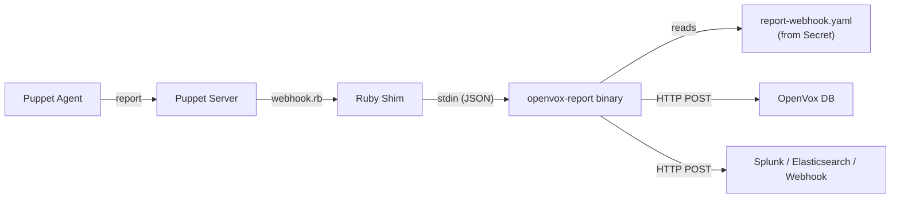

# Report Processing

The openvox-operator supports forwarding Puppet reports to external endpoints via the `ReportProcessor` CRD. Reports can be sent to OpenVox DB (PuppetDB), Splunk, Elasticsearch, or any generic HTTP webhook.

## How It Works



1. A Puppet Agent completes a catalog run and sends its report to Puppet Server
2. Puppet Server calls the `webhook` report processor (`webhook.rb`)
3. The Ruby shim serializes the report as JSON and pipes it to the `openvox-report` binary via stdin
4. The binary reads its endpoint configuration from `report-webhook.yaml` (mounted from a Secret)
5. For each configured endpoint, the binary transforms (if needed) and forwards the report via HTTP POST

Multiple ReportProcessors can reference the same Config. All endpoints receive every report.

## Architecture

The report processing pipeline is split into two stages:

### Stage 1: Ruby Shim (webhook.rb)

The Ruby shim is a Puppet report processor that bridges Puppet Server's internal report mechanism to the Go binary. It:

- Registers as a Puppet report processor named `webhook`
- Calls `self.to_data_hash.to_json` to serialize the full report
- Pipes the JSON to `/opt/puppetlabs/server/bin/openvox-report` via stdin
- Has a 120-second timeout to prevent Puppet Server thread blocking

The shim is intentionally thin -- it contains no endpoint-specific logic.

### Stage 2: Go Binary (openvox-report)

The Go binary handles transformation, authentication, and HTTP delivery:

- Reads endpoint configuration from `/etc/puppetlabs/puppet/report-webhook.yaml`
- For `processor: puppetdb`: transforms the report to PuppetDB Wire Format v8
- For generic endpoints: forwards the report JSON as-is
- Supports mTLS, Bearer, Basic, and custom token authentication
- Reports errors on stderr (visible in Puppet Server logs)

## Processor Types

### Generic (default)

When `processor` is empty (or omitted), the report JSON from `to_data_hash` is forwarded as-is. This works for any endpoint that accepts Puppet report JSON, such as Splunk HEC, Elasticsearch, or custom webhooks.

### OpenVox DB

When `processor: puppetdb` is set, the binary transforms the report from Puppet's `to_data_hash` format to [PuppetDB Wire Format v8](https://www.puppet.com/docs/puppetdb/latest/api/wire_format/report_format_v8.html). Key transformations include:

| `to_data_hash` field | Wire Format v8 field | Notes |
|---|---|---|
| `host` | `certname` | Agent's certname (same value, different key) |
| `time` | `start_time` | Report start time |
| *(calculated)* | `end_time` | `start_time` + `metrics.time.total` |
| *(added)* | `producer` | From `server_used` or `host` as fallback |
| *(added)* | `producer_timestamp` | Current time at submission |
| `resource_statuses` (map) | `resources` (array) | Keys dropped, `title` → `resource_title`, `time` → `timestamp` |
| `metrics` (nested hash) | `metrics` (flat array) | `[{category, name, value}]` format |
| Events: `desired_value` | Events: `new_value` | Converted to string |
| Events: `previous_value` | Events: `old_value` | Converted to string |

The transformed report is wrapped in a command envelope and POSTed to `<url>/pdb/cmd/v1`:

```json
{
  "command": "store report",
  "version": 8,
  "payload": { ... }
}
```

## Authentication Methods

| Method | Description | Use Case |
|---|---|---|
| `mtls` | Mutual TLS using Puppet SSL certificates | OpenVox DB with Puppet CA trust |
| `token` | Custom HTTP header with token value | Services with custom auth headers |
| `bearer` | Authorization: Bearer header | Generic API services |
| `basic` | HTTP Basic Authentication | Elasticsearch, legacy services |

At most one authentication method may be configured per ReportProcessor.

## Config Integration

When at least one ReportProcessor references a Config, the operator automatically:

1. Adds `webhook` to the `reports` setting in puppet.conf
2. Renders `report-webhook.yaml` into a Secret and mounts it into Server pods
3. Triggers a rolling restart via annotation hash when the configuration changes

```yaml
apiVersion: openvox.voxpupuli.org/v1alpha1
kind: Config
metadata:
  name: production
spec:
  authorityRef: production-ca
  image:
    repository: ghcr.io/slauger/openvox-server
    tag: "8.12.1"
```

```yaml
apiVersion: openvox.voxpupuli.org/v1alpha1
kind: ReportProcessor
metadata:
  name: openvoxdb
spec:
  configRef: production
  processor: puppetdb
  url: "https://openvoxdb:8081"
  auth:
    mtls: true
```

No changes to the Config resource are needed -- the operator detects ReportProcessors via `configRef` and injects the report processor configuration automatically.

For the full CRD reference, see [ReportProcessor](../reference/reportprocessor.md).
