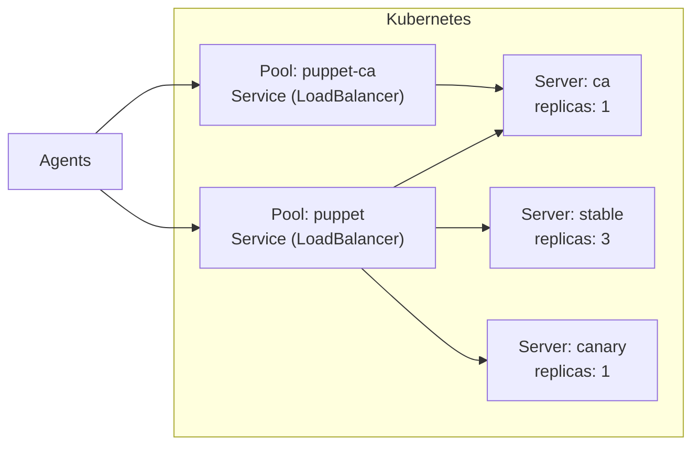
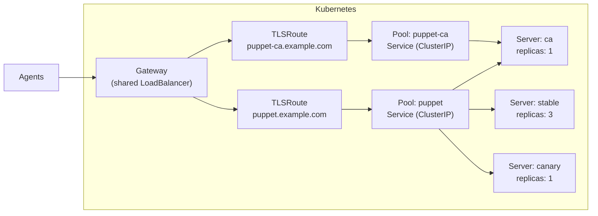

# Traffic Flow

Each Pool owns a Kubernetes Service that selects Server pods by label. The CA server can participate in both pools - handling CA requests via its dedicated pool and also serving catalog requests through the server pool.

## LoadBalancer Services

The simplest setup - each Pool gets its own external IP:

This works well for single-environment setups. For multiple environments, each Pool creates a separate LoadBalancer, which can become expensive.

## Gateway API TLSRoute

All Pools share a single LoadBalancer, routed by SNI hostname. Since Puppet uses mTLS, TLS passthrough is required - the Gateway does not terminate TLS.

With this setup, Pools use ClusterIP Services and the Gateway handles external access. Adding a new environment only requires a new TLSRoute - no additional LoadBalancer.

See [Gateway API](gateway-api.md) for the full configuration guide.
