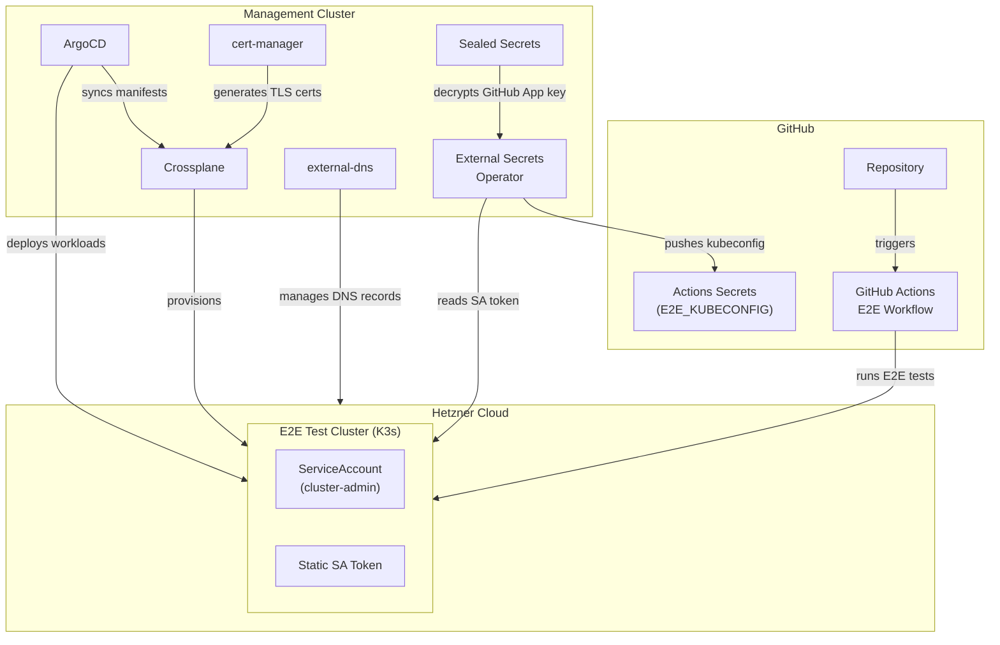
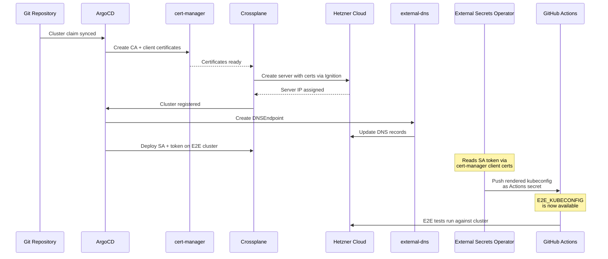

# E2E Infrastructure

This document describes the GitOps-managed infrastructure stack that provisions ephemeral Kubernetes clusters for E2E testing and automatically syncs credentials to GitHub Actions.

## Overview

The E2E test cluster is fully managed through a GitOps pipeline. A management cluster runs the control plane components that provision a remote test cluster on Hetzner Cloud, deploy a service account, and push the resulting kubeconfig to GitHub Actions without any manual intervention.



## Components

### Management Cluster

The management cluster runs all control plane components and orchestrates the lifecycle of the E2E test cluster.

| Component | Purpose |
|-----------|---------|
| **ArgoCD** | GitOps continuous delivery; syncs all manifests from Git to both clusters |
| **Crossplane** | Provisions the E2E cluster as a Hetzner Cloud server running K3s |
| **cert-manager** | Generates TLS CA certificates and client certificates for the K3s API server |
| **Sealed Secrets** | Encrypts secrets in Git; decrypts them in-cluster (e.g. GitHub App private key) |
| **External Secrets Operator** | Reads the SA token from the remote cluster and pushes it to GitHub |
| **external-dns** | Creates DNS records for the E2E cluster based on the provisioned server IP |

### E2E Test Cluster

A single-node K3s cluster provisioned on Hetzner Cloud via Crossplane. ArgoCD deploys a `ServiceAccount` with `cluster-admin` permissions and a static token secret onto this cluster.

### GitHub

The External Secrets Operator pushes a rendered kubeconfig (containing the SA token and cluster CA) as a GitHub Actions secret. The E2E workflow uses this kubeconfig to connect to the test cluster.

## Provisioning Flow

The following sequence shows what happens when the E2E cluster is created or rebuilt from scratch:



## Key Design Decisions

### Static Service Account Token

A `Secret` of type `kubernetes.io/service-account-token` is used to generate a non-expiring token bound to the service account. This avoids the need for token refresh logic in CI pipelines. The token is automatically populated by the Kubernetes token controller.

### Credential Sync via External Secrets Operator

ESO runs on the management cluster and uses the Kubernetes provider to read secrets from the remote E2E cluster. Authentication is done via the same client certificates that cert-manager generates for the cluster's admin user.

The kubeconfig is rendered using ESO's template engine:

```yaml
apiVersion: external-secrets.io/v1
kind: ExternalSecret
spec:
  secretStoreRef:
    name: e2e-cluster-kubernetes
    kind: ClusterSecretStore
  target:
    name: e2e-github-kubeconfig
    template:
      data:
        E2E_KUBECONFIG: |
          apiVersion: v1
          kind: Config
          clusters:
            - name: e2e
              cluster:
                server: https://e2e.example.com:6443
                certificate-authority-data: {{ .ca_crt | b64enc }}
          users:
            - name: ci
              user:
                token: {{ .token }}
          contexts:
            - name: e2e
              context:
                cluster: e2e
                user: ci
          current-context: e2e
  data:
    - secretKey: token
      remoteRef:
        key: ci-token
        property: token
    - secretKey: ca_crt
      remoteRef:
        key: ci-token
        property: ca.crt
```

A `PushSecret` then syncs the rendered kubeconfig to GitHub Actions using a GitHub App for authentication.

### GitHub App Authentication

ESO's GitHub provider requires a GitHub App (not a personal access token). The app needs **Secrets: Read & Write** permission on the target repository. The app's private key is stored as a Sealed Secret in the management cluster.

### Ephemeral Clusters

Because the entire flow is automated, the E2E cluster can be destroyed and recreated at any time. Crossplane reprovisions the server, ArgoCD redeploys the workloads, and ESO updates the GitHub Actions secret with the new credentials. No manual steps required.

## Cluster Rebuild

To rebuild the E2E cluster from scratch:

1. Delete the cluster claim (Crossplane `K3sCluster` resource)
2. ArgoCD re-syncs the claim from Git
3. Crossplane provisions a new server with fresh certificates
4. ArgoCD deploys the service account and token
5. ESO pushes the updated kubeconfig to GitHub

The entire process takes a few minutes and requires no manual interaction.
