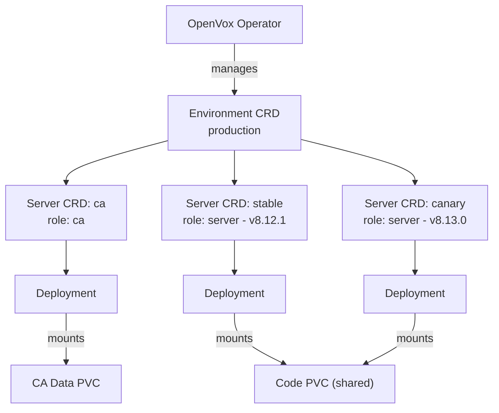
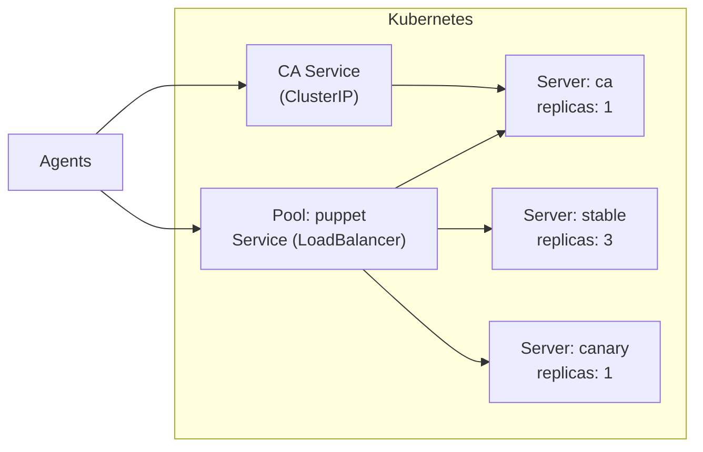

# OpenVox Operator

A Kubernetes Operator for running [OpenVox Server](https://github.com/OpenVoxProject) environments on **Kubernetes** and **OpenShift**.

## Features

- **Automated CA Lifecycle** - CA initialization, certificate signing and distribution - fully managed
- **One Image, Two Roles** - Same rootless image runs as CA or server, configured by the operator
- **Scalable Servers** - Scale catalog compilation horizontally with multiple server pools and HPA
- **Multi-Version Deployments** - Run different server versions side by side for canary deployments and rolling upgrades
- **Rootless & OpenShift Ready** - Random UID compatible, no root, no ezbake, no privilege escalation
- **Kubernetes-Native** - All config via ConfigMaps/Secrets, no entrypoint scripts, no ENV translation

## How It Works

The operator manages OpenVox Server environments through a set of Custom Resource Definitions (CRDs):

| Kind | Purpose |
|---|---|
| **Environment** | Shared config, CA lifecycle, PuppetDB connection |
| **Pool** | Owns a Kubernetes Service for load balancing |
| **Server** | OpenVox Server instance pool (CA or compiler) |
| **CodeDeploy** | r10k code deployment from Git |

An **Environment** is the central resource that holds shared configuration, manages the Certificate Authority, and connects to PuppetDB. **Server** resources reference an Environment and run as either CA or compiler role. Multiple Servers can join the same **Pool**, which owns the Kubernetes Service that distributes traffic across them.

## Traffic Flow

Agents connect to a Pool Service which load-balances across all Servers in the pool. The CA server has its own dedicated service for certificate operations.

The CA server can participate in both services - handling CA requests via the dedicated CA service and also serving catalog requests through the pool service.

## License

Apache License 2.0
