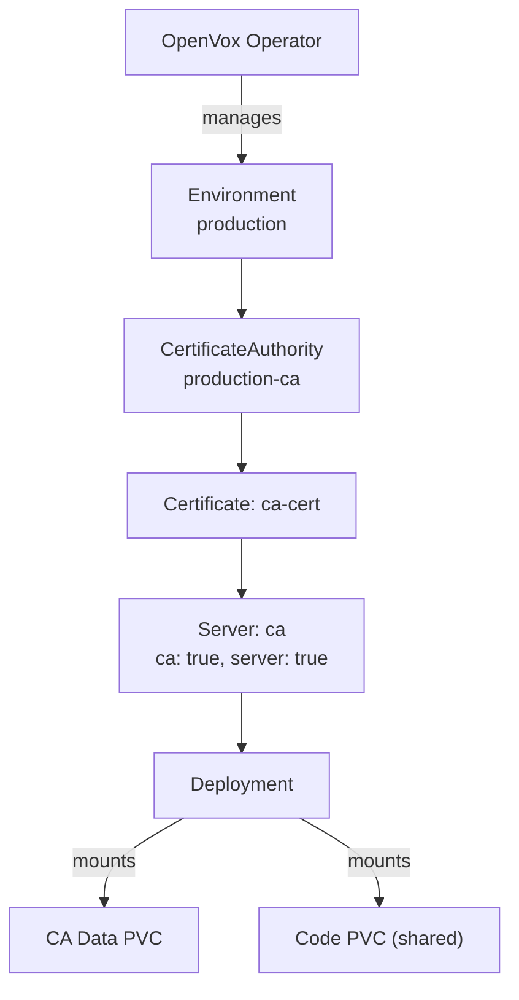
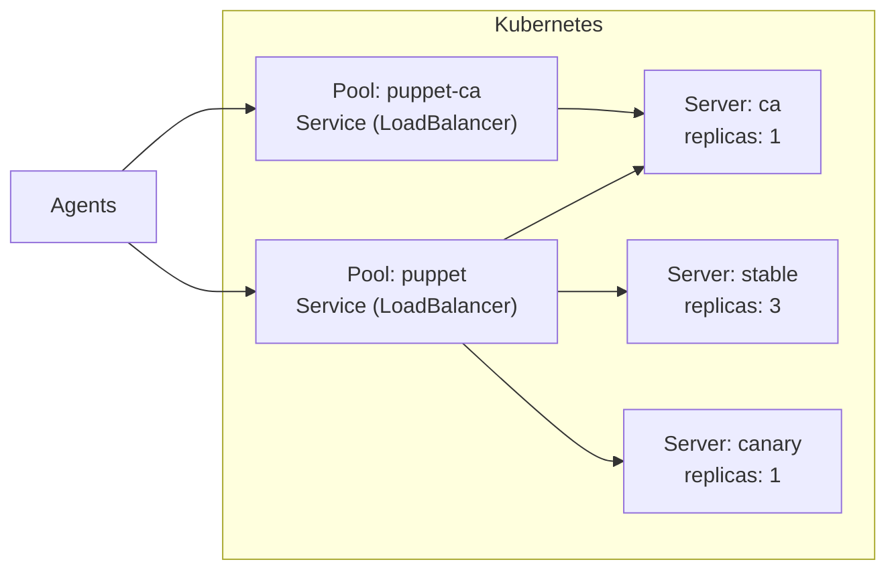

# OpenVox Operator

A Kubernetes Operator for running [OpenVox Server](https://github.com/OpenVoxProject) environments on **Kubernetes** and **OpenShift**.

## Features

- 🔐 **Automated CA Lifecycle** - CA initialization, certificate signing, distribution, and periodic CRL refresh - fully managed
- 📜 **Declarative Signing Policies** - CSR approval via patterns, CSR attributes, or open signing - no autosign scripts
- 📦 **One Image, Two Roles** - Same rootless image runs as CA or server, configured by the operator
- ⚡ **Scalable Servers** - Scale catalog compilation horizontally with multiple server pools and HPA
- 🔄 **Multi-Version Deployments** - Run different server versions side by side for canary deployments and rolling upgrades
- 🔒 **Rootless & OpenShift Ready** - Random UID compatible, no root, no ezbake, no privilege escalation
- 🪶 **Minimal Image** - UBI9-based, no system Ruby, no ezbake packaging - smaller footprint, fewer updates
- 🧠 **Auto-tuned JVM** - Heap size calculated from memory limits (90%) - no manual `-Xmx` tuning needed
- 🔃 **Automatic Config Rollout** - Config and certificate changes trigger rolling restarts automatically
- ☸️ **Kubernetes-Native** - All config via ConfigMaps/Secrets, no entrypoint scripts, no ENV translation

## How It Works

The operator manages OpenVox Server environments through a set of Custom Resource Definitions (CRDs):

| Kind | Purpose |
|---|---|
| **Environment** | Shared config (puppet.conf, auth.conf, etc.), PuppetDB connection |
| **CertificateAuthority** | CA infrastructure: keys, signing, split Secrets (cert, key, CRL) |
| **SigningPolicy** | Declarative CSR signing policy (any, pattern, CSR attributes) |
| **Certificate** | Lifecycle of a single certificate (request, sign) |
| **Server** | OpenVox Server instance pool (CA and/or server role) |
| **Pool** | Owns a Kubernetes Service, selects Servers via labels |

An **Environment** holds shared configuration and connects to PuppetDB. A **CertificateAuthority** manages the CA infrastructure (PVC, setup Job, split Secrets for cert/key/CRL) and periodically refreshes the CRL. **SigningPolicy** resources define declarative rules for CSR approval (including DNS SAN validation). **Certificate** resources manage the lifecycle of individual certificates. **Server** resources reference a Certificate and can run as CA, server, or both. A **Pool** creates a Kubernetes Service that selects Server pods by label.

## Traffic Flow

Agents connect to a Pool Service which load-balances across all Servers in the pool. The CA server has its own dedicated Pool for certificate operations.

The CA server can participate in both pools - handling CA requests via the dedicated CA pool and also serving catalog requests through the server pool.

## License

Apache License 2.0
