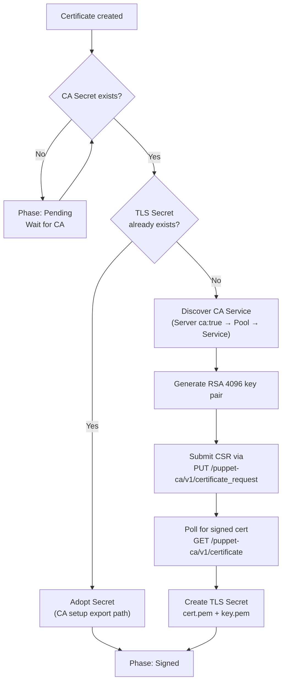

# Certificate

A Certificate manages the lifecycle of a single X.509 certificate signed by a CertificateAuthority.

## Example

```yaml
apiVersion: openvox.voxpupuli.org/v1alpha1
kind: Certificate
metadata:
  name: production-cert
spec:
  authorityRef: production-ca
  certname: puppet
  dnsAltNames:
    - puppet
    - production-ca
```

## Spec

| Field | Type | Default | Description |
|---|---|---|---|
| `authorityRef` | string | **required** | Reference to the CertificateAuthority |
| `certname` | string | `puppet` | Certificate common name (CN) |
| `dnsAltNames` | []string | - | DNS subject alternative names |

## Status

| Field | Type | Description |
|---|---|---|
| `phase` | string | Current lifecycle phase |
| `secretName` | string | Name of the Secret containing `cert.pem` and `key.pem` |
| `notAfter` | time | Expiry time of the signed certificate |
| `conditions` | []Condition | `CertSigned` |

## Phases

| Phase | Description |
|---|---|
| `Pending` | Waiting for CertificateAuthority to reach `Ready` or `External` |
| `Requesting` | Certificate signing in progress |
| `WaitingForSigning` | CSR submitted, waiting for CA to sign (backoff polling in progress) |
| `Signed` | TLS Secret created, Servers can mount it |
| `Error` | Certificate signing failed |

### CSR Poll Backoff

When the CA does not immediately sign the CSR (e.g. autosigning is disabled), the controller enters `WaitingForSigning` after 10 unsuccessful poll attempts and retries with exponential backoff:

| Attempts | Interval |
|---|---|
| 0--2 | 5s |
| 3--5 | 30s |
| 6--9 | 2m |
| 10+ | 5m |

The poll attempt count is tracked via the annotation `openvox.voxpupuli.org/csr-poll-attempts` on the pending Secret `{name}-tls-pending`. To resolve manually, sign the CSR on the CA and the controller will pick it up on the next poll:

```bash
puppetserver ca sign --certname <certname>
```

## Signing Strategy

The controller uses two paths to obtain a signed certificate:

| Strategy | Condition | How it works |
|---|---|---|
| **CA setup export** | Certificate created before/with CA | CA setup Job creates the CA AND exports the server cert+key as a TLS Secret. The Certificate controller adopts the Secret. |
| **HTTP signing** | Certificate created after CA is Ready | Operator generates an RSA key pair in-process, submits a CSR to the Puppet CA HTTP API, and polls for the signed certificate. No Jobs or shell scripts involved. |



The controller discovers the CA Service automatically by finding Servers with `ca: true` in the same Config and the Pools whose selector matches them.

## Created Resources

| Resource | Name | Description |
|---|---|---|
| Secret | `{name}-tls` | Certificate data: `cert.pem`, `key.pem` |
