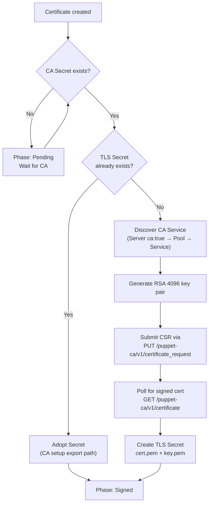

# Certificate

A Certificate manages the lifecycle of a single X.509 certificate signed by a CertificateAuthority.

## Example

```yaml
apiVersion: openvox.voxpupuli.org/v1alpha1
kind: Certificate
metadata:
  name: production-cert
spec:
  authorityRef: production-ca
  certname: puppet
  dnsAltNames:
    - puppet
    - production-ca
```

## Spec

| Field | Type | Default | Description |
|---|---|---|---|
| `authorityRef` | string | **required** | Reference to the CertificateAuthority |
| `certname` | string | **required** | Certificate common name (CN) |
| `dnsAltNames` | []string | - | DNS subject alternative names |
| `renewBefore` | string | `60d` | Duration before expiration when the certificate should be renewed (e.g. `60d`, `720h`) |
| `csrExtensions` | CSRExtensionsSpec | - | Puppet CSR extension attributes to embed in the CSR |

## Status

| Field | Type | Description |
|---|---|---|
| `observedGeneration` | int64 | The `.metadata.generation` the status was last derived from. A value below `.metadata.generation` means the rest of this status has not caught up with the current spec yet |
| `phase` | string | Current lifecycle phase |
| `secretName` | string | Name of the Secret containing `cert.pem` and `key.pem` |
| `notAfter` | time | Expiry time of the signed certificate |
| `signedSpecHash` | string | Digest of what the current certificate was issued for: certname, effective alt names and CSR extensions. A mismatch triggers re-signing; empty means the hash was never recorded and is adopted rather than triggering one |
| `effectiveDNSAltNames` | []string | The alt names the certificate is actually issued for: `spec.dnsAltNames` plus the route hostname of every Pool with `injectDNSAltName` that a Server using this Certificate joins |
| `conditions` | []Condition | `CertSigned` |

## Deletion

Deleting a Certificate revokes it on the CA before the finalizer
(`openvox.voxpupuli.org/certificate-cleanup`) is released, so the certificate
cannot be used again. If the CA cannot be reached the controller retries a few
times and then releases the finalizer anyway, rather than leaving the resource
stuck in `Terminating`.

Revocation is skipped when the CertificateAuthority is itself being deleted --
there is nothing left to revoke against, and its Service is on its way out. This
is what lets `kubectl delete namespace` finish promptly: every object is marked
for deletion at the same moment.

## Phases

| Phase | Description |
|---|---|
| `Pending` | Waiting for CertificateAuthority to reach `Ready` or `External` |
| `Requesting` | Certificate signing in progress |
| `WaitingForSigning` | CSR submitted, waiting for CA to sign (backoff polling in progress) |
| `Signed` | TLS Secret created, Servers can mount it |
| `Renewing` | A renewal attempt failed and will be retried |
| `Error` | Certificate signing failed |

Phases are a human-readable summary of the observed state. The controller never
reads them back as input: whether a certificate needs renewing is recomputed on
every reconcile from `status.notAfter` and `spec.renewBefore`, so editing or
losing the phase does not change what the operator does.

### Immutable fields

`certname` cannot be changed after creation. The name is baked into the issued
certificate and into the entry the CA keeps for it; changing it would orphan
that entry under the old name, so the finalizer could no longer revoke it on
deletion.

To use a different certname, delete the Certificate and create a new one -- the
finalizer cleans up the old entry on the CA on the way out.

### Re-signing on spec changes

`status.signedSpecHash` records the spec fields the current certificate was
issued for: `certname`, `dnsAltNames` and `csrExtensions`. When any of them
changes, the certificate is re-signed on the next reconcile -- adding a DNS alt
name takes effect immediately instead of waiting for the next renewal.

`renewBefore` is not part of the hash. It only moves the point in time at which
renewal happens and does not change the certificate itself.

Certificates issued before this field existed carry an empty hash. The
controller adopts the current spec as the baseline for them rather than
re-signing every certificate after an operator upgrade.

### Renewal reuses the private key

A renewal submits a CSR for the key the certificate already has
(`certificate_signing.go`: the existing `key.pem` is read from the TLS Secret
and reused). The CA renews for the same public key, so the key material must
not change between the old and the new certificate.

The consequence is worth stating: renewal extends validity, it does not rotate
the key. A key that must be replaced needs a new Certificate under a different
name, since `certname` is immutable and the CA keeps one entry per name.

### CSR Poll Backoff

When the CA does not immediately sign the CSR (e.g. autosigning is disabled), the controller enters `WaitingForSigning` after 10 unsuccessful poll attempts and retries with exponential backoff:

| Attempts | Interval |
|---|---|
| 0-2 | 5s |
| 3-5 | 30s |
| 6-9 | 2m |
| 10+ | 5m |

The poll attempt count is tracked via the annotation `openvox.voxpupuli.org/csr-poll-attempts` on the pending Secret `{name}-tls-pending`. To resolve manually, sign the pending CSR on the CA server (for example via a matching [SigningPolicy](signingpolicy.md) or the CA's signing API); the controller picks it up on the next poll.

## CSR Extensions

The `csrExtensions` field allows embedding Puppet CSR extension attributes in the certificate signing request. These extensions are used by the Puppet CA for authorization and metadata.

| Field | Type | Description |
|---|---|---|
| `ppCliAuth` | bool | Adds the `pp_cli_auth` extension, granting CA API signing rights |
| `ppRole` | string | Sets the `pp_role` extension value |
| `ppEnvironment` | string | Sets the `pp_environment` extension value |
| `customExtensions` | map[string]string | Arbitrary `pp_*` extensions as name/value pairs |

Keys in `customExtensions` must be known Puppet extension names (e.g. `pp_cost_center`, `pp_department`). The dedicated fields (`ppCliAuth`, `ppRole`, `ppEnvironment`) must not be duplicated in `customExtensions`.

### Example

```yaml
apiVersion: openvox.voxpupuli.org/v1alpha1
kind: Certificate
metadata:
  name: operator-signing
spec:
  authorityRef: production-ca
  certname: production-ca-operator
  csrExtensions:
    ppCliAuth: true
    ppRole: compiler
    ppEnvironment: production
    customExtensions:
      pp_cost_center: IT
      pp_department: Engineering
```

## Signing Strategy

The controller uses two paths to obtain a signed certificate:

| Strategy | Condition | How it works |
|---|---|---|
| **CA setup export** | Certificate created before/with CA | CA setup Job creates the CA AND exports the server cert+key as a TLS Secret. The Certificate controller adopts the Secret. |
| **HTTP signing** | Certificate created after CA is Ready | Operator generates an RSA key pair in-process, submits a CSR to the Puppet CA HTTP API, and polls for the signed certificate. No Jobs or shell scripts involved. |


```mermaid
flowchart TD
    Start["Certificate created"] --> CheckCA{"CA Secret exists?"}
    CheckCA -->|No| Wait["Phase: Pending<br/>Wait for CA"]
    Wait --> CheckCA

    CheckCA -->|Yes| CheckTLS{"TLS Secret<br/>already exists?"}
    CheckTLS -->|Yes| Adopt["Adopt Secret<br/>(CA setup export path)"]
    Adopt --> Signed

    CheckTLS -->|No| FindSvc["Discover CA Service<br/>(Server ca:true → Pool → Service)"]
    FindSvc --> GenKey["Generate RSA 4096 key pair"]
    GenKey --> CSR["Submit CSR via<br/>PUT /puppet-ca/v1/certificate_request"]
    CSR --> Poll["Poll for signed cert<br/>GET /puppet-ca/v1/certificate"]
    Poll --> CreateSecret["Create TLS Secret<br/>cert.pem + key.pem"]
    CreateSecret --> Signed["Phase: Signed"]
```

The controller discovers the CA Service automatically by finding Servers with `ca: true` in the same Config and the Pools whose selector matches them.

## Certname uniqueness

A certname identifies exactly one entry on the CertificateAuthority. Two
Certificates that claim the same certname against the same CA are
indistinguishable to it, with two consequences: the second CSR is rejected, and
deleting either one revokes the entry both rely on.

The operator therefore refuses the collision in three places:

- the admission webhook rejects a duplicate at creation, naming the other resource
- the controller refuses to sign and reports `CertnameConflict`, since webhooks
  are disabled by default
- a certificate returned by the CA is verified against the private key it was
  requested for, so a foreign certificate under the same name is never stored

`certname` is required and has no default. It used to default to `puppet`, which
made two Certificates created without one collide by default rather than by
mistake, and `puppet` is only the right identity for the main server anyway --
PuppetDB and any further certificate need their own.

The names agents connect through, such as a load balancer or a service address,
belong in `dnsAltNames` rather than here. The chart derives the Service names of
every Pool a server joins into that list automatically.

## Created Resources

| Resource | Name | Description |
|---|---|---|
| Secret | `{name}-tls` | Certificate data: `cert.pem`, `key.pem` |
