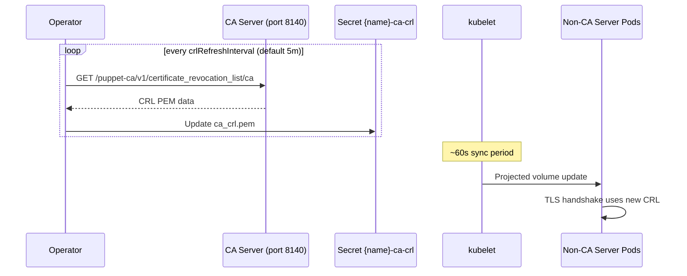

# CertificateAuthority

A CertificateAuthority manages the CA infrastructure for an Environment: a PVC for CA data, a setup Job that runs `puppetserver ca setup`, and Secrets for CA certificates, keys, and CRLs.

## Example

```yaml
apiVersion: openvox.voxpupuli.org/v1alpha1
kind: CertificateAuthority
metadata:
  name: production-ca
spec:
  environmentRef: production
  crlRefreshInterval: 5m
  storage:
    size: 1Gi
```

Autosigning is configured via [SigningPolicy](signingpolicy.md) resources that reference this CertificateAuthority.

## Spec

| Field | Type | Default | Description |
|---|---|---|---|
| `environmentRef` | string | **required** | Reference to the Environment |
| `ttl` | string | `5y` | CA certificate TTL as duration string (e.g. `5y`, `365d`, `8760h`) |
| `allowSubjectAltNames` | bool | `true` | Allow SANs in CSRs |
| `crlRefreshInterval` | string | `5m` | How often the operator refreshes the CRL Secret from the CA (Go duration: `5m`, `1h`, `30s`) |
| `storage` | [StorageSpec](index.md#storagespec) | - | PVC settings for CA data |
| `intermediateCA` | [IntermediateCASpec](#intermediatecaspec) | - | Intermediate CA configuration |

### IntermediateCASpec

| Field | Type | Default | Description |
|---|---|---|---|
| `enabled` | bool | `false` | Activate intermediate CA mode |
| `secretName` | string | - | Secret containing ca.pem, key.pem, crl.pem |

## Status

| Field | Type | Description |
|---|---|---|
| `phase` | string | Current lifecycle phase |
| `caSecretName` | string | Name of the Secret containing `ca_crt.pem` (public CA certificate) |
| `conditions` | []Condition | `CAReady` |

## Phases

| Phase | Description |
|---|---|
| `Pending` | CertificateAuthority created, waiting for reconciliation |
| `Initializing` | CA setup Job is running |
| `Ready` | CA Secrets created, Certificates can be signed |
| `Error` | CA setup failed |

## CA Secrets

The CA setup Job creates three separate Secrets with different security profiles:

| Secret | Contents | Mounted in Pods | Purpose |
|---|---|---|---|
| `{name}-ca` | `ca_crt.pem` | Yes (all pods) | Public CA certificate for trust chain |
| `{name}-ca-key` | `ca_key.pem` | No (API access only) | CA private key, never exposed to pods |
| `{name}-ca-crl` | `ca_crl.pem`, `infra_crl.pem` | Yes (non-CA pods) | CRL for certificate revocation checks |

The CRL Secret is periodically refreshed by the operator (see `crlRefreshInterval`). Non-CA pods mount it as a directory volume (not SubPath) so kubelet auto-syncs changes without pod restarts. CA pods read the CRL directly from the CA PVC.



## Created Resources

| Resource | Name | Description |
|---|---|---|
| PVC | `{name}-data` | Persistent storage for CA keys and data |
| ServiceAccount | `{name}-ca-setup` | Job ServiceAccount with permission to create CA Secrets |
| Role | `{name}-ca-setup` | Scoped to CA Secret creation |
| RoleBinding | `{name}-ca-setup` | Binds Role to ServiceAccount |
| Job | `{name}-ca-setup` | Runs `puppetserver ca setup`, creates CA Secrets |
| Secret | `{name}-ca` | Public CA certificate (`ca_crt.pem`) |
| Secret | `{name}-ca-key` | CA private key (`ca_key.pem`) |
| Secret | `{name}-ca-crl` | CRL data (`ca_crl.pem`, `infra_crl.pem`) — periodically refreshed |
