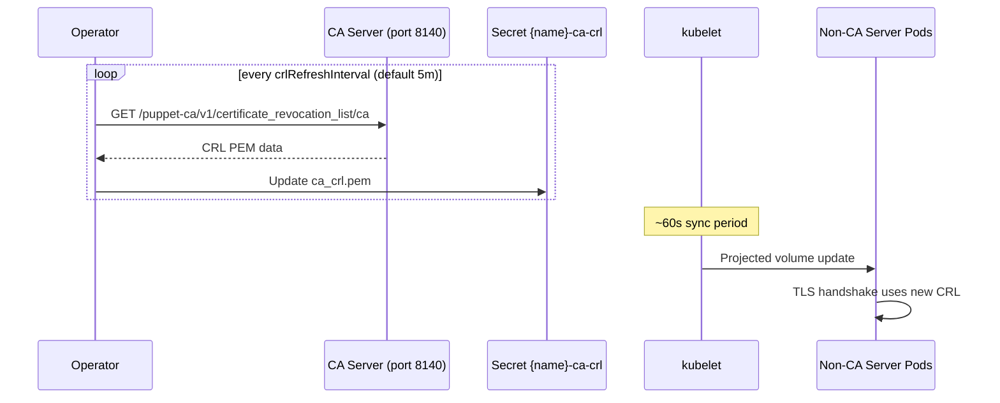

# CertificateAuthority

A CertificateAuthority manages the CA infrastructure: a PVC for CA data, a setup Job that runs `puppetserver ca setup`, and Secrets for CA certificates, keys, and CRLs. A Config references the CertificateAuthority via its `authorityRef` field.

## Example

```yaml
apiVersion: openvox.voxpupuli.org/v1alpha1
kind: CertificateAuthority
metadata:
  name: production-ca
spec:
  crlRefreshInterval: 5m
  storage:
    size: 1Gi
```

Autosigning is configured via [SigningPolicy](signingpolicy.md) resources that reference this CertificateAuthority.

## Spec

| Field | Type | Default | Description |
|---|---|---|---|
| `ttl` | string | `5y` | CA certificate TTL as duration string (e.g. `5y`, `365d`, `8760h`) |
| `allowSubjectAltNames` | bool | `true` | Allow SANs in CSRs |
| `allowAuthorizationExtensions` | bool | `true` | Allow authorization extensions (`pp_role`, `pp_environment`, etc.) in CSRs |
| `enableInfraCRL` | bool | `true` | Enable infrastructure CRL for compile server revocation |
| `allowAutoRenewal` | bool | `true` | Allow agents to automatically renew certificates before expiry |
| `autoRenewalCertTTL` | string | `90d` | TTL threshold for automatic certificate renewal (duration: `90d`, `30d`, `2160h`) |
| `crlRefreshInterval` | string | `5m` | How often the operator refreshes the CRL Secret from the CA (Go duration: `5m`, `1h`, `30s`) |
| `resources` | [ResourceRequirements](https://kubernetes.io/docs/reference/kubernetes-api/workload-resources/pod-v1/#resources) | requests: 200m/768Mi, limits: 1/1Gi | Compute resources for the CA setup Job |
| `storage` | [StorageSpec](index.md#storagespec) | - | PVC settings for CA data |
| `external` | [ExternalCASpec](#externalcaspec) | - | External CA configuration (mutually exclusive with custom storage) |
| `intermediateCA` | [IntermediateCASpec](#intermediatecaspec) | - | Intermediate CA configuration |

### ExternalCASpec

Configures an external CA running outside the cluster. When set, the operator delegates CSR signing and CRL fetching to the external CA URL instead of managing its own CA infrastructure. See the [External CA guide](../guides/ca-import.md#option-b-external-ca-ongoing-delegation) for step-by-step setup instructions.

!!! warning "Mutual exclusivity"
    `spec.external` and custom `spec.storage` are mutually exclusive. A CEL validation rule rejects resources that set both. External CAs do not need local storage.

| Field | Type | Required | Description |
|---|---|---|---|
| `url` | string | Yes | Base URL of the external Puppet/OpenVox CA (e.g. `https://puppet-ca.example.com:8140`). Must start with `http://` or `https://`. |
| `caSecretRef` | string | No | Name of a Secret containing `ca_crt.pem` for TLS verification of the external CA |
| `tlsSecretRef` | string | No | Name of a Secret containing `tls.crt` and `tls.key` for mTLS client authentication |
| `insecureSkipVerify` | bool | No | Skip TLS certificate verification (not recommended for production) |

**Example:**

```yaml
apiVersion: openvox.voxpupuli.org/v1alpha1
kind: CertificateAuthority
metadata:
  name: external-ca
spec:
  allowSubjectAltNames: true
  allowAuthorizationExtensions: true
  enableInfraCRL: true
  crlRefreshInterval: 5m
  external:
    url: https://puppet-ca.example.com:8140
    caSecretRef: external-ca-cert      # Secret with ca_crt.pem
    tlsSecretRef: external-ca-tls      # Secret with tls.crt + tls.key (optional mTLS)
    insecureSkipVerify: false
```

### IntermediateCASpec

!!! note "Not yet implemented"
    Intermediate CA support is defined in the CRD schema but not yet implemented in the controller. This section documents the planned API surface.

| Field | Type | Default | Description |
|---|---|---|---|
| `enabled` | bool | `false` | Activate intermediate CA mode |
| `secretName` | string | - | Secret containing ca.pem, key.pem, crl.pem |

## Status

| Field | Type | Description |
|---|---|---|
| `phase` | string | Current lifecycle phase |
| `caSecretName` | string | Name of the Secret containing `ca_crt.pem` (public CA certificate) |
| `serviceName` | string | Name of the internal ClusterIP Service for operator communication. Empty when `spec.external` is set. |
| `signingSecretName` | string | Name of the TLS Secret used for mTLS authentication when signing certificates via the CA HTTP API. Populated once the auto-managed operator-signing Certificate (`{name}-operator-signing`) reaches `Signed`. Empty for external CAs. |
| `notAfter` | time | Expiry time of the CA certificate |
| `conditions` | []Condition | See [Conditions](#conditions) below |

### Conditions

| Type | Description |
|---|---|
| `CAReady` | CA Secrets are present (`{name}-ca`, `{name}-ca-key`, `{name}-ca-crl`) and the CA can sign certificates. Set when the setup Job completes successfully or when an external CA is reachable. |
| `OperatorSigningReady` | The auto-managed `{name}-operator-signing` Certificate is signed and its TLS Secret is available for mTLS-authenticated CSR signing. Not set for external CAs (which manage their own signing credentials). |

## Phases

| Phase | Description |
|---|---|
| `Pending` | CertificateAuthority created, waiting for reconciliation |
| `Initializing` | CA setup Job is running |
| `Ready` | CA Secrets created, Certificates can be signed |
| `External` | External CA configured (no PVC, Job, or internal Service) |
| `Error` | CA setup failed |

## CA Secrets

The CA setup Job creates three separate Secrets with different security profiles:

| Secret | Contents | Mounted in Pods | Purpose |
|---|---|---|---|
| `{name}-ca` | `ca_crt.pem` | Yes (all pods) | Public CA certificate for trust chain |
| `{name}-ca-key` | `ca_key.pem` | No (API access only) | CA private key, never exposed to pods |
| `{name}-ca-crl` | `ca_crl.pem`, `infra_crl.pem` | Yes (non-CA pods) | CRL for certificate revocation checks |

The CRL Secret is periodically refreshed by the operator (see `crlRefreshInterval`). Non-CA pods mount it as a directory volume (not SubPath) so kubelet auto-syncs changes without pod restarts. CA pods read the CRL directly from the CA PVC.



## Internal Service

The CertificateAuthority controller creates a dedicated ClusterIP Service named `{name}-internal` for operator-internal communication (CSR signing and CRL refresh). This Service is separate from any Pool Service so that users can freely configure the Pool's Service type (ClusterIP, LoadBalancer, NodePort) without conflicting with the operator.

The internal Service FQDN (`{name}-internal.{namespace}.svc`) is automatically added as a SAN to the CA server certificate during setup, so TLS validation succeeds without manual configuration.

## Operator Signing Certificate

For internal CAs, the controller automatically creates a dedicated Certificate after the CA reaches `Ready`:

```yaml
apiVersion: openvox.voxpupuli.org/v1alpha1
kind: Certificate
metadata:
  name: {name}-operator-signing
  ownerReferences:
    - apiVersion: openvox.voxpupuli.org/v1alpha1
      kind: CertificateAuthority
      name: {name}
spec:
  authorityRef: {name}
  certname: {name}-operator
  csrExtensions:
    ppCliAuth: true
```

The `pp_cli_auth` extension grants the holder permission to call the CA's certificate signing endpoint via the HTTP API. Once the Certificate controller signs it (autosigned because the CA controller submits with operator-managed credentials), `status.signingSecretName` is populated with `{name}-operator-signing-tls` and the `OperatorSigningReady` condition is set to `True`. From then on, the Certificate controller uses this Secret for all subsequent mTLS-authenticated CSR signing operations.

This Certificate is owned by the CertificateAuthority -- deleting the CA removes both the operator-signing Certificate and its TLS Secret. To rotate the operator-signing credentials manually, delete the `{name}-operator-signing` Certificate; the controller recreates it on the next reconcile.

External CAs (with `spec.external` set) skip this entirely -- they delegate signing to the external Puppet CA and use the configured `tlsSecretRef` for client authentication.

## Created Resources

| Resource | Name | Description |
|---|---|---|
| Service | `{name}-internal` | Internal ClusterIP Service for operator communication (port 8140) |
| PVC | `{name}-data` | Persistent storage for CA keys and data |
| ServiceAccount | `{name}-ca-setup` | Job ServiceAccount with permission to create CA Secrets |
| Role | `{name}-ca-setup` | Scoped to CA Secret creation |
| RoleBinding | `{name}-ca-setup` | Binds Role to ServiceAccount |
| Job | `{name}-ca-setup` | Runs `puppetserver ca setup`, creates CA Secrets |
| Secret | `{name}-ca` | Public CA certificate (`ca_crt.pem`) |
| Secret | `{name}-ca-key` | CA private key (`ca_key.pem`) |
| Secret | `{name}-ca-crl` | CRL data (`ca_crl.pem`, `infra_crl.pem`) -- periodically refreshed |
| Certificate | `{name}-operator-signing` | Auto-managed signing Certificate with `pp_cli_auth` extension (internal CAs only) |
| Secret | `{name}-operator-signing-tls` | TLS material for the operator-signing Certificate (created by the Certificate controller) |
