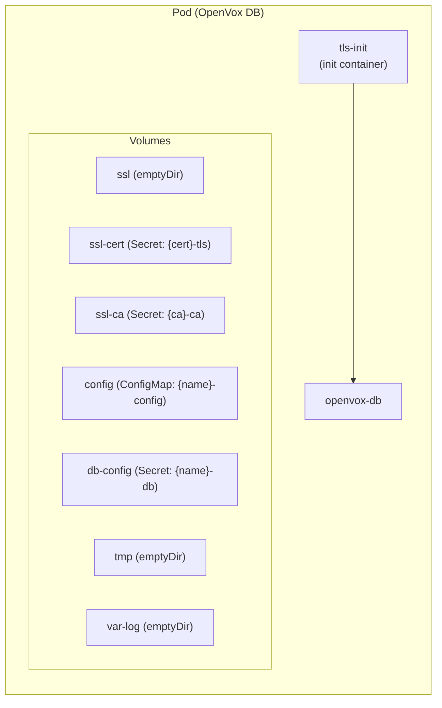

# Database

A Database creates a Deployment of OpenVox DB pods. It references a Certificate for SSL and connects to an external PostgreSQL instance. The operator does not manage PostgreSQL itself -- users provision it externally (e.g. via CloudNativePG).

## Example

```yaml
apiVersion: openvox.voxpupuli.org/v1alpha1
kind: Database
metadata:
  name: production-db
spec:
  certificateRef: production-db-cert
  image:
    repository: ghcr.io/slauger/openvox-db
    tag: latest
    pullPolicy: IfNotPresent
  postgres:
    host: pg-rw.openvox.svc
    port: 5432
    database: openvoxdb
    credentialsSecretRef: pg-credentials
    sslMode: require
  replicas: 1
  javaArgs: "-Xms256m -Xmx256m"
  resources:
    requests:
      cpu: 250m
      memory: 512Mi
    limits:
      memory: 1Gi
```

## Spec

| Field | Type | Default | Description |
|---|---|---|---|
| `certificateRef` | string | **required** | Reference to the Certificate whose SSL Secret is mounted |
| `image` | [ImageSpec](index.md#imagespec) | **required** | Container image for OpenVox DB |
| `postgres` | [PostgresSpec](#postgresspec) | **required** | External PostgreSQL connection settings |
| `resources` | ResourceRequirements | - | CPU/memory requests and limits |
| `replicas` | int32 | `1` | Number of pod replicas |
| `javaArgs` | string | - | JVM arguments |
| `service` | [DatabaseServiceSpec](#databaseservicespec) | - | Service configuration |

### PostgresSpec

| Field | Type | Default | Description |
|---|---|---|---|
| `host` | string | **required** | PostgreSQL hostname |
| `port` | int32 | `5432` | PostgreSQL port |
| `database` | string | `openvoxdb` | PostgreSQL database name |
| `credentialsSecretRef` | string | **required** | Secret containing `username` and `password` keys |
| `sslMode` | string | `require` | SSL mode (`disable`, `allow`, `prefer`, `require`, `verify-ca`, `verify-full`) |

### DatabaseServiceSpec

| Field | Type | Default | Description |
|---|---|---|---|
| `type` | string | `ClusterIP` | Service type |
| `port` | int32 | `8081` | Service port |
| `annotations` | map[string]string | - | Additional Service annotations |

## Status

| Field | Type | Description |
|---|---|---|
| `phase` | string | Current lifecycle phase |
| `url` | string | HTTPS endpoint of the Database Service (e.g. `https://production-db:8081`) |
| `ready` | int32 | Number of ready replicas |
| `desired` | int32 | Desired number of replicas |
| `conditions` | []Condition | `Ready` |

## Phases

| Phase | Description |
|---|---|
| `Pending` | Database created, resolving references |
| `WaitingForCert` | Certificate not yet `Signed` |
| `Running` | Deployment created and running |
| `Error` | Reconciliation failed |

## Pod Anatomy



The init container copies TLS certificates from Secrets into the writable `ssl` emptyDir, naming files by the Certificate's `certname` as required by OpenVox DB's jetty configuration.

## Created Resources

| Resource | Name | Description |
|---|---|---|
| Deployment | `{name}` | OpenVox DB pods |
| Service | `{name}` | HTTPS endpoint on port 8081 |
| ConfigMap | `{name}-config` | `jetty.ini` and `config.ini` |
| Secret | `{name}-db` | `database.ini` with PostgreSQL credentials |

## Prerequisites

- A [Certificate](certificate.md) must be created and reach `Signed` phase
- An external PostgreSQL instance must be available at the configured host/port
- A Kubernetes Secret with `username` and `password` keys for PostgreSQL authentication
