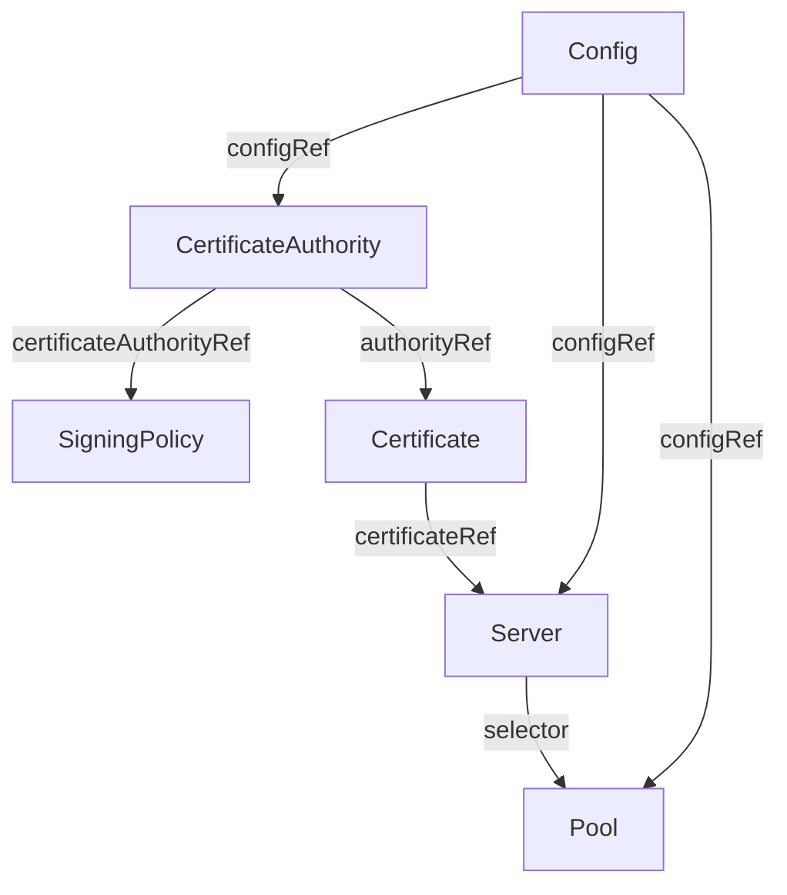

# CRD Reference

All resources use the API group `openvox.voxpupuli.org/v1alpha1`.

## Resource Hierarchy

Each resource references its parent. The operator reconciles them in order: a Config must exist before a CertificateAuthority can reference it, a CertificateAuthority must be `Ready` before a Certificate can be signed, and a Certificate must be `Signed` before a Server creates its Deployment. SigningPolicies can be created at any time and take effect within ~60 seconds.

## Resources

| Kind | Short Name | Purpose |
|---|---|---|
| [Config](config.md) | `cfg` | Shared config (puppet.conf, auth.conf), PuppetDB connection |
| [CertificateAuthority](certificateauthority.md) | `ca` | CA infrastructure: PVC, keys, 3 CA Secrets (cert, key, CRL) |
| [SigningPolicy](signingpolicy.md) | `sp` | Declarative CSR signing policy for a CA |
| [Certificate](certificate.md) | `cert` | Lifecycle of a single certificate (request, sign) |
| [Server](server.md) | - | OpenVox Server Deployment (CA and/or server role) |
| [Pool](pool.md) | - | Kubernetes Service that selects Server Pods |

## Shared Types

These types are reused across multiple CRDs.

### ImageSpec

| Field | Type | Default | Description |
|---|---|---|---|
| `repository` | string | `ghcr.io/slauger/openvox-server` | Container image repository |
| `tag` | string | `latest` | Container image tag |
| `pullPolicy` | string | `IfNotPresent` | Image pull policy |
| `pullSecrets` | []LocalObjectReference | - | Image pull secrets |

### StorageSpec

| Field | Type | Default | Description |
|---|---|---|---|
| `size` | string | `1Gi` | Requested storage size |
| `storageClass` | string | - | Storage class name (empty = default) |

### CodeSpec

Used by [Config](config.md) and [Server](server.md) to define the Puppet code source. Either `claimName` or `image` may be set, not both.

| Field | Type | Default | Description |
|---|---|---|---|
| `claimName` | string | - | Name of an existing PVC containing Puppet code |
| `image` | string | - | OCI image reference containing Puppet code (requires Kubernetes 1.31+) |
| `imagePullPolicy` | string | `IfNotPresent` | When to pull the code image |
| `imagePullSecret` | string | - | Secret name for pulling from private registries |
