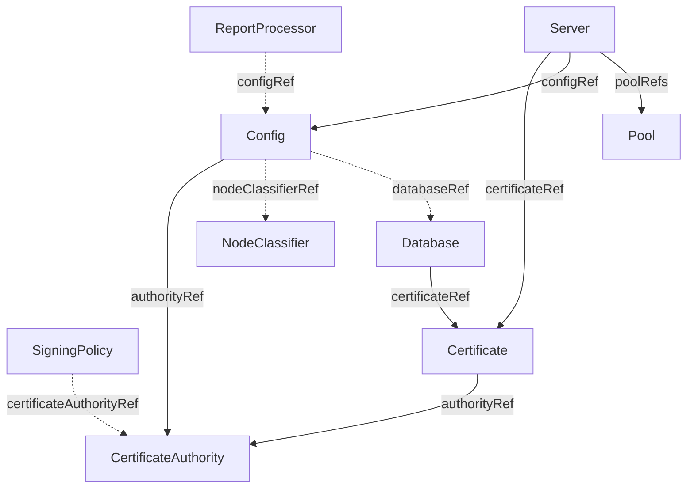

# CRD Reference

All resources use the API group `openvox.voxpupuli.org/v1alpha1`.

## Resource Hierarchy


```mermaid
graph TD
    Cfg["Config"]
    CA["CertificateAuthority"]
    SP["SigningPolicy"]
    NC["NodeClassifier"]
    RP["ReportProcessor"]
    Cert["Certificate"]
    Srv["Server"]
    DB["Database"]
    Pool["Pool"]

    Cfg -->|authorityRef| CA
    Cfg -.->|nodeClassifierRef| NC
    Cfg -.->|databaseRef| DB
    SP -.->|certificateAuthorityRef| CA
    Cert -->|authorityRef| CA
    Srv -->|certificateRef| Cert
    DB -->|certificateRef| Cert
    Srv -->|configRef| Cfg
    RP -.->|configRef| Cfg
    Srv -->|poolRefs| Pool
```

Each resource references its parent. The operator reconciles them in order: a Config references a CertificateAuthority via `authorityRef`, optionally a NodeClassifier via `nodeClassifierRef`, and optionally a Database via `databaseRef` (which auto-wires the PuppetDB connection URL). A CertificateAuthority must be `Ready` before a Certificate can be signed, and a Certificate must be `Signed` before a Server or Database creates its Deployment. SigningPolicies, NodeClassifiers, and ReportProcessors can be created at any time and take effect within ~60 seconds.

## Resources

| Kind | Short Name | Purpose |
|---|---|---|
| [Config](config.md) | `cfg` | Shared config (puppet.conf, auth.conf), OpenVox DB connection |
| [CertificateAuthority](certificateauthority.md) | `ca` | CA infrastructure: PVC, keys, 3 CA Secrets (cert, key, CRL) |
| [SigningPolicy](signingpolicy.md) | `sp` | Declarative CSR signing policy for a CA |
| [NodeClassifier](nodeclassifier.md) | `nc` | External Node Classifier (ENC) endpoint |
| [Certificate](certificate.md) | `cert` | Lifecycle of a single certificate (request, sign) |
| [Server](server.md) | - | OpenVox Server Deployment (CA and/or server role) |
| [Database](database.md) | `db` | OpenVox DB Deployment with external PostgreSQL |
| [Pool](pool.md) | - | Networking resource: Service for Servers that reference this Pool |
| [ReportProcessor](reportprocessor.md) | `rp` | Webhook-based report forwarding endpoint |

## Shared Types

These types are reused across multiple CRDs.

### ImageSpec

| Field | Type | Default | Description |
|---|---|---|---|
| `repository` | string | - | Container image repository |
| `tag` | string | - | Container image tag |
| `pullPolicy` | string | - | Image pull policy |
| `pullSecrets` | []LocalObjectReference | - | Image pull secrets |

No field here carries an API-level default. That is deliberate: a nested
default is applied whether or not the parent object was given, so a defaulted
field can never express "inherit from the Config" - it is simply never empty.

`repository` and `tag` are required on `Config` and `Database`. On `Server`
both are optional and fall back to the referenced `Config`, which is what lets
one Config drive a whole set of Servers.

`pullPolicy` follows the same rule, falling back to the Config and then to
`IfNotPresent`. `pullSecrets` behaves differently: a non-empty list on a
`Server` *replaces* the Config's rather than extending it, so a Server pulling
from another registry does not carry the Config's credentials along. Secrets
for code images are always added on top.

The registry defaults live in the Helm charts (`config.image.*`,
`database.image.*`), where changing them is a values change rather than a CRD
update.

### StorageSpec

| Field | Type | Default | Description |
|---|---|---|---|
| `size` | string | `1Gi` | Requested storage size |
| `storageClass` | string | - | Storage class name (empty = default) |

### CodeSpec

`code` on [Config](config.md) and [Server](server.md) is a **list** of code sources.
Each entry sets exactly one source (`claimName` **or** `image`, not both) and an
optional mount target (`environment` **or** `mountPath`, not both).

| Field | Type | Default | Description |
|---|---|---|---|
| `claimName` | string | - | Name of an existing PVC containing Puppet code (mutually exclusive with `image`) |
| `image` | string | - | OCI image reference containing Puppet code, Kubernetes 1.35+ or 1.31+ with feature gate (mutually exclusive with `claimName`) |
| `imagePullPolicy` | string | `IfNotPresent` | When to pull the code image |
| `imagePullSecret` | string | - | Secret name for pulling from private registries |
| `environment` | string | - | Mount this source as a single Puppet environment at `<environmentpath>/<environment>`. Must be unique across the list (mutually exclusive with `mountPath`) |
| `mountPath` | string | - | Mount this source at an absolute path under the Puppet codedir (`/etc/puppetlabs/code`), e.g. the global modules dir or hieradata (mutually exclusive with `environment`) |

**Mount target rules:**

- **0 entries** - an `emptyDir` is mounted at `environmentpath` so Puppet Server can
  bootstrap its default `production` environment.
- **1 entry without `environment`/`mountPath`** - the source is mounted as the whole
  `environments` tree at `environmentpath` (the pre-list behaviour).
- **More than 1 entry** - each entry must set `environment` or `mountPath`;
  `environment` values must be unique. `mountPath` must be under `/etc/puppetlabs/code`.

Entries are mounted read-only. A Server's `code` replaces (does not merge with) the
Config's `code`.

```yaml
code:
  - image: registry/control-repo-production:latest
    environment: production                 # -> <environmentpath>/production
  - claimName: shared-modules
    mountPath: /etc/puppetlabs/code/modules # global modules dir
```

### PodSecurityContextSpec

Used by [CertificateAuthority](certificateauthority.md), [Server](server.md) and [Database](database.md) to override the pod-level security context of managed pods. All fields are optional; an unset field keeps the operator default.

| Field | Type | Default | Description |
|---|---|---|---|
| `runAsUser` | int64 | `1001` | UID the pod runs as |
| `runAsGroup` | int64 | `0` | Primary GID the pod runs as |
| `runAsNonRoot` | bool | `true` | Require the pod to run as a non-root user |
| `fsGroup` | int64 | `1001` | Supplemental group applied to mounted volumes. The kubelet chowns the volume to this group, letting the non-root user write to CSI-provisioned volumes that would otherwise be owned by `root`. |
| `fsGroupChangePolicy` | string | `OnRootMismatch` | When volume ownership is changed to match `fsGroup` (`OnRootMismatch` or `Always`) |

By default the operator sets a matching `fsGroup` so managed pods can write to freshly provisioned CSI volumes (e.g. Ceph RBD/CephFS), which are typically owned by `root:root`. Override these fields on OpenShift or PodSecurity-restricted namespaces that assign their own UID/GID ranges.

## Status: phases and conditions

Every resource reports both a `phase` and a list of `conditions`. They serve
different purposes and are not interchangeable.

**`status.phase`** is a coarse, human-readable summary -- the thing you want in
a `kubectl get` column. It is derived on every reconcile and is never read back
as controller input, so editing or losing it does not change what the operator
does.

**`status.conditions`** is the machine-readable contract. Automation, scripts
and the controllers themselves check conditions, not phases. Each condition
carries `observedGeneration`, so you can tell whether it refers to the spec you
are looking at:

```console
$ kubectl get certificate web -o jsonpath='{.status.conditions[?(@.type=="CertSigned")].status}'
True
```

**`status.observedGeneration`** records the `metadata.generation` the controller
last processed successfully. When it lags behind `metadata.generation`, the rest
of the status has not caught up with the current spec yet.

### Readiness conditions

| Resource | Condition | True when |
|---|---|---|
| `Config` | `ConfigReady` | Configuration ConfigMaps and Secrets are rendered |
| `CertificateAuthority` | `CAReady` | CA Secrets exist and certificates can be signed; also set for an external CA |
| `CertificateAuthority` | `OperatorSigningReady` | The operator's own signing certificate is available |
| `CertificateAuthority` | `DeletionBlocked` | Deletion is held back by referencing Certificates |
| `Certificate` | `CertSigned` | The certificate is signed and its Secret is available |
| `Server` | `Ready` | At least one replica is ready |
| `Database` | `Ready` | At least one replica is ready |
| `Pool` | `Ready` | At least one ready endpoint is behind the Service |
| `SigningPolicy`, `NodeClassifier`, `ReportProcessor` | `Ready` | The resource was rendered into the configuration the servers mount |

Any resource can additionally carry `Paused` -- see
[Pausing Reconciliation](../guides/pausing-reconciliation.md).
