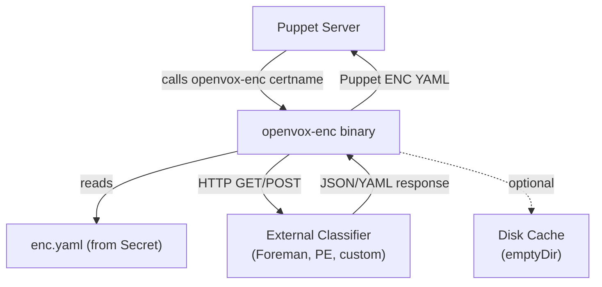

# NodeClassifier

A NodeClassifier defines an External Node Classifier (ENC) endpoint for Puppet Server. It specifies how to query an external service for node classification data (classes, parameters, environment).

NodeClassifier is a standalone resource referenced by Config via `nodeClassifierRef`. This allows reusing the same classifier across multiple Configs.

## Example

### Foreman (GET, mTLS)

```yaml
apiVersion: openvox.voxpupuli.org/v1alpha1
kind: NodeClassifier
metadata:
  name: foreman
spec:
  url: https://foreman.example.com
  request:
    method: GET
    path: /node/{certname}
  response:
    format: yaml
  auth:
    mtls: true
  cache:
    enabled: true
```

### Puppet Enterprise (POST, Token Auth)

```yaml
apiVersion: openvox.voxpupuli.org/v1alpha1
kind: NodeClassifier
metadata:
  name: pe-classifier
spec:
  url: https://pe-console.example.com:4433
  request:
    method: POST
    path: /classifier-api/v1/classified/nodes/{certname}
    body: facts
  response:
    format: json
  auth:
    token:
      header: X-Authentication
      secretKeyRef:
        name: pe-rbac-token
        key: token
  cache:
    enabled: true
```

### Generic HTTP (Bearer Token)

```yaml
apiVersion: openvox.voxpupuli.org/v1alpha1
kind: NodeClassifier
metadata:
  name: custom-enc
spec:
  url: https://enc-service.internal:8443
  request:
    method: GET
    path: /v1/classify/{certname}
  response:
    format: yaml
  auth:
    bearer:
      secretKeyRef:
        name: enc-api-token
        key: token
```

### Cluster-internal (no auth)

```yaml
apiVersion: openvox.voxpupuli.org/v1alpha1
kind: NodeClassifier
metadata:
  name: internal-enc
spec:
  url: http://enc-service.enc-system.svc:8080
  request:
    method: GET
    path: /enc/{certname}
  response:
    format: yaml
```

### Config referencing a NodeClassifier

```yaml
apiVersion: openvox.voxpupuli.org/v1alpha1
kind: Config
metadata:
  name: production
spec:
  image: ...
  authorityRef: production-ca
  nodeClassifierRef: foreman
```

## Spec

| Field | Type | Default | Description |
|---|---|---|---|
| `url` | string | **required** | Base URL of the classifier service |
| `request` | [NodeClassifierRequest](#nodeclassifierrequest) | **required** | HTTP request configuration |
| `response` | [NodeClassifierResponse](#nodeclassifierresponse) | **required** | Response interpretation settings |
| `timeoutSeconds` | int32 | `10` | HTTP request timeout |
| `auth` | [NodeClassifierAuth](#nodeclassifierauth) | - | Authentication method |
| `cache` | [NodeClassifierCache](#nodeclassifiercache) | - | Disk caching settings |

### NodeClassifierRequest

| Field | Type | Default | Description |
|---|---|---|---|
| `method` | string | `GET` | HTTP method (`GET` or `POST`) |
| `path` | string | `/node/{certname}` | URL path template. `{certname}` is replaced with the node's certname |
| `body` | string | - | POST body type: `facts` (PE-compatible JSON with certname + facts), `certname` (minimal JSON), or empty. Only allowed with `POST` method |

### NodeClassifierResponse

| Field | Type | Default | Description |
|---|---|---|---|
| `format` | string | `yaml` | Expected response format: `yaml` or `json` |

### NodeClassifierAuth

At most one authentication method may be configured.

| Field | Type | Description |
|---|---|---|
| `mtls` | bool | Use Puppet SSL certificates for mutual TLS |
| `token` | [TokenAuth](#tokenauth) | Send token via custom HTTP header |
| `bearer` | [SecretKeySelector](#secretkeyselector) | Send Bearer token via Authorization header |
| `basic` | [BasicAuth](#basicauth) | HTTP Basic Authentication |

### TokenAuth

| Field | Type | Description |
|---|---|---|
| `header` | string | HTTP header name (e.g. `X-Authentication`) |
| `secretKeyRef.name` | string | Name of the Secret |
| `secretKeyRef.key` | string | Key within the Secret |

### SecretKeySelector

| Field | Type | Description |
|---|---|---|
| `secretKeyRef.name` | string | Name of the Secret |
| `secretKeyRef.key` | string | Key within the Secret |

### BasicAuth

| Field | Type | Description |
|---|---|---|
| `secretRef.name` | string | Name of the Secret |
| `secretRef.usernameKey` | string | Key containing the username (default: `username`) |
| `secretRef.passwordKey` | string | Key containing the password (default: `password`) |

### NodeClassifierCache

| Field | Type | Default | Description |
|---|---|---|---|
| `enabled` | bool | `false` | Enable disk caching of classifier responses |
| `directory` | string | `/var/cache/openvox-enc` | Cache directory path inside the container |

## Status

| Field | Type | Description |
|---|---|---|
| `phase` | string | Current lifecycle phase |
| `conditions` | []Condition | `Ready` |

## Phases

| Phase | Description |
|---|---|
| `Active` | Classifier configuration is rendered and active |
| `Error` | Configuration error (e.g. referenced Secret not found) |

## How It Works

1. Create a NodeClassifier resource with your classifier endpoint configuration
2. Set `nodeClassifierRef` on your Config to reference the NodeClassifier
3. The operator renders an `enc.yaml` config into a Secret, mounted into Server pods
4. puppet.conf gets `node_terminus = exec` and `external_nodes = /usr/local/bin/openvox-enc`
5. When Puppet Server needs to classify a node, it calls the `openvox-enc` binary
6. The binary reads `enc.yaml`, queries the classifier service, and returns Puppet ENC YAML



When the classifier is unreachable and caching is enabled, the binary falls back to the last cached response for that node.
