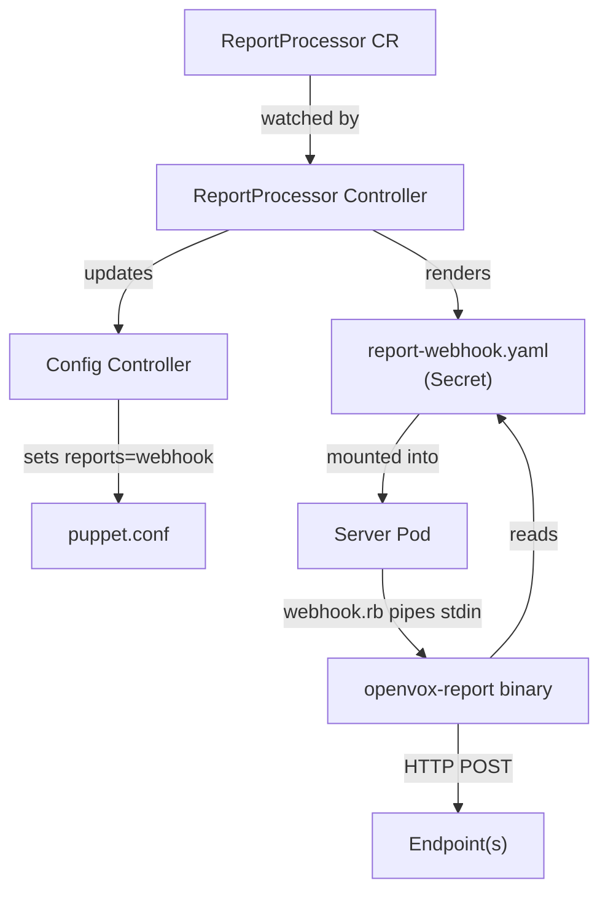

# ReportProcessor

A ReportProcessor defines a report forwarding endpoint for Puppet Server. It specifies where and how to send Puppet reports after each agent run.

ReportProcessor references a Config via `configRef`. Multiple ReportProcessors can reference the same Config -- all endpoints receive every report.

## Examples

### OpenVox DB (mTLS)

```yaml
apiVersion: openvox.voxpupuli.org/v1alpha1
kind: ReportProcessor
metadata:
  name: openvoxdb
spec:
  configRef: production
  processor: puppetdb
  url: "https://openvoxdb:8081"
  timeoutSeconds: 30
  auth:
    mtls: true
```

### Splunk HEC (Custom Header)

```yaml
apiVersion: openvox.voxpupuli.org/v1alpha1
kind: ReportProcessor
metadata:
  name: splunk
spec:
  configRef: production
  url: "https://splunk:8088/services/collector/event"
  timeoutSeconds: 30
  headers:
    - name: "Authorization"
      valueFrom:
        secretKeyRef:
          name: splunk-hec-token
          key: token
```

### Elasticsearch (Basic Auth)

```yaml
apiVersion: openvox.voxpupuli.org/v1alpha1
kind: ReportProcessor
metadata:
  name: elasticsearch
spec:
  configRef: production
  url: "https://elasticsearch:9200/puppet-reports/_doc"
  timeoutSeconds: 30
  auth:
    basic:
      secretRef:
        name: elasticsearch-credentials
        usernameKey: username
        passwordKey: password
```

### Generic Webhook (Bearer Token)

```yaml
apiVersion: openvox.voxpupuli.org/v1alpha1
kind: ReportProcessor
metadata:
  name: custom-webhook
spec:
  configRef: production
  url: "https://report-service.internal:8443/v1/reports"
  timeoutSeconds: 30
  auth:
    bearer:
      secretKeyRef:
        name: webhook-api-token
        key: token
```

### Cluster-internal (no auth)

```yaml
apiVersion: openvox.voxpupuli.org/v1alpha1
kind: ReportProcessor
metadata:
  name: internal-collector
spec:
  configRef: production
  url: "http://report-collector.monitoring.svc:8080/reports"
  timeoutSeconds: 10
```

## Spec

| Field | Type | Default | Description |
|---|---|---|---|
| `configRef` | string | **required** | Name of the Config this ReportProcessor belongs to |
| `processor` | string | `""` (generic) | Processor type. `puppetdb` for PuppetDB Wire Format v8 transformation, empty for generic forwarding |
| `url` | string | **required** | Endpoint URL to forward reports to |
| `timeoutSeconds` | int32 | `30` | HTTP request timeout |
| `auth` | [ReportProcessorAuth](#reportprocessorauth) | - | Authentication method |
| `headers` | [][HTTPHeader](#httpheader) | - | Custom HTTP headers |

### ReportProcessorAuth

At most one authentication method may be configured.

| Field | Type | Description |
|---|---|---|
| `mtls` | bool | Use Puppet SSL certificates for mutual TLS |
| `token` | [TokenAuth](#tokenauth) | Send token via custom HTTP header |
| `bearer` | [SecretKeySelector](#secretkeyselector) | Send Bearer token via Authorization header |
| `basic` | [BasicAuth](#basicauth) | HTTP Basic Authentication |

### TokenAuth

| Field | Type | Description |
|---|---|---|
| `header` | string | HTTP header name (e.g. `X-Authentication`) |
| `secretKeyRef.name` | string | Name of the Secret |
| `secretKeyRef.key` | string | Key within the Secret |

### SecretKeySelector

| Field | Type | Description |
|---|---|---|
| `secretKeyRef.name` | string | Name of the Secret |
| `secretKeyRef.key` | string | Key within the Secret |

### BasicAuth

| Field | Type | Description |
|---|---|---|
| `secretRef.name` | string | Name of the Secret |
| `secretRef.usernameKey` | string | Key containing the username (default: `username`) |
| `secretRef.passwordKey` | string | Key containing the password (default: `password`) |

### HTTPHeader

Either `value` or `valueFrom` may be set, not both.

| Field | Type | Description |
|---|---|---|
| `name` | string | HTTP header name |
| `value` | string | Literal header value |
| `valueFrom` | [HTTPHeaderValueFrom](#httpheadervaluefrom) | Reference to Secret or ConfigMap for the value |

### HTTPHeaderValueFrom

| Field | Type | Description |
|---|---|---|
| `secretKeyRef` | [SecretKeyRef](#secretkeyselector) | Reference a key in a Secret |
| `configMapKeyRef` | [ConfigMapKeyRef](#configmapkeyref) | Reference a key in a ConfigMap |

### ConfigMapKeyRef

| Field | Type | Description |
|---|---|---|
| `name` | string | Name of the ConfigMap |
| `key` | string | Key within the ConfigMap |

## Status

| Field | Type | Description |
|---|---|---|
| `phase` | string | Current lifecycle phase |
| `conditions` | []Condition | `Ready` |

## Phases

| Phase | Description |
|---|---|
| `Active` | Report processor configuration is rendered and active |
| `Error` | Configuration error (e.g. referenced Secret not found) |

## Processor Types

### Generic (default)

When `processor` is empty, the report is forwarded as-is in Puppet's `to_data_hash` JSON format. This is suitable for Splunk, Elasticsearch, custom webhooks, or any endpoint that can accept arbitrary JSON.

### PuppetDB

When `processor: puppetdb`, the binary transforms the report to [PuppetDB Wire Format v8](https://www.puppet.com/docs/puppetdb/latest/api/wire_format/report_format_v8.html) and POSTs it to `<url>/pdb/cmd/v1`. The `/pdb/cmd/v1` path is appended automatically -- configure `url` as the OpenVox DB base URL only.

## How It Works



1. Create a ReportProcessor with your endpoint configuration
2. Set `configRef` to reference your Config
3. The operator renders `report-webhook.yaml` into a Secret
4. The Config controller adds `webhook` to the `reports` setting in puppet.conf
5. Server pods mount the Secret and receive rolling restarts on config changes
6. On each Puppet run, `webhook.rb` pipes the report to `openvox-report`, which forwards it to all configured endpoints
