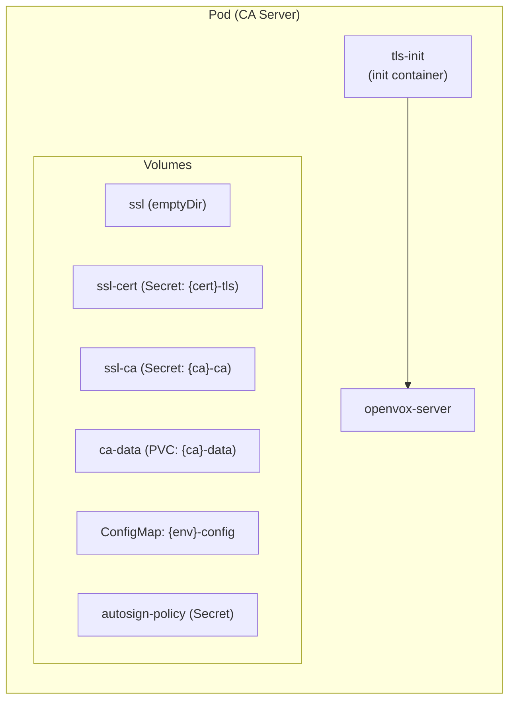
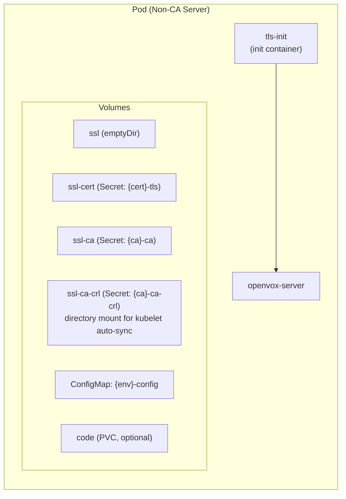

# Server

A Server creates a Deployment of OpenVox Server pods. It references a Certificate for SSL and a Config for shared configuration. A Server can run as CA, as a catalog server, or both. Servers declare which [Pools](pool.md) they join via `poolRefs`.

## Example

```yaml
apiVersion: openvox.voxpupuli.org/v1alpha1
kind: Server
metadata:
  name: production-ca
spec:
  configRef: production
  certificateRef: production-cert
  poolRefs: [production-ca, production-server]
  ca: true
  server: true
  replicas: 1
  javaArgs: "-Xms1g -Xmx2g"
  maxActiveInstances: 4
```

## Spec

| Field | Type | Default | Description |
|---|---|---|---|
| `configRef` | string | **required** | Reference to the Config |
| `certificateRef` | string | **required** | Reference to the Certificate whose SSL Secret is mounted |
| `poolRefs` | []string | - | List of [Pool](pool.md) names this Server joins |
| `image` | [ImageSpec](index.md#imagespec) | - | Override the Config's default image |
| `ca` | bool | `false` | Enable CA role (mounts CA PVC) |
| `server` | bool | `true` | Enable server role (catalog compilation, file serving) |
| `replicas` | int32 | `1` | Number of pod replicas |
| `autoscaling` | [AutoscalingSpec](#autoscalingspec) | - | HPA configuration |
| `resources` | ResourceRequirements | - | CPU/memory requests and limits |
| `javaArgs` | string | `-Xms512m -Xmx1024m` | JVM arguments |
| `maxActiveInstances` | int32 | `2` | Number of JRuby instances per pod |
| `code` | [CodeSpec](index.md#codespec) | - | Override the Config's code volume |
| `topologySpreadConstraints` | []TopologySpreadConstraint | - | Pod spread constraints across topology domains |
| `affinity` | Affinity | - | Pod affinity/anti-affinity rules |
| `pdb` | [PDBSpec](#pdbspec) | - | PodDisruptionBudget configuration |

### PDBSpec

| Field | Type | Default | Description |
|---|---|---|---|
| `enabled` | bool | `false` | Activate the PodDisruptionBudget |
| `minAvailable` | int or string | - | Minimum pods that must be available (mutually exclusive with `maxUnavailable`) |
| `maxUnavailable` | int or string | - | Maximum pods that can be unavailable (mutually exclusive with `minAvailable`) |

### AutoscalingSpec

| Field | Type | Default | Description |
|---|---|---|---|
| `enabled` | bool | `false` | Activate HPA |
| `minReplicas` | int32 | `1` | Minimum replicas |
| `maxReplicas` | int32 | `5` | Maximum replicas |
| `targetCPU` | int32 | `75` | Target CPU utilization percentage |

## Status

| Field | Type | Description |
|---|---|---|
| `phase` | string | Current lifecycle phase |
| `ready` | int32 | Number of ready replicas |
| `desired` | int32 | Desired number of replicas |
| `conditions` | []Condition | `SSLBootstrapped`, `Ready` |

## Phases

| Phase | Description |
|---|---|
| `Pending` | Server created, resolving references |
| `WaitingForCert` | Certificate not yet `Signed` |
| `Running` | Deployment created and running |
| `Error` | Reconciliation failed |

## Deployment Strategy

| Role | Strategy | Reason |
|---|---|---|
| CA (`ca: true`) | `Recreate` | Only one pod can write to the CA PVC at a time |
| Server only | `RollingUpdate` | Zero-downtime updates for stateless catalog compilation |

## Pod Anatomy

The operator builds different pod specs for CA and non-CA servers:





Key differences:

| | CA Server | Non-CA Server |
|---|---|---|
| CA PVC | Mounted read-write | Not mounted |
| CRL | Read from CA PVC | Mounted as directory volume (kubelet auto-sync) |
| Autosign Policy | Mounted from Secret | Not mounted |
| webserver.conf | `webserver-ca.conf` (CRL from PVC) | `webserver.conf` (CRL from Secret mount) |
| ca.cfg | `ca-enabled.cfg` | `ca-disabled.cfg` |
| Strategy | Recreate | RollingUpdate |

## Created Resources

| Resource | Name | Description |
|---|---|---|
| Deployment | `{name}` | OpenVox Server pods |
| HPA | `{name}` | Only when `autoscaling.enabled: true` |
| PDB | `{name}` | Only when `pdb.enabled: true` |
