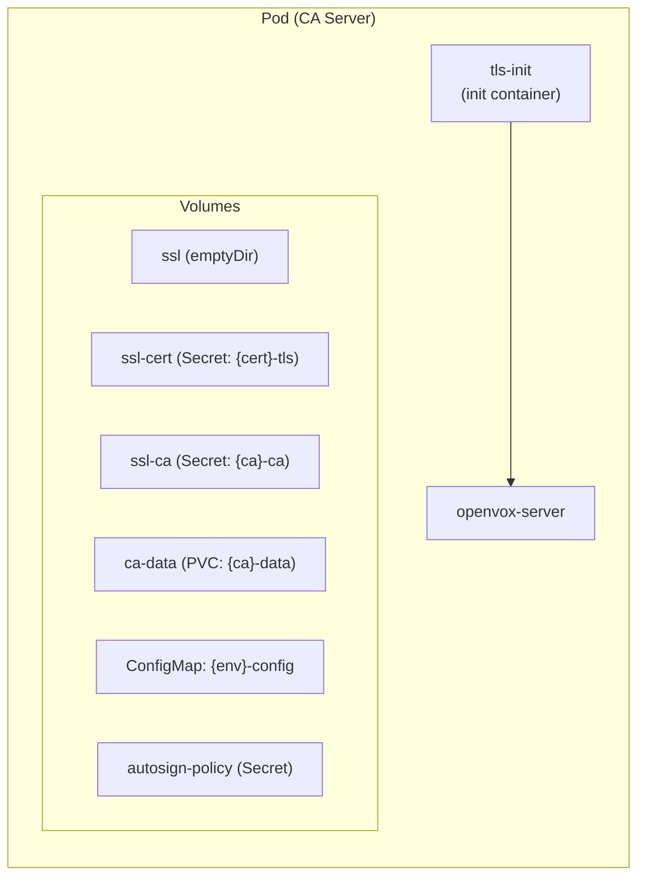
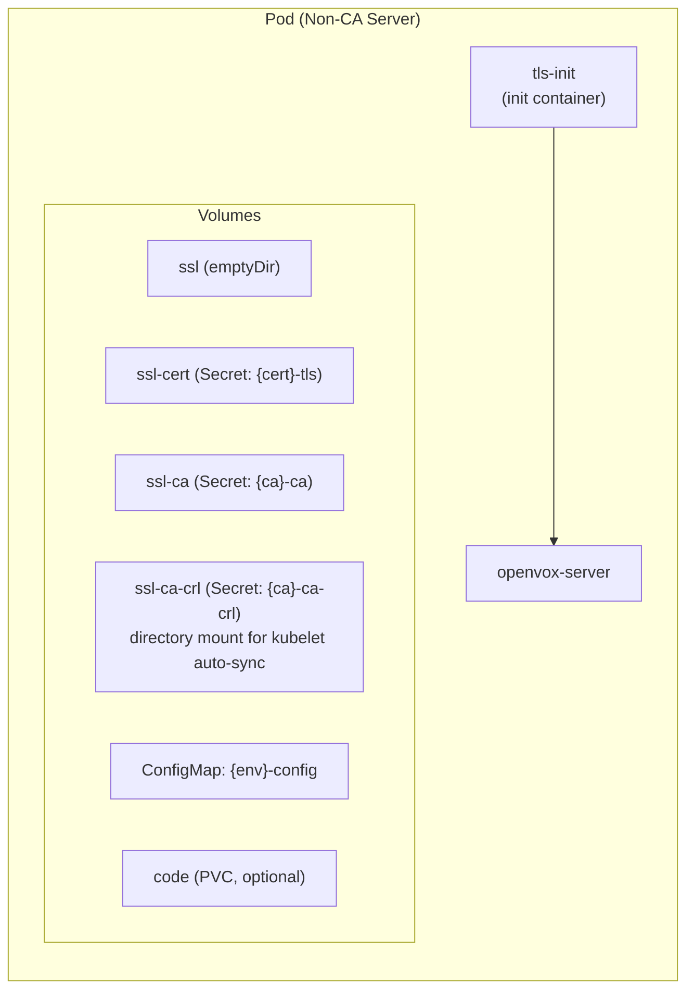

# Server

A Server creates a Deployment of OpenVox Server pods. It references a Certificate for SSL and a Config for shared configuration. A Server can run as CA, as a catalog server, or both. Servers declare which [Pools](pool.md) they join via `poolRefs`.

## Example

```yaml
apiVersion: openvox.voxpupuli.org/v1alpha1
kind: Server
metadata:
  name: production-ca
spec:
  configRef: production
  certificateRef: production-cert
  poolRefs: [production-ca, production-server]
  ca: true
  server: true
  replicas: 1
  javaArgs: "-Xms1g -Xmx2g"
  maxActiveInstances: 4
```

## Spec

| Field | Type | Default | Description |
|---|---|---|---|
| `configRef` | string | **required** | Reference to the Config |
| `certificateRef` | string | **required** | Reference to the Certificate whose SSL Secret is mounted |
| `poolRefs` | []string | - | List of [Pool](pool.md) names this Server joins |
| `image` | [ImageSpec](index.md#imagespec) | - | Override the Config's default image |
| `ca` | bool | `false` | Enable CA role (mounts CA PVC) |
| `server` | bool | `true` | Enable server role (catalog compilation, file serving) |
| `replicas` | int32 | `1` | Number of pod replicas |
| `autoscaling` | [AutoscalingSpec](#autoscalingspec) | - | HPA configuration |
| `resources` | ResourceRequirements | - | CPU/memory requests and limits |
| `javaArgs` | string | `-Xms512m -Xmx1024m` | JVM arguments |
| `maxActiveInstances` | int32 | `1` | Number of JRuby instances per pod |
| `code` | [[]CodeSpec](index.md#codespec) | - | Override the Config's code sources (replace, not merge). A list; see [CodeSpec](index.md#codespec) |
| `topologySpreadConstraints` | []TopologySpreadConstraint | - | Pod spread constraints across topology domains |
| `affinity` | Affinity | - | Pod affinity/anti-affinity rules |
| `pdb` | [PDBSpec](#pdbspec) | - | PodDisruptionBudget configuration |
| `priorityClassName` | string | - | PriorityClass name for Server pods |
| `networkPolicy` | [NetworkPolicySpec](#networkpolicyspec) | - | NetworkPolicy configuration |
| `extraEnv` | []EnvVar | - | Extra environment variables, appended after the operator-managed ones |
| `envFrom` | []EnvFromSource | - | ConfigMap/Secret sources to populate environment variables from |
| `extraVolumes` | []Volume | - | Extra volumes added to the Server pods |
| `extraVolumeMounts` | []VolumeMount | - | Extra volume mounts for the `openvox-server` container |
| `readOnlyRootFilesystem` | *bool | *(inherits from Config)* | Overrides the Config's setting for this Server. One Config backs several Servers with different roles, so the CA and the compilers can differ. Unset inherits |
| `securityContext` | [PodSecurityContextSpec](index.md#podsecuritycontextspec) | - | Override pod-level security context (runAsUser/runAsGroup/fsGroup) |

### Extra Environment and Volumes

`extraEnv`, `envFrom`, `extraVolumes` and `extraVolumeMounts` pass straight through to
the pod spec, for material the operator does not manage itself: credentials for a
report processor, an ENC that talks to a CMDB, a client certificate for an external
API. They are appended after the operator-managed entries, so a name or path
collision with an operator volume is rejected by the API server rather than silently
overriding it.

Puppet code is not one of these cases. The code volume, the global modules directory
and hieradata belong under [`code`](index.md#codespec), which handles image volumes,
pull secrets and the read-only bootstrap.

```yaml
spec:
  extraEnv:
    - name: INVENTORY_API_URL
      value: https://inventory.internal
  envFrom:
    - secretRef:
        name: server-extra-env
  extraVolumes:
    - name: autosign-client
      secret:
        secretName: autosign-client
  extraVolumeMounts:
    - name: autosign-client
      mountPath: /etc/puppetlabs/autosign-client
      readOnly: true
```

### PDBSpec

| Field | Type | Default | Description |
|---|---|---|---|
| `enabled` | bool | `false` | Activate the PodDisruptionBudget |
| `minAvailable` | int or string | - | Minimum pods that must be available (mutually exclusive with `maxUnavailable`) |
| `maxUnavailable` | int or string | - | Maximum pods that can be unavailable (mutually exclusive with `minAvailable`) |

### NetworkPolicySpec

| Field | Type | Default | Description |
|---|---|---|---|
| `enabled` | bool | `false` | Activate the NetworkPolicy |
| `additionalIngress` | []NetworkPolicyIngressRule | - | Extra ingress rules appended to the defaults |

When enabled, the default policy allows TCP/8140 from all sources (agents may connect from outside the cluster). Additional ingress rules are appended to this default.

### AutoscalingSpec

| Field | Type | Default | Description |
|---|---|---|---|
| `enabled` | bool | `false` | Activate HPA |
| `minReplicas` | int32 | `1` | Minimum replicas |
| `maxReplicas` | int32 | `5` | Maximum replicas |
| `targetCPU` | int32 | `75` | Target CPU utilization percentage |

## Status

| Field | Type | Description |
|---|---|---|
| `phase` | string | Current lifecycle phase |
| `ready` | int32 | Number of ready replicas |
| `desired` | int32 | Desired number of replicas |
| `observedGeneration` | int64 | The `.metadata.generation` the status was last derived from |
| `conditions` | []Condition | See below |

### Conditions

| Type | Reason | Meaning |
|---|---|---|
| `SSLBootstrapped` | `CertificateSigned` | The referenced Certificate is signed, so the pods have TLS material |
| `SSLBootstrapped` | `CertificateNotFound` | `spec.certificateRef` points at a Certificate that does not exist |
| `SSLBootstrapped` | `CertificateNotSigned` | The Certificate exists but has not been signed yet |
| `Ready` | `ReplicasReady` | At least one replica is ready |
| `Ready` | `ReplicasNotReady` | No replica is ready yet |

## Phases

| Phase | Description |
|---|---|
| `Pending` | Server created, resolving references |
| `WaitingForCert` | Certificate not yet `Signed` |
| `Running` | Deployment created and running |
| `Error` | Defined in the API, but never set by the controller (see below) |

`Error` is part of the API but the controller never assigns it. A failing
reconcile leaves the phase at its previous value, reports the reason in the
`Ready` condition and emits a warning event. Watch the condition rather than
the phase:

```bash
kubectl get server <name> -o jsonpath='{range .status.conditions[*]}{.type}={.status} {.reason}: {.message}{"\n"}{end}'
```


## Deployment Strategy

| Role | Strategy | Reason |
|---|---|---|
| CA (`ca: true`) | `Recreate` | Only one pod can write to the CA PVC at a time |
| Server only | `RollingUpdate` | Zero-downtime updates for stateless catalog compilation |

## Pod Anatomy

The operator builds different pod specs for CA and non-CA servers:


```mermaid
flowchart LR
    subgraph "Pod (CA Server)"
        direction TB
        Init1["tls-init<br/>(init container)"]
        Main1["openvox-server"]

        Init1 --> Main1

        subgraph Volumes
            SSL1["ssl (emptyDir)"]
            CERT1["ssl-cert (Secret: {cert}-tls)"]
            CA1["ssl-ca (Secret: {ca}-ca)"]
            CAPVC["ca-data (PVC: {ca}-data)"]
            CFG1["ConfigMap: {env}-config"]
            ASP["autosign-policy (Secret)"]
        end
    end
```


```mermaid
flowchart LR
    subgraph "Pod (Non-CA Server)"
        direction TB
        Init2["tls-init<br/>(init container)"]
        Main2["openvox-server"]

        Init2 --> Main2

        subgraph Volumes
            SSL2["ssl (emptyDir)"]
            CERT2["ssl-cert (Secret: {cert}-tls)"]
            CA2["ssl-ca (Secret: {ca}-ca)"]
            CRL["ssl-ca-crl (Secret: {ca}-ca-crl)<br/>directory mount for kubelet auto-sync"]
            CFG2["ConfigMap: {env}-config"]
            CODE["code (PVC, optional)"]
        end
    end
```

Key differences:

| | CA Server | Non-CA Server |
|---|---|---|
| CA PVC | Mounted read-write | Not mounted |
| CRL | Read from CA PVC | Mounted as directory volume (kubelet auto-sync) |
| Autosign Policy | Mounted from Secret | Not mounted |
| webserver.conf | `webserver-ca.conf` (CRL from PVC) | `webserver.conf` (CRL from Secret mount) |
| ca.cfg | `ca-enabled.cfg` | `ca-disabled.cfg` |
| Strategy | Recreate | RollingUpdate |

### Image resolution

`repository` and `tag` on a Server override the Config's values individually;
an unset field falls back to the Config. `pullPolicy` follows the same rule and
defaults to `IfNotPresent` when neither sets it. `pullSecrets` is different: a
non-empty list on the Server *replaces* the Config's rather than extending it,
so a Server pulling from another registry does not carry the Config's
credentials along. Secrets for code images are always added on top.

## Created Resources

| Resource | Name | Description |
|---|---|---|
| Deployment | `{name}` | OpenVox Server pods |
| HPA | `{name}` | Only when `autoscaling.enabled: true` |
| PDB | `{name}` | Only when `pdb.enabled: true` |
| NetworkPolicy | `{name}-netpol` | Only when `networkPolicy.enabled: true` |
