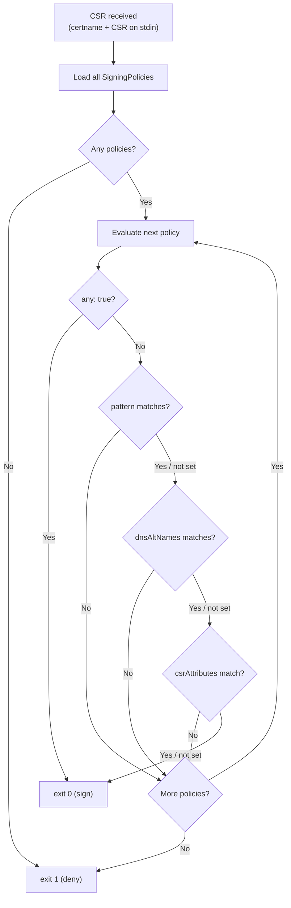

# SigningPolicy

A SigningPolicy defines a policy for automatic CSR signing against a CertificateAuthority. Multiple policies can reference the same CA — if **any** policy matches, the CSR is signed (OR logic between policies). Within a single policy, **all** set fields must match (AND logic).

## Example

```yaml
apiVersion: openvox.voxpupuli.org/v1alpha1
kind: SigningPolicy
metadata:
  name: auto-approve
spec:
  certificateAuthorityRef: production-ca
  any: true
```

### Pattern Matching

```yaml
apiVersion: openvox.voxpupuli.org/v1alpha1
kind: SigningPolicy
metadata:
  name: trusted-hosts
spec:
  certificateAuthorityRef: production-ca
  pattern:
    allow:
      - "*.example.com"
      - "web-*"
```

### DNS SAN Validation

```yaml
apiVersion: openvox.voxpupuli.org/v1alpha1
kind: SigningPolicy
metadata:
  name: allow-internal-sans
spec:
  certificateAuthorityRef: production-ca
  pattern:
    allow:
      - "*.example.com"
  dnsAltNames:
    allow:
      - "*.internal.example.com"
      - "*.svc.cluster.local"
```

### CSR Attribute Matching

Match CSR extension attributes with inline values or Secret references:

```yaml
apiVersion: openvox.voxpupuli.org/v1alpha1
kind: SigningPolicy
metadata:
  name: bootstrap-key
spec:
  certificateAuthorityRef: production-ca
  csrAttributes:
    - name: pp_preshared_key
      valueFrom:
        secretKeyRef:
          name: signing-psk
          key: psk
```

### Combined (AND within policy)

```yaml
apiVersion: openvox.voxpupuli.org/v1alpha1
kind: SigningPolicy
metadata:
  name: trusted-with-psk
spec:
  certificateAuthorityRef: production-ca
  pattern:
    allow:
      - "*.example.com"
  csrAttributes:
    - name: pp_preshared_key
      valueFrom:
        secretKeyRef:
          name: signing-psk
          key: psk
    - name: pp_environment
      value: production
```

This policy requires a matching certname pattern **and** a valid PSK **and** the correct `pp_environment` extension.

## Spec

| Field | Type | Default | Description |
|---|---|---|---|
| `certificateAuthorityRef` | string | **required** | Reference to the CertificateAuthority |
| `any` | bool | `false` | Sign all CSRs unconditionally |
| `pattern` | [PatternSpec](#patternspec) | - | Certname glob matching |
| `dnsAltNames` | [PatternSpec](#patternspec) | - | Allowed DNS SAN patterns. If unset and `any` is false, CSRs with SANs are denied |
| `csrAttributes` | [][CSRAttributeMatch](#csrattributematch) | - | CSR extension attributes that must all match (AND) |

### PatternSpec

| Field | Type | Default | Description |
|---|---|---|---|
| `allow` | []string | **required** | Glob patterns; certname must match at least one |

### CSRAttributeMatch

| Field | Type | Default | Description |
|---|---|---|---|
| `name` | string | **required** | CSR extension attribute name (e.g. `pp_preshared_key`, `pp_environment`) |
| `value` | string | - | Expected value (inline) |
| `valueFrom` | [SecretKeySelector](#secretkeyselector) | - | Expected value from a Secret |

Either `value` or `valueFrom` must be set.

### SecretKeySelector

| Field | Type | Default | Description |
|---|---|---|---|
| `secretKeyRef.name` | string | **required** | Name of the Secret |
| `secretKeyRef.key` | string | **required** | Key within the Secret |

## Status

| Field | Type | Description |
|---|---|---|
| `phase` | string | Current lifecycle phase |
| `conditions` | []Condition | `Ready` |

## Phases

| Phase | Description |
|---|---|
| `Active` | Policy is rendered and active |
| `Error` | Policy has a configuration error (e.g. referenced Secret not found) |

## How It Works

1. The operator collects all SigningPolicies for a CertificateAuthority
2. It renders a policy config YAML into a Secret, mounted into the CA pod
3. puppet.conf always points to the `openvox-autosign` binary (static config, no pod restarts)
4. When a SigningPolicy changes, the operator updates the Secret. Kubelet syncs the mounted file (~60s). **No pod restart needed.**

The `openvox-autosign` binary shipped in the openvox-server container image evaluates policies at CSR signing time:



- **Between policies**: OR — any matching policy is sufficient
- **Within a policy**: AND — all set fields must match
- **No policies** → deny all
- **`any: true`** → approve unconditionally

## Supported CSR Attributes

All standard Puppet/OpenVox CSR extension attributes are supported, including:

| Attribute | OID |
|---|---|
| `pp_preshared_key` | `1.3.6.1.4.1.34380.1.1.4` |
| `pp_environment` | `1.3.6.1.4.1.34380.1.1.12` |
| `pp_role` | `1.3.6.1.4.1.34380.1.1.13` |
| `pp_auth_token` | `1.3.6.1.4.1.34380.1.3.2` |
| `challengePassword` | `1.2.840.113549.1.9.7` |

See the [Puppet CSR attributes documentation](https://www.puppet.com/docs/puppet/latest/ssl_attributes_extensions.html) for the full list.
