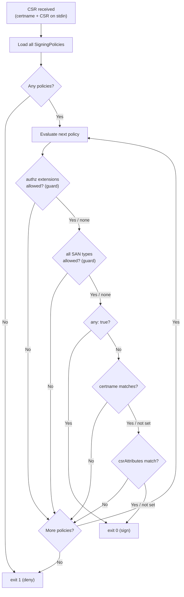

# SigningPolicy

A SigningPolicy defines a policy for automatic CSR signing against a CertificateAuthority. Multiple policies can reference the same CA -- if **any** policy matches, the CSR is signed (OR logic between policies). Within a single policy, **all** set fields must match (AND logic).

Signing has two planes:

- **Match plane** (`any`, `certnames`, `csrAttributes`) -- decides *whether a policy applies* to a CSR.
- **Guard plane** (`dnsAltNames`, `ipAltNames`, `uriAltNames`, `emailAltNames`, `extensions`) -- **fail-closed** constraints that decide *whether the CSR is safe to sign*. If a CSR carries a SAN type or a privileged authorization extension the policy does not explicitly allow, it is denied. The guard plane applies to **every** policy, including `any: true`, so no policy can implicitly grant a privileged extension.

## Example

```yaml
apiVersion: openvox.voxpupuli.org/v1alpha1
kind: SigningPolicy
metadata:
  name: auto-approve
spec:
  certificateAuthorityRef: production-ca
  any: true
```

### Certname Matching

```yaml
apiVersion: openvox.voxpupuli.org/v1alpha1
kind: SigningPolicy
metadata:
  name: trusted-hosts
spec:
  certificateAuthorityRef: production-ca
  certnames:
    allow:
      - "*.example.com"
      - "web-*"
```

### DNS SAN Validation

```yaml
apiVersion: openvox.voxpupuli.org/v1alpha1
kind: SigningPolicy
metadata:
  name: allow-internal-sans
spec:
  certificateAuthorityRef: production-ca
  certnames:
    allow:
      - "*.example.com"
  dnsAltNames:
    allow:
      - "*.internal.example.com"
      - "*.svc.cluster.local"
```

### IP / URI / Email SAN Validation

Each SAN type has its own fail-closed allowlist. `ipAltNames` uses **CIDR** ranges; `uriAltNames` and `emailAltNames` use wildcard patterns where `*` spans any characters (including `/` and `@`).

```yaml
apiVersion: openvox.voxpupuli.org/v1alpha1
kind: SigningPolicy
metadata:
  name: gateway-sans
spec:
  certificateAuthorityRef: production-ca
  certnames:
    allow:
      - "gateway-*"
  ipAltNames:
    allow:
      - "10.0.0.0/16"
      - "::1/128"
  uriAltNames:
    allow:
      - "spiffe://example.com/gateway/*"
  emailAltNames:
    allow:
      - "*@example.com"
```

A CSR carrying a SAN of a type whose allowlist is unset is denied.

### Checks that no policy can waive

Two conditions are evaluated before any policy is consulted. They apply to
every policy, `any: true` included.

**Reserved certnames.** The operator issues itself a certificate under
`{ca}-operator` for mTLS against the CA API, and the CA `auth.conf` grants
admin rights to that name as well as to the `pp_cli_auth` extension. An agent
holding a certificate under it would therefore be a CA admin. The operator
renders the name into the generated policy file, and the autosign binary
refuses it regardless of what any policy allows.

You do not configure this: the name is derived from the CertificateAuthority
and reserved automatically.

**Subject binding.** puppetserver takes the certname from the request path and
passes it to the autosign binary as an argument, while the CN lives in the CSR
subject. A CSR whose subject differs from the requested certname is refused,
so a policy cannot approve one name while the certificate is issued carrying
another.

### Authorization Extensions

Privileged authorization extensions (the `1.3.6.1.4.1.34380.1.3` arc: `pp_cli_auth`, `pp_authorization`, `pp_auth_token`) are **denied by default**, even for `any: true` policies. A certificate carrying `pp_cli_auth=true` is granted CA-admin access by the built-in auth.conf rules, so a CSR requesting it must be explicitly allowed:

```yaml
apiVersion: openvox.voxpupuli.org/v1alpha1
kind: SigningPolicy
metadata:
  name: ca-admin-bootstrap
spec:
  certificateAuthorityRef: production-ca
  certnames:
    allow:
      - "ca-admin.example.com"
  extensions:
    allow:
      - pp_cli_auth
```

Authorization-arc OIDs with no known Puppet name cannot be allow-listed and are always denied. Trusted-fact extensions (the `1.3.6.1.4.1.34380.1.1` arc, e.g. `pp_role`, `pp_environment`) are not gated.

### CSR Attribute Matching

Match CSR extension attributes with inline values or Secret references:

```yaml
apiVersion: openvox.voxpupuli.org/v1alpha1
kind: SigningPolicy
metadata:
  name: bootstrap-key
spec:
  certificateAuthorityRef: production-ca
  csrAttributes:
    - name: pp_preshared_key
      valueFrom:
        secretKeyRef:
          name: signing-psk
          key: psk
```

### Combined (AND within policy)

```yaml
apiVersion: openvox.voxpupuli.org/v1alpha1
kind: SigningPolicy
metadata:
  name: trusted-with-psk
spec:
  certificateAuthorityRef: production-ca
  certnames:
    allow:
      - "*.example.com"
  csrAttributes:
    - name: pp_preshared_key
      valueFrom:
        secretKeyRef:
          name: signing-psk
          key: psk
    - name: pp_environment
      value: production
```

This policy requires a matching certname pattern **and** a valid PSK **and** the correct `pp_environment` extension.

## Spec

| Field | Type | Default | Description |
|---|---|---|---|
| `certificateAuthorityRef` | string | **required** | Reference to the CertificateAuthority |
| `any` | bool | `false` | Sign all CSRs unconditionally |
| `certnames` | [PatternSpec](#patternspec) | - | Allowed certname glob patterns; the certname must match at least one |
| `dnsAltNames` | [PatternSpec](#patternspec) | - | Allowed DNS SAN glob patterns. If a CSR carries DNS SANs and this is unset, it is denied |
| `ipAltNames` | [PatternSpec](#patternspec) | - | Allowed IP SAN **CIDR** ranges. If a CSR carries IP SANs and this is unset, it is denied |
| `uriAltNames` | [PatternSpec](#patternspec) | - | Allowed URI SAN wildcard patterns (`*` spans `/`). If a CSR carries URI SANs and this is unset, it is denied |
| `emailAltNames` | [PatternSpec](#patternspec) | - | Allowed email SAN wildcard patterns (`*` spans `@`). If a CSR carries email SANs and this is unset, it is denied |
| `extensions` | [PatternSpec](#patternspec) | - | Puppet extension names a CSR may carry. Authorization-arc extensions are denied unless listed here (applies to `any: true` too) |
| `csrAttributes` | [][CSRAttributeMatch](#csrattributematch) | - | CSR extension attributes that must all match (AND) |

### PatternSpec

| Field | Type | Default | Description |
|---|---|---|---|
| `allow` | []string | **required** | Glob patterns; certname must match at least one |

### CSRAttributeMatch

| Field | Type | Default | Description |
|---|---|---|---|
| `name` | string | **required** | CSR extension attribute name (e.g. `pp_preshared_key`, `pp_environment`) |
| `value` | string | - | Expected value (inline) |
| `valueFrom` | [SecretKeySelector](#secretkeyselector) | - | Expected value from a Secret |

Either `value` or `valueFrom` must be set.

### SecretKeySelector

| Field | Type | Default | Description |
|---|---|---|---|
| `secretKeyRef.name` | string | **required** | Name of the Secret |
| `secretKeyRef.key` | string | **required** | Key within the Secret |

## Status

| Field | Type | Description |
|---|---|---|
| `phase` | string | Current lifecycle phase |
| `conditions` | []Condition | `Ready` |

## Phases

| Phase | Description |
|---|---|
| `Active` | Policy is rendered and active |
| `Error` | Policy has a configuration error (e.g. referenced Secret not found) |

## How It Works

1. The operator collects all SigningPolicies for a CertificateAuthority
2. It renders a policy config YAML into a Secret, mounted into the CA pod
3. puppet.conf always points to the `openvox-autosign` binary, so puppet.conf itself never changes when policies change
4. When a SigningPolicy changes, the operator rewrites the Secret and hashes it into the CA pod's `autosign-policy-secret-hash` annotation, which rolls the CA pod so the new policy applies automatically. **No manual restart needed.**

The `openvox-autosign` binary shipped in the openvox-server container image evaluates policies at CSR signing time:


```mermaid
flowchart TD
    Start["CSR received<br/>(certname + CSR on stdin)"] --> Load["Load all SigningPolicies"]
    Load --> Any{"Any policies?"}
    Any -->|No| Deny

    Any -->|Yes| Loop["Evaluate next policy"]
    Loop --> CheckExt{"authz extensions<br/>allowed? (guard)"}
    CheckExt -->|No| Next
    CheckExt -->|Yes / none| CheckSAN{"all SAN types<br/>allowed? (guard)"}
    CheckSAN -->|No| Next

    CheckSAN -->|Yes / none| CheckAny{"any: true?"}
    CheckAny -->|Yes| Sign

    CheckAny -->|No| CheckPattern{"certname matches?"}
    CheckPattern -->|No| Next
    CheckPattern -->|Yes / not set| CheckCSR{"csrAttributes match?"}
    CheckCSR -->|No| Next
    CheckCSR -->|Yes / not set| Sign

    Next{"More policies?"} -->|Yes| Loop
    Next -->|No| Deny

    Sign["exit 0 (sign)"]
    Deny["exit 1 (deny)"]
```

- **Guard plane first**: privileged authorization extensions and every SAN type are fail-closed and evaluated for **every** policy, including `any: true`
- **Between policies**: OR -- any matching policy is sufficient
- **Within a policy**: AND -- all set match fields must match
- **No policies** → deny all
- **`any: true`** → approve unconditionally **after** the guard plane passes (it does not waive extension/SAN protection)

!!! warning "OR composition"
    Adding a restrictive policy never removes permission granted by another policy. A CSR is signed if **any** policy both matches it **and** permits its extensions/SANs. Avoid a broad `any: true` policy alongside restrictive ones unless you intend it.

## Supported CSR Attributes

All standard Puppet/OpenVox CSR extension attributes are supported, including:

| Attribute | OID |
|---|---|
| `pp_preshared_key` | `1.3.6.1.4.1.34380.1.1.4` |
| `pp_environment` | `1.3.6.1.4.1.34380.1.1.12` |
| `pp_role` | `1.3.6.1.4.1.34380.1.1.13` |
| `pp_auth_token` | `1.3.6.1.4.1.34380.1.3.2` |
| `challengePassword` | `1.2.840.113549.1.9.7` |

See the [Puppet CSR attributes documentation](https://www.puppet.com/docs/puppet/latest/ssl_attributes_extensions.html) for the full list.
